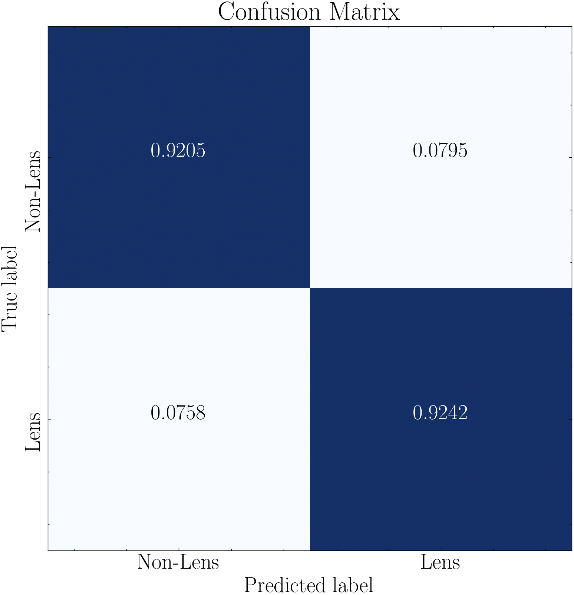

.. _unsupervised_models:

Outlier Detection
===========

.. admonition:: Documentation status (last updated |today|)

   This documentation is still being written and may change frequently!

Overview
-----------
The `outlier_detection <https://pybia.readthedocs.io/en/latest/autoapi/pyBIA/outlier_detection/index.html>`_ module provides an end-to-end pipeline for image-based anomaly detection. Currently, pyBIA includes only the Isolation Forest (iForest) model, an unsupervised machine learning technique that trains only on a single class. While traditional anomaly detection trains on the inliers (i.e., the normal instances), training on the outlier class can also yield robust performance. 

In this example, we will train an iForest classifier to detect satellitle streaks in wide-field surveys, despite not seeing such instances during training. The model will be trained with unaffected images only (the inliers), and performance will be assesed according to how well the model works at flagging images with satellite streaks as outliers while maintaining high inlier detection rates. This example will demonstrate the utility of pyBIA's anomaly detection framework and the robustness of the built-in feature sets. 

Feature Engineering
----------------

The current implementation supports five different feature sets... ('hog','lbp','fft','wavelet','stats')

Key Parameters
--------------

The ``Classifier`` class manages the training of the model. Below are the primary arguments used to configure its behavior...

Example
-----------

This example will utilize broadband imaging in the COSMOS field, provided by the Hyper Suprime-Cam Subaru Strategic Program (HSC-SSP). A satellite trail effecting the image data of 75 sources has been identified in the Deep/Ultra-Deep layer, as shown in the image below:

|

.. figure:: _static/HSC_Imaging_Cosmos.png
    :align: center
    :alt: HSC-SSP Imaging Data
    :width: 800px

    HSC-SSP Deep/Ultra-Deep broadband imaging of the COSMOS field in the $g$-band. The checker overlay indicates patches composing the individual tracts. The sources affected by satellite trails in one of the tracts are shown as red markers. 

The g-band imaging of these 75 anomalies, as well as their corresponding coordinates (RA & Dec in decimal degrees), is available for download here:

* `satellite_streaks <https://drive.google.com/file/d/14C5ZVA1Jja-RN0kkERePBAzcjz93ITZd/view?usp=sharing>`_
* :download:`satellite_streaks_ra_dec <satellite_streaks_ra_dec.txt>`.

The inlier sample used to train the classifier is composed of randomly selected sources that are unaffected by such satellite streaks, and can be downloaded here: 

* `inliers <https://drive.google.com/file/d/18mOyLI_vH7nBXVFAFA64SYQCg8-IWbjv/view?usp=sharing>`_

We can visualize these outliers/inliers using the `plot_images_grid_2x2 <https://pybia.readthedocs.io/en/latest/autoapi/pyBIA/catalog/index.html#pyBIA.catalog.plot_images_grid_2x2>`_ function provided in the `Catalog <https://pybia.readthedocs.io/en/latest/autoapi/pyBIA/catalog/index.html>`_ module.

.. code-block:: python

   import numpy as np
   from pyBIA import catalog

   # First plot the outliers
   outliers = np.load('satellite_streaks.npy')

   pix_conversion = 5.8 # Survey pixel-per-arcsecond (for setting the axes)
   suptitle = r'Example Outliers'
   savefig = False # If False the image will be displayed

   # Plot the first four images
   catalog.plot_images_grid_2x2(
      outliers[0], 
      outliers[1], 
      outliers[2], 
      outliers[3], 
      pix_conversion=pix_conversion, 
      suptitle=suptitle, 
      savefig=savefig
      )

   # Next plot the inliers
   inliers = np.load('inliers.npy')

   suptitle = r'Example Inliers'

   # Plot the first four images
   catalog.plot_images_grid_2x2(
      inliers[0], 
      inliers[1], 
      inliers[2], 
      inliers[3], 
      pix_conversion=pix_conversion, 
      suptitle=suptitle, 
      savefig=savefig
      )

.. grid:: 2
   :gutter: 2

   .. grid-item::

      .. figure:: _static/Example_HSC_Outliers.png
         :class: with-shadow with-border
         :width: 100%

         **Example Outliers**

   .. grid-item::

      .. figure:: _static/Example_HSC_Inliers.png
         :class: with-shadow with-border
         :width: 100%

         **Example Inliers**

