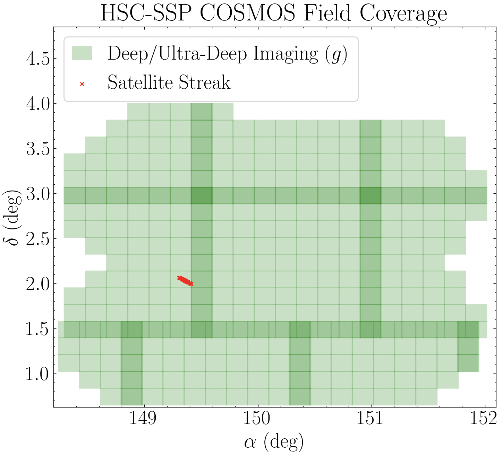
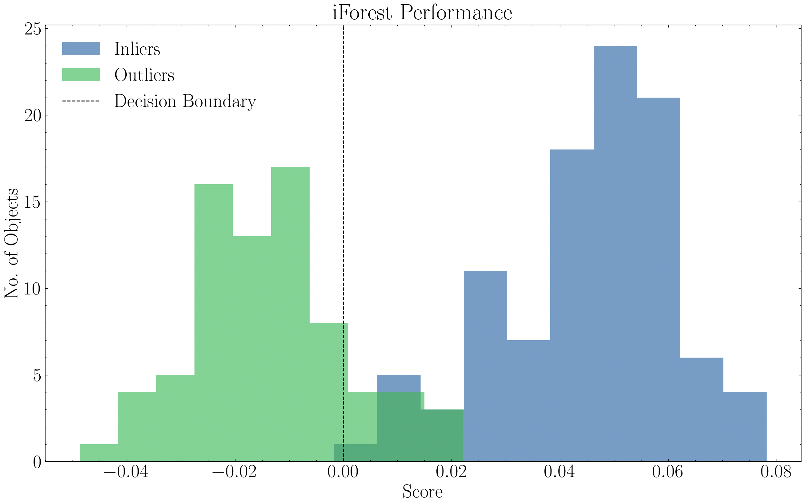

.. _unsupervised_models:

Outlier Detection
===========

Overview
-----------
The `outlier_detection <https://pybia.readthedocs.io/en/latest/autoapi/pyBIA/outlier_detection/index.html>`_ module provides an end-to-end pipeline for image-based anomaly detection. Currently, pyBIA includes only the Isolation Forest (iForest) model, an unsupervised machine learning technique that trains only on a single class. While traditional anomaly detection trains on the inliers (i.e., the normal instances), training on the outlier class can also yield robust performance. 

In this example, we will train an iForest classifier to detect satellitle streaks in wide-field surveys, despite not seeing such instances during training. The model will be trained with unaffected images only (the inliers), and performance will be assesed according to how well the model works at flagging images with satellite streaks as outliers while maintaining high inlier detection rates. This example will demonstrate the utility of pyBIA's anomaly detection framework and the robustness of the built-in feature sets. 

Feature Engineering
----------------

The current implementation supports five different feature sets... ('hog','lbp','fft','wavelet','stats')

Key Parameters
--------------

The ``Classifier`` class manages the training of the model. Below are the primary arguments used to configure its behavior...

Example
-----------

This example will utilize broadband imaging in the COSMOS field, provided by the Hyper Suprime-Cam Subaru Strategic Program (HSC-SSP). A satellite trail effecting the image data of 75 sources has been identified in the Deep/Ultra-Deep layer, as shown in the image below:

    HSC-SSP Deep/Ultra-Deep broadband imaging of the COSMOS field in the g-band. The checker overlay indicates patches composing the individual tracts. The sources affected by satellite trails in one of the tracts are shown as red markers. 

The g-band imaging of these 75 anomalies, as well as their corresponding coordinates (RA & Dec in decimal degrees), is available for download here:

* `satellite_streaks <https://drive.google.com/file/d/14C5ZVA1Jja-RN0kkERePBAzcjz93ITZd/view?usp=sharing>`_
* :download:`satellite_streaks_ra_dec <satellite_streaks_ra_dec.txt>`

The inlier sample used to train the classifier is composed of 300 randomly selected sources that are unaffected by such satellite streaks, and can be downloaded here: 

* `inliers <https://drive.google.com/file/d/18mOyLI_vH7nBXVFAFA64SYQCg8-IWbjv/view?usp=sharing>`_

We can visualize these outliers/inliers using the `plot_images_grid_2x2 <https://pybia.readthedocs.io/en/latest/autoapi/pyBIA/catalog/index.html#pyBIA.catalog.plot_images_grid_2x2>`_ function provided in the `Catalog <https://pybia.readthedocs.io/en/latest/autoapi/pyBIA/catalog/index.html>`_ module.

.. code-block:: python

   import numpy as np
   from pyBIA import catalog

   # First plot the outliers
   outliers = np.load('satellite_streaks.npy')

   pix_conversion = 5.8 # Survey pixel-per-arcsecond (for setting the axes)
   suptitle = r'Example Outliers'
   savefig = False # If False the image will be displayed

   # Plot the first four images
   catalog.plot_images_grid_2x2(
      outliers[0], 
      outliers[1], 
      outliers[2], 
      outliers[3], 
      pix_conversion=pix_conversion, 
      suptitle=suptitle, 
      savefig=savefig
      )

   # Next plot the inliers
   inliers = np.load('inliers.npy')

   suptitle = r'Example Inliers'

   # Plot the first four images
   catalog.plot_images_grid_2x2(
      inliers[0], 
      inliers[1], 
      inliers[2], 
      inliers[3], 
      pix_conversion=pix_conversion, 
      suptitle=suptitle, 
      savefig=savefig
      )

.. grid:: 2
   :gutter: 2

   .. grid-item::

      .. figure:: _static/Example_HSC_Outliers.png
         :class: with-shadow with-border
         :width: 100%

   .. grid-item::

      .. figure:: _static/Example_HSC_Inliers.png
         :class: with-shadow with-border
         :width: 100%
|

To detect these anomalies caused by satellite trails, we train a single-band Isolation Forest (iForest) model on the inlier class.

.. code-block:: python

   import numpy as np
   from pyBIA import outlier_detection

   feat_set = 'hog' # Will train on HOG features (Histogram of Oriented Gradients)

   normalize = True # Will min-max normalize the image data
   min_pixel = -1 # Minimum pixel value for normalization
   max_pixel = 1 # Maximum pixel value for normalization
   img_num_channels = 1 # Number of bands in the image array(s)
   clf = 'iforest' # Model to train
   impute = True # Whether to fit an imputer in case there are NaN pixels
   imp_method = 'median' # The imputation method to employ
   SEED_NO = 1909 # RNG for model determinism

   # Load the inlier class
   inliers = np.load('inliers.npy')

   # Reserve the first 100 for testing
   inliers_test = inliers[:100]

   # Train with the other 200
   inliers_train = inliers[100:]

   # The input images must be 4-dimensional -- (No. Instances, Height, Width, No. Bands)
   # Adding fourth dimension (number of bands)
   inliers_test = np.expand_dims(inliers_test, axis=-1)
   inliers_train = np.expand_dims(inliers_train, axis=-1)

   # Instantiate the classifier
   model = outlier_detection.Classifier(
      data=inliers_train,
      normalize=normalize,
      min_pixel=min_pixel,
      max_pixel=max_pixel,
      img_num_channels=img_num_channels,
      feat_set=feat_set,
      clf=clf,
      impute=impute,
      imp_method=imp_method,
      SEED_NO=SEED_NO
   )
   # Train the model
   model.create()

Once the model is created, it can be saved using the `save <https://pybia.readthedocs.io/en/latest/_modules/pyBIA/outlier_detection.html#Classifier.save>`_ class method (and can be loaded later using the `load <https://pybia.readthedocs.io/en/latest/_modules/pyBIA/outlier_detection.html#Classifier.load>`_ method). This will save the trained model, the imputer (if fitted), and all other corresponding class attributes including the feature set and normalization parameters that were set, which are automatically applied to preprocess data during inference.

We can now proceed with model validation. We will assess performance according to how many of the 75 outliers were correctly flagged as anomalies, and how many of the inliers in the hold-out test set were classified correctly. Predictions are made using the `predict <https://pybia.readthedocs.io/en/latest/_modules/pyBIA/outlier_detection.html#Classifier.predict>`_ class method, which will automatically normalized and impute the input data according to the Classifier configuration.

.. code-block:: python
   
   # Predict the inlier test set
   inlier_predictions = model.predict(inliers_test)

   # Load the outliers
   outliers = np.load('satellite_streaks.npy')

   # Need to add fourth dimension as before
   outliers = np.expand_dims(outliers, axis=-1)
   
   # Predict the outliers
   outlier_predictions = model.predict(outliers)

The predict method returns the following three values, in order: the predicted class (1 for inlier, -1 for outliers), the corresponding decision function score (< 0 for outliers), and the raw anomaly scores (< -0.5 for outliers).

**In this example we observe a 99% inlier retention rate, with 85% of the images containing satellite streaks correctly identified as outliers.** The decision function score distributions for both classes are shown below.

.. code-block:: python
   
   import pylab as plt

   plt.hist(inlier_predictions[:,1], alpha=0.6, label='Inliers')
   plt.hist(outlier_predictions[:,1], alpha=0.6, label='Outliers')
   plt.axvline(x = 0., linestyle='--', color='k', label='Decision Boundary')
   plt.xlabel('Score'); plt.ylabel('No. of Objects')
   plt.title('iForest Performance')
   plt.legend()
   plt.show()

    Distribution of the decision scores from the inlier-trained iForest model, trained on g-band HOG features. 
