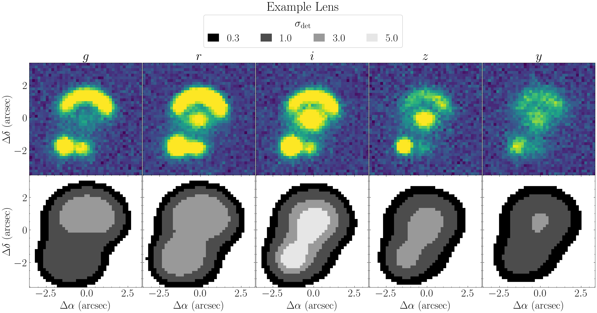

.. _catalog:

Morphological Catalog
===========

.. admonition:: Under Construction (last updated 2025-10-26)

   This documentation is still being written and may change frequently!

The `catalog <https://pybia.readthedocs.io/en/latest/autoapi/pyBIA/catalog/index.html>`_ module available in pyBIA provides functionality for source detection in astrophysical images, as well as subsequent catalog generation during which photometric and morphological features are computed. The morphological image descriptors pyBIA computes are derived using an image segmentation routine which isolates the pixels composing the source. These source characteristics includes raw image moments as well as invariants such as Hu moments. In addition, pyBIA utilizes the PhotUtils `SourceCatalog <https://photutils.readthedocs.io/en/latest/api/photutils.segmentation.SourceCatalog.html#photutils.segmentation.SourceCatalog>`_ API to compute additional morphological properties including common SourceExtractor parameters. 

If you have a 2D array, but no positions, creating a catalog is quick and easy using the `catalog <https://pybia.readthedocs.io/en/latest/autoapi/pyBIA/catalog/index.html>`_ module:

.. code-block:: python

    from pyBIA import catalog

    cat = catalog.Catalog(data)
    cat.create(save_file=True)

The X and Y pixel arguments can be input if source locations are known, with optional parameters available to control background subtraction, source detection thresholds, and flux calculations. If the error map is provided, the output catalog will contain the photometric error as well; likewise, if the zeropoint (``zp``) is input, the catalog will contain the apparent magnitudes. The catalog that is generated can be accessed via the ``cat`` class attribute which will be a dataframe containing all of the source features. These computed features can then be used to train a machine learning model using the `ensemble_model <https://pybia.readthedocs.io/en/latest/autoapi/pyBIA/ensemble_model/index.html>`_ module. 

Overview
-----------

By design, the catalog class requires that the source position(s) (in pixels relative to the image) be input alongside the image data. These positions are input as the ``x`` and ``y`` parameters. The pipeline begins by centering about the input position(s), cropping a square sub-image around it, and then performs the image segmentation. The size of this sub-image (controlled by the ``size`` parameter) is important to control as it determines the maximum extent of segmentation patches, as well as how much of the environment can be captured. By default the ``size`` parameter is set to 100 pixels, which will perform the image segmentation on a 100x100 pixel image centered around each source.

Background subtraction is also important as this determines the validity of the segmentation patch. By default the catalog class assumes that image-subtraction is required. This is controlled via the ``bkg`` parameter which is None by default. If the images are already background-subtracted, set this parameter to zero. If image-subtraction is required, the local background will be calculated by sigma-clipping the sky present within circular annuli. The radius of the inner annuli is set by the ``annulus_in`` parameter (20 pixels by default), and the radius of the outer annuli is controlled by the ``annulus_out`` parameter (35 pixels by default). These radii must be greater than the ``aperture`` parameter, which sets the radius of the circular aperture used to compute the source flux (15 pixels by default).

Other important parameters to consider include the segmentation detection threshold (``nsig``), which represents the standard deviations above the background noise a pixel must be to be included in the segmentation patch. Larger values constrain the segmentation patch to brighter pixels. There is also the ``deblend`` option which determines whether source deblending takes place, which is set to ``False`` by default and is the recommended setting for capturing environmental characteristics (e.g., adjacent galaxies part of a proto-cluster). We also include a ``threshold`` parameter which is used to control non-detections, which are sources for which no segmentation patch could be generated. This can happen if the source is faint and the ``nsig`` detection threshold is too high. By default this parameter is set to 10 pixels, meaning that the nearest segmentation patch to the source position will be taken to be the source, but only if it is present within a circular aperture centered about the input position with a radius of 10 pixels. Therefore, to require that the image segmentation patch be present at the input position(s), set the ``threshold`` parameter to zero. If no image segmentation patch exists within the circular aperture determine by the ``threshold``, the catalog will input a sentinel value of -999 on all of the morphological features, which effectively flags this as a non-detection. Note that the flux/magnitude measurements will still be recorded, as these are independent of the image segmentation.

When generating the catalog, users can input corresponding arrays containing object name(s), field name(s), and/or flag(s) (i.e., class labels). These are appended to the catalog to facilitate comprehensive dataframe construction. Optional instrumentation and observational parameters includes the zeropoint (``zp``) as well as the exposure time (``exptime``), which are used to calculate magnitudes and normalize the pixel intensities, respectively. The resulting image segmentation can also be further controlled via the ``kernel_size``, ``npixels``, and ``connectivity`` parameters, which control how the data is convolved, how many connecting pixels are required to detect a source, and what the connectivitiy scheme should be (touch along edges or edge/corners). 

Example
-----------

In this example we will use the pyBIA.Catalog.catalog class to generate a source catalog of extragalactic images. These include ten thousand galaxies undergoing strong gravitational lensing, and ten thousand galaxies that are not. These sources are simulated in the five bands LSST will observe (grizy), thus we will generate a catalog for all five bands which will then be combined to construct a comprehensive feature matrix to train a classifier for strong lensing detection. 

The images have been saved as binary files and are available for download here:

- `lenses_10k <https://drive.google.com/file/d/1fpr1LIPD08qBkeER0q3hREhdi9g40pDm/view?usp=sharing>`_
- `nonlenses_10k <https://drive.google.com/file/d/1EQK1o0INWbMpVr-2qh_8MLiDNzG6fyVT/view?usp=sharing>`_ 

As we are processing individual images, we will construct individual catalogs for each source, one filter at a time. For each filter we will construct individual catalogs for the lenses first and append to a master catalog list, after which this will be repeated for the non-lenses. This master catalog will be merged at the end and saved as a full dataframe.

.. code-block:: python

   import numpy as np 
   import pandas as pd 
   from pyBIA import catalog  

   # Load the images, binary files (41x41 pixels) containing five filters: g,r,i,z,y
   lenses = np.load('lenses_10k.npy')
   nonlenses = np.load('nonlenses_10k.npy')

   # pyBIA catalog parameteres #

   error = None # The corresponding error map, for computing photometric errors 
   xpix = ypix = lenses.shape[-1] // 2 # Relative position (in pixels) of the source centroid, here they are centered about the image cutouts
   bkg = None # None if background subtraction required, else set to 0 if data already bg-subtracted
   aperture = 10 # Aperture radius (in pixels) for the photometry
   annulus_in = 15 # Inner radius (in pixels) of background annulus for local sky estimation
   annulus_out = 50 # Outer radius (in pixels) of background annulus. 
   nsig = 0.3 # The image segmentation detection threshold 
   threshold = 1 # Will plot the closest object within a circular mask of radius 10 (pixels) within the center
   exptime = 1 # Radius (in pixels) around the source center used to validate detection. If no object is found within this region, the source is flagged as a non-detection.
   zp = 27 # The instrumental zeropoint, for computing the apparent magnitudes
   deblend = False # Whether to deblend detected source(s)
   kernel_size = 21 # Gaussian filter kernel size used to convolve the data prior to segmentation
   npixels = 9 # Required number of pixels above the sigma threshold required to detect a source
   connectivity = 8 # Scheme to determine how pixels are grouped into a detected source, either 4 (touch along edges) or 8 (edges and corners)

   # Will process one band at a time, and save each individually
   for i, band in enumerate(['g','r','i','z','y']):

           # To save all of the individual catalogs
           master_catalog = [] 

           # Loop through each individual lens source
           for j in range(len(lenses)):
                   obj_name = j # The object name in the catalog will just be the order as it appears in the data
                   flag = 1 # The positive class label

                   # Instantiate the Catalog class
                   cat = catalog.Catalog(
                           data=lenses[j][i], # First axis selects the individual source, second axis the band 
                           error=error, 
                           x=xpix, 
                           y=ypix, 
                           bkg=bkg, 
                           aperture=aperture,
                           annulus_in=annulus_in,
                           annulus_out=annulus_out,
                           nsig=nsig, 
                           threshold=threshold,
                           exptime=exptime,
                           zp=zp,
                           deblend=deblend, 
                           kernel_size=kernel_size,
                           npixels=npixels,
                           connectivity=connectivity,
                           obj_name=obj_name,
                           flag=flag
                           )

                   # Create the catalog, will be stored as the `cat` class attribute.
                   cat.create(save_file=False) 

                   # Append the created `cat` attribute to the master list 
                   master_catalog.append(cat.cat)

           ##
           ## Now repeat for the non-lenses ##
           ##

           # Loop through each individual non-lens source
           for j in range(len(nonlenses)):
                   obj_name = len(lenses) + j # The object name in the catalog will just be the order as it appears in the data + how many lenses there are already
                   flag = 0 # The negative class label

                   # Instantiate the Catalog class
                   cat = catalog.Catalog(
                           data=nonlenses[j][i], # First axis selects the individual source, second axis the band 
                           error=error, 
                           x=xpix, 
                           y=ypix, 
                           bkg=bkg, 
                           aperture=aperture,
                           annulus_in=annulus_in,
                           annulus_out=annulus_out,
                           nsig=nsig, 
                           threshold=threshold,
                           exptime=exptime,
                           zp=zp,
                           deblend=deblend, 
                           kernel_size=kernel_size,
                           npixels=npixels,
                           connectivity=connectivity,
                           obj_name=obj_name,
                           flag=flag
                           )

                   # Create the catalog, will be stored as the `cat` class attribute.
                   cat.create(save_file=False) 

                   # Append the created `cat` attribute to the master list 
                   master_catalog.append(cat.cat)

           # Now Merge all individual catalogs into one master dataframe and save
           df = pd.concat(master_catalog, ignore_index=True)
           df.to_csv(f'segm_catalog_{band}_band.csv', index=False)

The five catalogs generated above are available for download here:

- `segm_catalog_g_band <https://drive.google.com/file/d/11IE0XTBl-xI6VtL_6objv5G9IKKt1ZB6/view?usp=sharing>`_
- `segm_catalog_r_band <https://drive.google.com/file/d/1--JoD2hB_sBb8AwtW4DZVllbQFolpe6v/view?usp=sharing>`_ 
- `segm_catalog_i_band <https://drive.google.com/file/d/189rstaGZrSBT679SK2HVSBDMTslJPAJw/view?usp=sharing>`_ 
- `segm_catalog_z_band <https://drive.google.com/file/d/1rqRXs05nPeKB9qQUtEw0BAipTQ9yZ3Y6/view?usp=sharing>`_ 
- `segm_catalog_y_band <https://drive.google.com/file/d/1Zp0n1xed_EcUsgC3Y4G7GXgrUQOStFCH/view?usp=sharing>`_ 

These catalogs will be merged and used to train a binary classifier using the `ensemble_model <https://pybia.readthedocs.io/en/latest/autoapi/pyBIA/ensemble_model/index.html>`_ module. This example is provided in the `Supervised Learning Algorithms <https://pybia.readthedocs.io/en/latest/source/Supervised%20Learning%20Algorithms.html>`_ page. 

**NOTE:** The catalog module also provides a standalone function to plot individual sources and the corresponding image segmentation patches given some set of parameter(s). The `plot_objects_segmentation <https://pybia.readthedocs.io/en/latest/autoapi/pyBIA/catalog/index.html#pyBIA.catalog.plot_objects_segmentation>`_ function allows users to visualize how the segmentation patches look like. As the source morphological features are dependent on the resulting segmentation, it is important to ensure the generated patches are truly representative of the source morphology. This function allows users to input up to four segmentation detection thresholds, so as to visualize how different values affect the resulting source extent. In the example below we can see how only the i-band imaging yields a positive detection at the strictest threshold of 5.0 sigma -- all other four filters at this detection level would be non-detections and would be cataloed with -999 values. 

.. code-block:: python

   import numpy as np
   from pyBIA import catalog

   # Load the lenses 
   lens = np.load('lenses_10k.npy')

   # Plotting parameters
   median_bkg = None # Whether to subtract the background (set to None if background subtraction required)
   pix_conversion = 5.8 # Survey pixel-per-arcsecond (for setting the axes)
   crop_size = None # Will crop the image to be of this size, otherwise set to None
   xpix = ypix = lens.shape[2] // 2 # Cropped image will be centered about these coords, if not cropping set to None
   r_in = 15 # Inner radius (in pixels) of background annulus for local sky estimation
   r_out = 50 # Outer radius (in pixels) of background annulus. 

   # Figure parameters
   fig_title = r'Example Lens' # Figure suptitle
   sup_titles = [r'$g$', r'$r$', r'$i$', r'$z$', r'$y$'] # Title(s) above each individual panel
   cmap = 'viridis' # Colormap to use when displaying input image, the segmentation patches always use binary

   # Segm detection parameters
   sigma_vals = [0.3, 1.0, 3.0, 5.0] # The detection threshold(s) to apply
   deblend = False # Whether to deblend detected sources
   kernel_size = 21 # Gaussian filter kernel size used to convolve the data prior to segmentation
   npixels = 9 # Required number of pixels above the sigma threshold required to detect a source
   connectivity = 8 # Scheme to determine how pixels are grouped into a detected source, either 4 (touch along edges) or 8 (edges and corners)
   threshold = 0 # Will plot the closest object within a circular mask of radius 10 (pixels) within the center
   savefig = True # Whether to save the figure, it False it will show instead
   savepath = 'segm_example_lens.png' # Path (and/or filename) to save in/as

   i = 4 # Will plot the fifth source in the array

   # This function takes in up to 5 images, and plots the detection thresholds (up to 4 thresholds allowed)
   catalog.plot_objects_segmentation(
      lens[i][0],
      lens[i][1],
      lens[i][2],
      lens[i][3],
      lens[i][4],
      pix_conversion=pix_conversion,
      sigma_values=sigma_vals,
      deblend=deblend,
      kernel_size=kernel_size,
      npixels=npixels,
      connectivity=connectivity,
      threshold=threshold,
      titles=sup_titles,
      suptitle=fig_title,
      cmap=cmap,
      xpix=xpix,
      ypix=ypix,
      size=crop_size,
      median_bkg=median_bkg,
      savefig=savefig,
      r_in=15,
      r_out=50,
      savepath=savepath
      )

|

