.. _godines_and_prescott:

Godines & Prescott (2025)
===========

.. admonition:: Under Construction (last updated 2025-09-17)

   This documentation is still being written and may change frequently!

**NOTE:** All figures are formatted using the `scienceplots` Python package, available via pip.

Image Segmentation
-----------

The multi-band data (Bw and R) for the five broadband-selected Lyman-alpha blobs (LABs) from `Prescott et al 2012 <https://ui.adsabs.harvard.edu/abs/2012ApJ...748..125P/abstract>`_ can be :download:`downloaded here <confirmed_LAB.npy>`.

The corresponding names for these five objects (as cataloged in the NDWFS Bootes Survey) can be :download:`downloaded here <confirmed_LAB_names.txt>`.

To visualize the affect the sigma detection threshold has on the image segmentation object, we can use the `plot_objects_segmentation <https://pybia.readthedocs.io/en/latest/autoapi/pyBIA/catalog/index.html#pyBIA.catalog.plot_objects_segmentation>`_ function available in the `catalog <https://pybia.readthedocs.io/en/latest/autoapi/pyBIA/catalog/index.html>`_ module.

.. code-block:: python

	import numpy as np
	from pyBIA import catalog

	# Load the five broadband-selected LABs from Prescott+12
	five_confirmed = np.load('confirmed_LAB.npy')

	# These are the Bw images, second axis contains the R-band data
	five_confirmed_bw = five_confirmed[:,:,:,0]

	# The corresponding cataloged names
	names = np.loadtxt('confirmed_LAB_names.txt', dtype=str)

	# Index the images of each LAB according to its cataloged name
	PRG1 = five_confirmed_bw[(names == 'NDWFS_J143512.2+351108')][0]
	PRG2 = five_confirmed_bw[(names == 'NDWFS_J142623.0+351422')][0]
	PRG3 = five_confirmed_bw[(names == 'NDWFS_J143412.7+332939')][0]
	PRG4 = five_confirmed_bw[(names == 'NDWFS_J142653.1+343856')][0]
	LABd05 = five_confirmed_bw[(names == 'NDWFS_J143410.9+331730')][0]

	# Plotting parameters
	median_bkg = 0 # Whether to subtract the background (set to None if background subtraction required)
	pix_conversion = 3.8961 # NDWFS survey pixel-per-arcsecond (for setting the axes)
	crop_size = 100 # Will crop the image to be of this size, otherwise set to None
	xpix = ypix = five_confirmed.shape[1] // 2 # Cropped image will be centered about these coords, if not cropping set to None

	# Figure parameters
	fig_title = r'Image Segmentation Example ($B_W$ Imaging)' # Figure suptitle
	sup_titles = ['LABd05', 'PRG1','PRG2','PRG3','PRG4'] # Title(s) above each individual panel
	cmap = 'viridis' # Colormap to use when displaying input image, the segmentation patches always use binary

	# Segm detection parameters
	sigma_vals = [0.1, 0.3, 0.7, 1.3] # The detection threshold(s) to apply
	deblend = False # Whether to deblend detected sources
	kernel_size = 21 # Gaussian filter kernel size used to convolve the data prior to segmentation
	npixels = 9 # Required number of pixels above the sigma threshold required to detect a source
	connectivity = 8 # Scheme to determine how pixels are grouped into a detected source, either 4 (touch along edges) or 8 (edges and corners)
	threshold = 10 # Will plot the closest object within a circular mask of radius 10 (pixels) within the center 
	savefig = True # Whether to save the figure, it False it will show instead
	savepath = 'segm_example_LAB.png' # Path (and/or filename) to save in/as

	# This function takes in up to 5 images, and plots the detection thresholds (up to 4 thresholds allowed)
	catalog.plot_objects_segmentation(
	    np.flip(LABd05, axis=0), 
	    np.flip(PRG1, axis=0), 
	    np.flip(PRG2, axis=0), 
	    np.flip(PRG3, axis=0), 
	    np.flip(PRG4, axis=0),
	    pix_conversion=pix_conversion, 
	    sigma_values=sigma_vals, 
	    deblend=deblend,
	    kernel_size=kernel_size, 
	    npixels=npixels, 
	    connectivity=connectivity, 
	    threshold=threshold,
	    titles=sup_titles, 
	    suptitle=fig_title, 
	    cmap=cmap,
	    xpix=xpix, 
	    ypix=ypix, 
	    size=crop_size, 
	    median_bkg=median_bkg, 
	    savefig=savefig, 
	    savepath='segm_example_LAB.png'
	    )

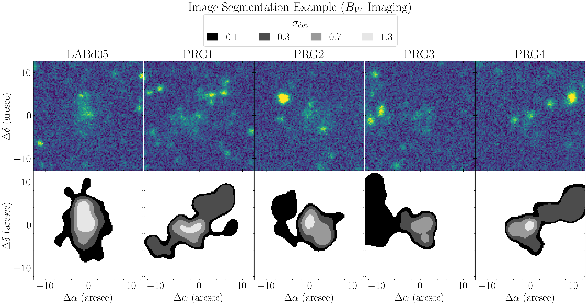
|
|

Training Morphological Catalog
-----------

To download the images used in this study please visit the `NoirLab <https://noirlab.edu/science/data-services/other/ndwfs>`_ website. We utilized the Bootes field data, from which there are 27 total subfields to download, in addition to the corresponding error maps. The data avaialable are in .fits format.

The training set objects used in our study can be :download:`downloaded here <training_set.csv>`_. This dataframe contains catalog information on the 866 LAB candidates compiled by `Prescott et al 2012 <https://ui.adsabs.harvard.edu/abs/2012ApJ...748..125P/abstract>`_, as well as 3200 randomly selected OTHER sources from the same dataset. 

The code below demonstrates how we conducted our detection threshold analysis. Using the catalog information available in the provided training set, we extracted the morphological features using image segmentation at different thresholds, between 0.1 to 1.5 standard deviations above the background rms.

.. code-block:: python

	import numpy as np 
	import pandas as pd
	from astropy.io import fits 
	from sklearn.model_selection import cross_validate
	from pyBIA import catalog, ensemble_model

	### Create the Data Files to Generate Figure 2 ###

	# This is where the subfield fits files are stored including the error maps
	data_path = 'NDWFS/fits_images/Bw_FITS/'
	data_error_path = 'NDWFS_Bootes/Error_Maps/Bw/'

	#866 LAB candidates from Prescott et al. (2012) plus 3200 randomly selected OTHER objects
	training_set = pd.read_csv('training_set.csv')

	# The training features will be computed using the following varying sigma thresholds
	sigs = np.around(np.arange(0.1, 1.51, 0.01), decimals=2)

	# Where the training set files will be saved
	nsig_path = 'nsigs/'

	deblend = False # Whether to deblend detected sources
	kernel_size = 21 # Gaussian filter kernel size used to convolve the data prior to segmentation
	npixels = 9 # Required number of pixels above the sigma threshold required to detect a source
	connectivity = 8 # Scheme to determine how pixels are grouped into a detected source, either 4 (touch along edges) or 8 (edges and corners)
	threshold = 10 # Will plot the closest object within a circular mask of radius 10 (pixels) within the center 
	invert = True # Flips the (x, y) input order when cropping sub-images

	for sig in sigs:
		print(sig)
		frame = [] #To store all 27 subfields
		for fieldname in np.unique(np.array(training_set['field_name'])):
			
			# Load the field data
			data_hdu, error_map = fits.open(data_path+fieldname+'_Bw_03_fix.fits'), fits.getdata(data_error_path+fieldname+'_Bw_03_rms.fits.fz')
			
			# Extract the data and corresponding ZP
			data_map, zeropoint, exptime = data_hdu[0].data, data_hdu[0].header['MAGZERO'], data_hdu[0].header['EXPTIME']
			
			# Select only the samples from this subfield
			subfield_index = np.where(training_set['field_name']==fieldname)[0]
			xpix, ypix = training_set[['xpix', 'ypix']].iloc[subfield_index].values.T
			objname, field, flag = training_set[['obj_name', 'field_name', 'flag']].iloc[subfield_index].values.T
			
			# Create the catalog object
			cat = catalog.Catalog(
				data_map, 
				error=error_map, 
				x=xpix, 
				y=ypix, 
				zp=zeropoint, 
				exptime=exptime, 
				nsig=sig, 
				flag=flag, 
				obj_name=objname, 
				field_name=field, 
				deblend=deblend, 
				kernel_size=kernel_size, 
				npixels=npixels, 
				connectivity=connectivity, 
				threshold=threshold, 
				invert=invert
				)

			# Generate the catalog and append the ``cat`` attribute to the frame list
			cat.create(save_file=False)
			frame.append(cat.cat)

		# Combine all 27 sub-catalogs into one master frame and save
		frame = pd.concat(frame, axis=0, join='inner')
		frame.to_csv(f'{nsig_path}_Bw_training_set_nsig_{sig}.csv', index=False)

These 141 nsig files are available for `download here <https://drive.google.com/file/d/12tg-bsbAVTNUWdL3yGadehPZMKOp52UJ/view?usp=sharing>`_.

Baseline Classification Models
-----------

The files generated above will be used to create baseline classifiers:

.. code-block:: python

	###  Read the Data Files ###
	import numpy as np 
	import pandas as pd
	from sklearn.model_selection import cross_validate, StratifiedKFold
	from pyBIA import data_processing, ensemble_model, optimization

	SEED_NO = 1909  # Fixed seed to initialize all random processes, including NumPy's RNG

	# The training features were computed using the following varying sigma thresholds
	sigs = np.around(np.arange(0.1, 1.51, 0.01), decimals=2)

	# Where the training set files were saved
	nsig_path = 'nsigs/'

	#These are the features to use, note that the catalog includes more than this!
	#Removing mu00 and G00 since these will be the same as M00
	#Also removing mu10 and mu01 since these should be zero but in practice they are not but are very small 
	#due to floating-point precision errors and minor asymmetries in the image; thus contribute little meaningful variance for classification.
	columns = [
	    'mag', 'mag_err',
	    'M00', 'M10', 'M01', 'M20', 'M11', 'M02', 'M30', 'M21', 'M12', 'M03',
	    'mu20', 'mu11', 'mu02', 'mu30', 'mu21', 'mu12', 'mu03',
	    'G10', 'G01', 'G20', 'G11', 'G02', 'G30', 'G21', 'G12', 'G03',
	    'Hu1', 'Hu2', 'Hu3', 'Hu4', 'Hu5', 'Hu6', 'Hu7',
	    'L00', 'L10', 'L01', 'L20', 'L11', 'L02', 'L30', 'L21', 'L12', 'L03',
	    'area', 'covar_sigx2', 'covar_sigy2', 'covar_sigxy', 'covariance_eigval1', 'covariance_eigval2',
	    'cxx', 'cxy', 'cyy', 'eccentricity', 'ellipticity', 'elongation',
	    'equivalent_radius', 'fwhm', 'gini', 'orientation', 'perimeter',
	    'semimajor_sigma', 'semiminor_sigma', 'max_value', 'min_value'
	]

	# To store the baseline performance as a function of sigma threshold for all classifiers, note that nn corresponds to MLP in the paper
	classifiers = ['tree', 'rf', 'xgb', 'logreg', 'svc', 'nn']
	all_metrics = {clf: {'nsig': [], 'accuracy': [], 'f1': [], 'precision': [], 'recall': [], 'roc_auc': []} for clf in classifiers}

	blob_nondetect, other_nondetect = [], [] # To store the number of non-detections (Right Panel of Figure 2)
	impute = False # Will not impute NaN values, as they should not be present after masking non-detections
	num_cv_folds = 10 # Will assess the model's accuracy using 10-fold CV

	###  Read the Data Files ###
	for sig in sigs:
		print(sig)
		# Load the corresponding nsig file
		df = pd.read_csv(f'{nsig_path}_Bw_training_set_nsig_{sig}')

		# Log-transform the Hu moments
		hu_cols = ['Hu1', 'Hu2', 'Hu3', 'Hu4', 'Hu5', 'Hu6', 'Hu7']
		df[hu_cols] = df[hu_cols].apply(data_processing.signed_log_transform)

		# Omit any non-detections (nan mags (~10%) and nan Hu moments (~0.02%))
		mask = np.where((df['area'] != -999) & np.isfinite(df['mag']) & np.all(np.isfinite(df[[f'Hu{i}' for i in range(1, 8)]]), axis=1))[0]
		
		# Balance both classes to be of same size
		blob_index = np.where(df['flag'].iloc[mask] == 1)[0]
		other_index = np.where(df['flag'].iloc[mask] == 0)[0]
		df_filtered = df.iloc[mask[np.concatenate((blob_index, other_index[:len(blob_index)]))]]

		# Feature matrix and labels array
		data_x, data_y = np.array(df_filtered[columns]), np.array(df_filtered['flag'])

		# Instantiate the Classifier class
		model = ensemble_model.Classifier(data_x, data_y, impute=impute)

		for clf_name in all_metrics.keys():
			# The last three in the list, these classifiers require the training data to be standardized
			if clf_name in ['logreg', 'svc', 'nn']:
				model.data_x = optimization.standardize_data(data_x, method='standard', return_scaler=False)
			else:
				model.data_x = data_x  
				
			model.clf = clf_name
			model.create(overwrite_training=False)
			
			# 10 fold CV, save multiple metrics
			cv_splitter = StratifiedKFold(n_splits=num_cv_folds, shuffle=True, random_state=SEED_NO)
			cross_val = cross_validate(model.model, model.data_x, model.data_y, cv=cv_splitter, scoring=['accuracy', 'f1', 'precision', 'recall', 'roc_auc'])
			
			# Append nsig and scores
			all_metrics[clf_name]['nsig'].append(sig)
			for metric in ['accuracy', 'f1', 'precision', 'recall', 'roc_auc']:
				all_metrics[clf_name][metric].append(np.mean(cross_val[f'test_{metric}']))

		# This checks how many normalized non-detections occurred at this threshold
		blob_index, other_index = np.where(df['flag'] == 1)[0], np.where(df['flag'] == 0)[0]
		blob_nondetect.append(len(np.where(df.area.iloc[blob_index] == -999)[0]) / len(blob_index))
		other_nondetect.append(len(np.where(df.area.iloc[other_index] == -999)[0]) / len(other_index))

	rows = []
	for clf_name, metrics in all_metrics.items():
	    for i, nsig in enumerate(metrics['nsig']):
	        rows.append({
	            'classifier': clf_name,
	            'nsig': nsig,
	            'accuracy': metrics['accuracy'][i],
	            'f1': metrics['f1'][i],
	            'precision': metrics['precision'][i],
	            'recall': metrics['recall'][i],
	            'roc_auc': metrics['roc_auc'][i]
	        })

	df_metrics = pd.DataFrame(rows)
	df_metrics.to_csv('baseline_classifiers.csv', index=False)
		
	non_detect_data = np.c_[sigs, blob_nondetect, other_nondetect]
	np.savetxt('non_detections_Bw', non_detect_data, header="nsigs, blob_non_detections, other_non_detections")

The two files generated above can be downloaded: 

- :download:`baseline_classifiers.csv <baseline_classifiers.csv>`
- :download:`non_detections_Bw <non_detections_Bw>`

We can now plot the non-detections and performance as a function of detection threshold:

.. code-block:: python

	### Generate the Plots ###
	import numpy as np
	import pandas as pd
	import matplotlib.pyplot as plt
	from matplotlib.ticker import FuncFormatter
	from matplotlib.lines import Line2D
	import scienceplots
	plt.style.use('science')
	plt.rcParams.update({'font.size': 21, 'lines.linewidth':1.5})

	# Load the data saved in previous script
	df_metrics = pd.read_csv('baseline_classifiers.csv')
	non_detect_data = np.loadtxt('non_detections_Bw')

	# Query best classifier according to the F1 score at chosen sigma
	metric = 'f1'
	best_sigma = 0.32  # The highest F1 score is at sigma=0.38 but comparable at 0.32 which yields more detections
	subdf = df_metrics[df_metrics['nsig'] == best_sigma]
	chosen_row = subdf[subdf[metric] == subdf[metric].max()].iloc[0]
	best_clf = chosen_row['classifier']
	best_f1 = chosen_row[metric]

	# Plots
	fig1, ax1 = plt.subplots(figsize=(8, 8))

	# Line styles
	colors = plt.cm.tab10.colors  
	linestyles = ['-', '--', '-.', ':', (0, (4, 2, 1, 2, 1, 2)), (0, (1, 3))]

	# The classifiers in order so they show from best to worst in legend (top left to bottom right)
	clf_order = ['xgb', 'nn', 'rf', 'logreg', 'svc', 'tree']
	clf_display = {'xgb': 'XGBoost', 'nn': 'MLP', 'rf': 'RF', 'logreg': 'LogReg', 'svc': 'SVC', 'tree': 'Tree'}

	for i, clf in enumerate(clf_order):
	    subdf = df_metrics[df_metrics['classifier'] == clf]
	    ax1.plot(subdf['nsig'], subdf[metric], label=clf_display[clf], color=colors[i % 10], linestyle=linestyles[i % len(linestyles)])

	# Highlight the optimal detection threshold
	ax1.axvline(best_sigma, linestyle=(0, (2, 2)), alpha=0.75, color='gray')
	ax1.annotate(f'Optimal: {clf_display[best_clf]}\n' + r'$\sigma_{\rm det}$ = ' + f'{best_sigma:.2f}', 
	    xy=(best_sigma, 0.881), 
	    xytext=(0.47, 0), 
	    textcoords='offset points',
	    ha='center', va='top',
	    color='gray', rotation=90)

	ax1.set_title('Baseline Classification Performance')
	ax1.set_xlabel(r'Segmentation Detection Threshold ($\sigma_{\rm det}$)')
	ax1.set_ylabel('F1 Score (10-Fold Cross-Validation)')
	ax1.set_xlim((0.1, 1.5)); ax1.set_ylim(0.82, 0.932)
	ax1.legend(loc='lower center', ncol=3, handlelength=1, handletextpad=0.3, columnspacing=0.7, labelspacing=0.3, frameon=True, fancybox=True)
	fig1.savefig('nsigs_f1_all_classifiers.png', dpi=300, bbox_inches='tight')
	plt.show()

	# Plot the non-detections
	fig2, ax2 = plt.subplots(figsize=(8, 8))

	lns1, = ax2.plot(non_detect_data[:, 0], non_detect_data[:, 2], linestyle='--', label='OTHER', color='tab:blue')
	lns2, = ax2.plot(non_detect_data[:, 0], non_detect_data[:, 1], linestyle='-', label='LAB', color='tab:orange')

	ax2.axvline(best_sigma, linestyle=(0, (2, 2)), alpha=0.75, color='gray')
	ax2.annotate(f'Optimal: {clf_display[best_clf]}\n' + r'$\sigma_{\rm det}$ = ' + f'{best_sigma:.2f}',
	    xy=(best_sigma, 0.4), 
	    xytext=(0.47, 0), 
	    textcoords='offset points',
	    ha='center', va='top',
	    color='gray', rotation=90)

	ax2.legend(handles=[lns2, lns1], labels=['LAB', 'OTHER'], loc='upper center', ncol=2, handlelength=1,  handletextpad=0.3, columnspacing=0.7, labelspacing=0.3, frameon=True, fancybox=True)

	ax2.set_title('Segmentation Non-Detections')
	ax2.set_xlabel(r'Segmentation Detection Threshold ($\sigma_{\rm det}$)')
	ax2.set_ylabel('Fraction of Instances')
	ax2.set_xlim((0.1, 1.5)); ax2.set_ylim(0, 0.7)
	ax2.yaxis.set_major_formatter(FuncFormatter(lambda x, _: f'{x:.2f}'))

	fig2.savefig('nsigs_normalized_non_detections.png', dpi=300, bbox_inches='tight')
	plt.show()

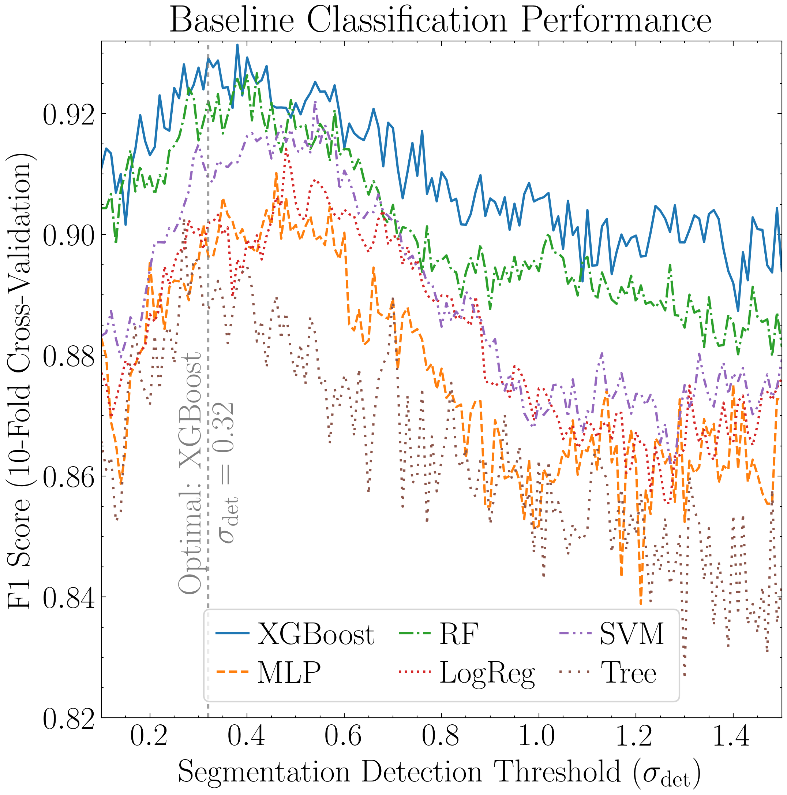
|

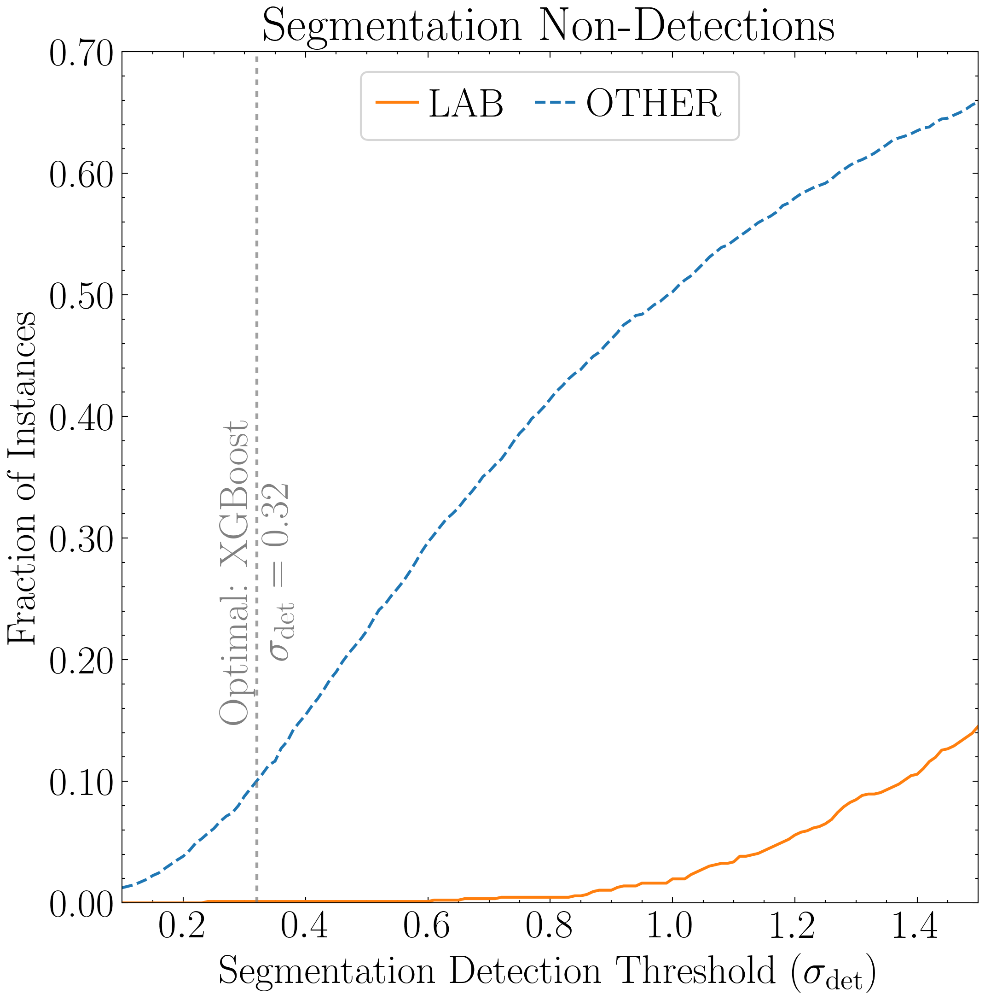
|

Baseline XGBoost Model
-----------

We now re-train the optimal model (XGBoost) and the optimal detection threshold of 0.32 to plot the corresponding confusion matrix.

.. code-block:: python

	import numpy as np
	import pandas as pd
	from pyBIA import ensemble_model, data_processing

	# Where the training set files were saved
	nsig_path = 'nsigs/'

	sig = 0.32 #The optimal sig threshold to apply as per Figure 2
	df = pd.read_csv(f'{nsig_path}_Bw_training_set_nsig_{sig}')

	# Log-transform the Hu moments
	hu_cols = ['Hu1', 'Hu2', 'Hu3', 'Hu4', 'Hu5', 'Hu6', 'Hu7']
	df[hu_cols] = df[hu_cols].apply(data_processing.signed_log_transform)

	# Omit any non-detections (nan mags (~10%) and nan Hu moments (~0.02%))
	mask = np.where((df['area'] != -999) & np.isfinite(df['mag']) & np.all(np.isfinite(df[[f'Hu{i}' for i in range(1, 8)]]), axis=1))[0]

	# Balance both classes to be of same size
	blob_index = np.where(df['flag'].iloc[mask] == 1)[0]
	other_index = np.where(df['flag'].iloc[mask] == 0)[0]
	df_filtered = df.iloc[mask[np.concatenate((blob_index, other_index[:len(blob_index)]))]]

	#These are the features to use, note that the catalog includes more than this!
	columns = [
	    'mag', 'mag_err',
	    'M00', 'M10', 'M01', 'M20', 'M11', 'M02', 'M30', 'M21', 'M12', 'M03',
	    'mu20', 'mu11', 'mu02', 'mu30', 'mu21', 'mu12', 'mu03',
	    'G10', 'G01', 'G20', 'G11', 'G02', 'G30', 'G21', 'G12', 'G03',
	    'Hu1', 'Hu2', 'Hu3', 'Hu4', 'Hu5', 'Hu6', 'Hu7',
	    'L00', 'L10', 'L01', 'L20', 'L11', 'L02', 'L30', 'L21', 'L12', 'L03',
	    'area', 'covar_sigx2', 'covar_sigy2', 'covar_sigxy', 'covariance_eigval1', 'covariance_eigval2',
	    'cxx', 'cxy', 'cyy', 'eccentricity', 'ellipticity', 'elongation',
	    'equivalent_radius', 'fwhm', 'gini', 'orientation', 'perimeter',
	    'semimajor_sigma', 'semiminor_sigma', 'max_value', 'min_value'
	]

	# Training data arrays
	data_x, data_y = np.array(df_filtered[columns]), np.array(df_filtered['flag'])

	# Classifier object
	SEED_NO = 1909 # Seed No for shuffling the data when assessing the classifier
	impute = False # No need to impute, no NaN should be present
	optimize = False # Disabling optimization routine, this is the baseline model
	opt_cv = 10 # Will assess performance using 10Fold CV
	clf = 'xgb' # Will train an XGBoost model (optimal model)

	model = ensemble_model.Classifier(
		data_x, 
		data_y, 
		clf=clf, 
		impute=impute, 
		optimize=optimize, 
		opt_cv=opt_cv, 
		SEED_NO=SEED_NO
		)

	model.create()

	# Plot confusion matrix with text class labels (instead of numerical) for the confusion matrix
	data_y_labels = ['LAB' if i == 1 else 'OTHER' for i in data_y]
	model.plot_conf_matrix(data_y=data_y_labels, title=r'XGBoost Model Performance ($\sigma_{\rm det} = 0.32$)', savefig=True)

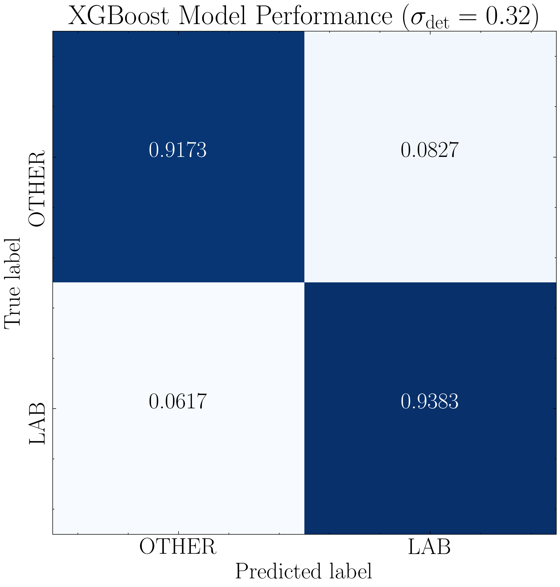
|

Optimized XGBoost Models
-----------

We now proceed with the generated training set at the optimal detection threshold. As the above analysis trained base models, at this step we invoke our optimization routine to select the optimal features to use as well as the best hyperparameters for our XGBoost engine. Note that in the below code, two distinct models are optimized, one using the `boruta_model`='rf' option and another with the 'xgb' option (more conservative feature selection).

.. code-block:: python

	import numpy as np
	import pandas as pd
	from pyBIA import ensemble_model, data_processing

	# Where the training set files were saved
	nsig_path = 'nsigs/'

	sig = 0.32 #The optimal sig threshold to apply as per Figure 2
	df = pd.read_csv(f'{nsig_path}_Bw_training_set_nsig_{sig}')
	hu_cols = ['Hu1', 'Hu2', 'Hu3', 'Hu4', 'Hu5', 'Hu6', 'Hu7']
	df[hu_cols] = df[hu_cols].apply(data_processing.signed_log_transform)

	# Omit any non-detections
	mask = np.where((df['area'] != -999) & np.isfinite(df['mag']) & np.all(np.isfinite(df[[f'Hu{i}' for i in range(1, 8)]]), axis=1))[0]

	# Balance both classes to be of same size
	blob_index = np.where(df['flag'].iloc[mask] == 1)[0]
	other_index = np.where(df['flag'].iloc[mask] == 0)[0]
	df_filtered = df.iloc[mask[np.concatenate((blob_index, other_index[:len(blob_index)]))]]

	#These are the features to use, note that the catalog includes more than this!
	columns = [
	    'mag', 'mag_err',
	    'M00', 'M10', 'M01', 'M20', 'M11', 'M02', 'M30', 'M21', 'M12', 'M03',
	    'mu20', 'mu11', 'mu02', 'mu30', 'mu21', 'mu12', 'mu03',
	    'G10', 'G01', 'G20', 'G11', 'G02', 'G30', 'G21', 'G12', 'G03',
	    'Hu1', 'Hu2', 'Hu3', 'Hu4', 'Hu5', 'Hu6', 'Hu7',
	    'L00', 'L10', 'L01', 'L20', 'L11', 'L02', 'L30', 'L21', 'L12', 'L03',
	    'area', 'covar_sigx2', 'covar_sigy2', 'covar_sigxy', 'covariance_eigval1', 'covariance_eigval2',
	    'cxx', 'cxy', 'cyy', 'eccentricity', 'ellipticity', 'elongation',
	    'equivalent_radius', 'fwhm', 'gini', 'orientation', 'perimeter',
	    'semimajor_sigma', 'semiminor_sigma', 'max_value', 'min_value'
	]

	# Training data arrays
	data_x, data_y = np.array(df_filtered[columns]), np.array(df_filtered['flag'])

	# Will run the optimization routine all at once, feature selection first followed by engine hyperparameter optimization
	# Enabling 10-fold cross validation which increases the hyperparameter optimization time ten-fold

	# XGB-BASED BorutaSHAP
	SEED_NO = 1909 # The seed number that will initialize the stochastic process (e.g., model training)
	clf = 'xgb' # The classification model that will be trined, options are: 'xgb', 'rf' and 'nn'
	impute = False # Whether to impute missing values (NaN)
	optimize = True # Will enable the optimization routine
	scoring_metric = 'f1' # The optimization trials will be assessed according to the F1 Score
	opt_cv = 10 # The number of folds to perform during cross validation, ONLY used during optimization (`optimize`=True)
	boruta_trials = 100 # Number of feature selection trials to perform (This is fast especially with `boruta_model`='xgb')
	boruta_model = 'xgb' # The model to use when assessing feautre importances during feature selection (either 'rf' or 'xgb', DOES NOT have to match the `clf`)
	n_iter = 100 # Number of hyperparameter optimization trials to perform, can set to 0 to disable hyperparam tuning
	limit_search = True # Set to False to expand the hyperparameter search space (will take longer)

	# Instantiate the Classifier
	model = ensemble_model.Classifier(
		data_x, 
		data_y, 
		clf=clf, 
		impute=impute, 
		optimize=optimize, 
		boruta_trials=boruta_trials, 
		boruta_model=boruta_model, 
		n_iter=n_iter, 
		scoring_metric=scoring_metric, 
		opt_cv=opt_cv, 
		limit_search=limit_search, 
		SEED_NO=SEED_NO
		)

	# Tune and train the model 
	model.create()

	# Save the model
	model.save(dirname=f'ensemble_model_xgb_boruta_{boruta_model}')

	boruta_model = 'rf' # Change to RF-based feature importance ranking during optimization

	# RF-BASED BorutaSHAP
	model = ensemble_model.Classifier(
		data_x, 
		data_y, 
		clf=clf, 
		impute=impute, 
		optimize=optimize, 
		boruta_trials=boruta_trials, 
		boruta_model=boruta_model, 
		n_iter=n_iter, 
		scoring_metric=scoring_metric, 
		opt_cv=opt_cv, 
		limit_search=limit_search, 
		SEED_NO=SEED_NO
		)

	model.create()
	model.save(dirname=f'ensemble_model_xgb_boruta_{boruta_model}')

The XGBoost model optimized with RF-based feature importance (to compute the SHAP values) can be :download:`downloaded here <ensemble_model_xgb_boruta_rf.zip>`.

The XGBoost model optimized with XGBoost-based feature importance (to compute the SHAP values) can be :download:`downloaded here <ensemble_model_xgb_boruta_xgb.zip>`.

**NOTE: These models were saved using Python3.12, to avoid pickle dependecny issues, load them using Python3.12.**

Below we plot the optimization results (feature selection results from the BorutaSHAP algorithm and the subsequent Optuna-based hyperparameter optimization) using the built-in class methods, 

.. code-block:: python

	import numpy as np
	from pyBIA import ensemble_model, data_processing
	import pandas as pd

	# Where the training set files were saved
	nsig_path = 'nsigs/'

	sig = 0.32 #The optimal sig threshold to apply as per Figure 2
	df = pd.read_csv(f'{nsig_path}_Bw_training_set_nsig_{sig}')

	# Log-transform the Hu moments
	hu_cols = ['Hu1', 'Hu2', 'Hu3', 'Hu4', 'Hu5', 'Hu6', 'Hu7']
	df[hu_cols] = df[hu_cols].apply(data_processing.signed_log_transform)

	# Omit any non-detections (nan mags (~10%) and nan Hu moments (~0.02%))
	mask = np.where((df['area'] != -999) & np.isfinite(df['mag']) & np.all(np.isfinite(df[[f'Hu{i}' for i in range(1, 8)]]), axis=1))[0]

	# Balance both classes to be of same size
	blob_index = np.where(df['flag'].iloc[mask] == 1)[0]
	other_index = np.where(df['flag'].iloc[mask] == 0)[0]
	df_filtered = df.iloc[mask[np.concatenate((blob_index, other_index[:len(blob_index)]))]]

	#These are the features to use, note that the catalog includes more than this!
	columns = [
	    'mag', 'mag_err',
	    'M00', 'M10', 'M01', 'M20', 'M11', 'M02', 'M30', 'M21', 'M12', 'M03',
	    'mu20', 'mu11', 'mu02', 'mu30', 'mu21', 'mu12', 'mu03',
	    'G10', 'G01', 'G20', 'G11', 'G02', 'G30', 'G21', 'G12', 'G03',
	    'Hu1', 'Hu2', 'Hu3', 'Hu4', 'Hu5', 'Hu6', 'Hu7',
	    'L00', 'L10', 'L01', 'L20', 'L11', 'L02', 'L30', 'L21', 'L12', 'L03',
	    'area', 'covar_sigx2', 'covar_sigy2', 'covar_sigxy', 'covariance_eigval1', 'covariance_eigval2',
	    'cxx', 'cxy', 'cyy', 'eccentricity', 'ellipticity', 'elongation',
	    'equivalent_radius', 'fwhm', 'gini', 'orientation', 'perimeter',
	    'semimajor_sigma', 'semiminor_sigma', 'max_value', 'min_value'
	]

	# Training data arrays
	data_x, data_y = np.array(df_filtered[columns]), np.array(df_filtered['flag'])

	#LOAD THE SAVED MODELS AND PLOT THE OPTIMIZATION RESULTS
	#XGB-Based BorutaSHAP

	clf = 'xgb' # The classification model 
	impute = False # Will not impute NaN values, as they should not be present after masking non-detections

	# Instantiate the classifier and load the saved model

	# First load the model that was optimized using XGBoost-based feature selection (8 features selected)
	xgboost8_model = ensemble_model.Classifier(data_x, data_y, clf=clf, impute=impute)
	xgboost8_model.load('ensemble_model_xgb_boruta_xgb')

	# Next load the model that was optimized using RF-based feature selection (47 features selected)
	xgboost45_model = ensemble_model.Classifier(data_x, data_y, clf=clf, impute=impute)
	xgboost45_model.load('ensemble_model_xgb_boruta_rf')

	# Plot the feature selection results

	#Setting custom column names for plotting purposes 
	columns_formatted = [
		r'$B_W$ Mag', r'$B_W$ MagErr', 
		r'$M_{00}$', r'$M_{10}$', r'$M_{01}$', r'$M_{20}$', r'$M_{11}$', r'$M_{02}$', r'$M_{30}$', r'$M_{21}$', r'$M_{12}$', r'$M_{03}$', 
		r'$\mu_{20}$', r'$\mu_{11}$', r'$\mu_{02}$', r'$\mu_{30}$', r'$\mu_{21}$', r'$\mu_{12}$', r'$\mu_{03}$', 
		r'$G_{10}$', r'$G_{01}$', r'$G_{20}$', r'$G_{11}$', r'$G_{02}$', r'$G_{30}$', r'$G_{21}$', r'$G_{12}$', r'$G_{03}$',
		r'$h_1$', r'$h_2$', r'$h_3$', r'$h_4$', r'$h_5$', r'$h_6$', r'$h_7$', 
		r'$L_{00}$', r'$L_{10}$', r'$L_{01}$', r'$L_{20}$', r'$L_{11}$', r'$L_{02}$', r'$L_{30}$', r'$L_{21}$', r'$L_{12}$', r'$L_{03}$', 
		'Area', r'$\sigma^2(x)$', r'$\sigma^2(y)$', r'$\sigma^2(xy)$', r'$\lambda_1$', r'$\lambda_2$', r'$C_{xx}$', r'$C_{xy}$', r'$C_{yy}$', 
		'Eccentricity', 'Ellipticity', 'Elongation', 'Equiv. Radius', 'FWHM', 'Gini Index', 'Orientation', 'Perimeter', 
		r'$\sigma_{\rm major}$', r'$\sigma_{\rm minor}$', 'Max Value', 'Min Value'
	]

	top = 'all' # Will show all accepted features
	include_other = True # The other accepted will be shown as a single point (combined Z-Scores)
	include_shadow = True # Whether to include a 'random performance' benchmark (i.e., the "shadow" feature)
	include_rejected = False # Whether to show the features that were not deemed important
	flip_axes = True # Set to False to plot the features on the x-axis (if you're plotting a lot of them)
	title = 'Feature Importance (8 Features)' # Figure title
	save_data = False # Whether to save the feature importances to a csv file
	savefig = False # Whether to save the figure (note that current version of program always saves with same figname so careful with overwrites)

	# First plot the XGBoost-based feature selection results
	xgboost8_model.plot_feature_opt(
		feat_names=columns_formatted, 
		top=top, 
		include_other=include_other, 
		include_shadow=include_shadow, 
		include_rejected=include_rejected, 
		flip_axes=flip_axes, 
		save_data=save_data, 
		title=title, 
		savefig=savefig
		)

	# Next plot the RF-based feature selection results
	top = 15 # Only plot the top 15 accepted features
	title = 'Feature Importance (45 Features)' # Figure title

	xgboost45_model.plot_feature_opt(
		feat_names=columns_formatted, 
		top=top, 
		include_other=include_other, 
		include_shadow=include_shadow, 
		include_rejected=include_rejected, 
		flip_axes=flip_axes, 
		save_data=save_data, 
		title=title, 
		savefig=savefig
		)

	# Plot the hyperparameter optimization results
	baseline = 0.92914 # The maximum XGBoost baseline accuracy as per Figure 2
	xlim = (1, 100) # xlim axes
	ylim = (0.91, 0.936) # ylim axes
	xlog = False # Whether to log-scale x-axis
	ylog = False # Whether to log-scale y-axis
	ylabel = 'F1 Score (10-Fold Cross-Validation)'
	loc = 'lower left' # Legend location
	ncol = 1 # No of columns in legend
	savefig = True # Whether to save the figure (note that current version of program always saves with same figname so careful about overwrites)

	# First plot the results from the XGBoost model trained with 8 features
	title = 'Hyperparameter Optimization (8 Features)' # Fig title

	xgboost8_model.plot_hyper_opt(
		baseline=baseline, 
		xlim=xlim, 
		ylim=ylim,
		xlog=xlog, 
		ylog=ylog, 
		title=title,
		ylabel=ylabel, 
		loc=loc,
		ncol=ncol,
		savefig=savefig
		)

	# First plot the results from the XGBoost model trained with 47 features
	title = 'Hyperparameter Optimization (45 Features)' # Fig title

	xgboost45_model.plot_hyper_opt(
		baseline=baseline, 
		xlim=xlim, 
		ylim=ylim,
		xlog=xlog, 
		ylog=ylog, 
		ylabel=ylabel,
		title=title,
		loc=loc,
		ncol=ncol,
		savefig=savefig
		)

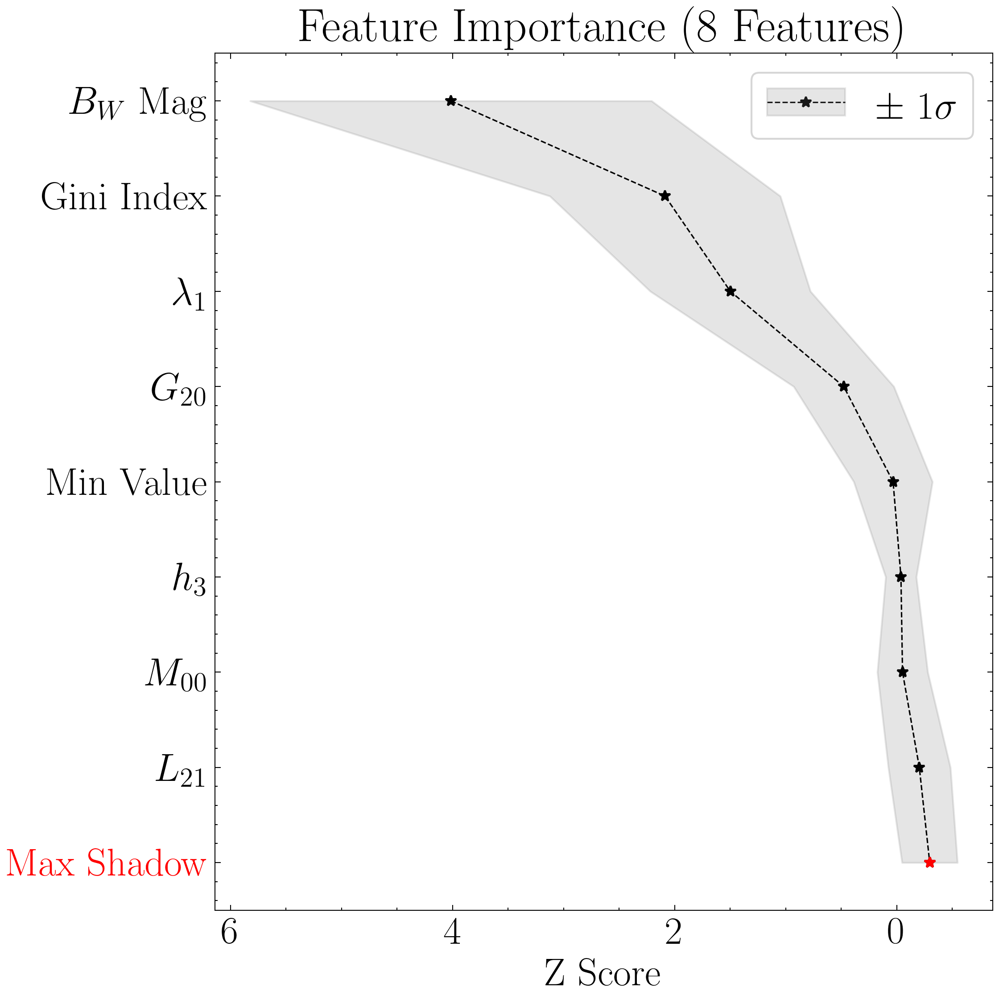
|

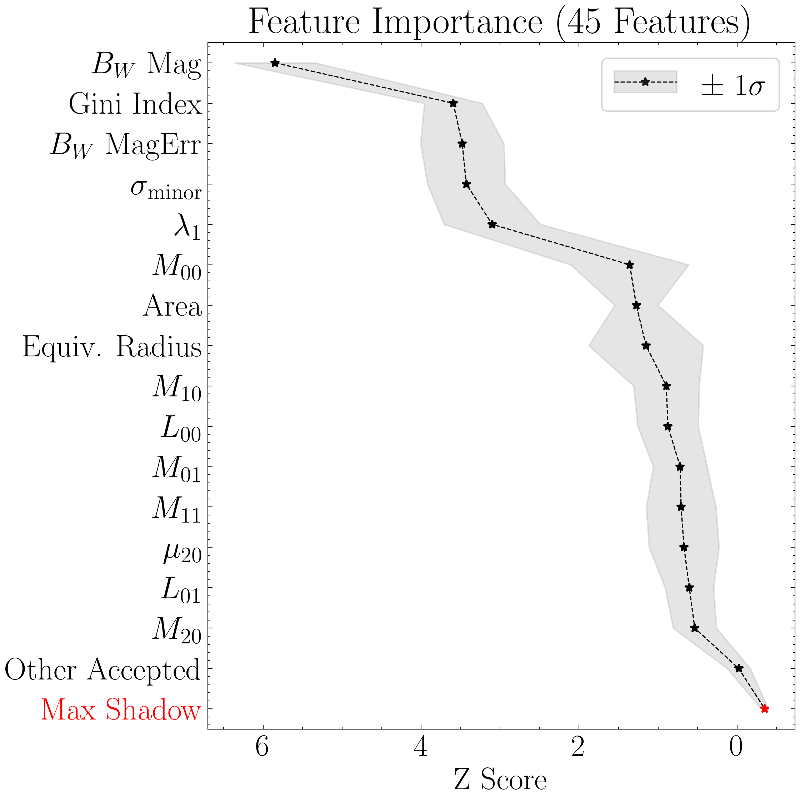
|

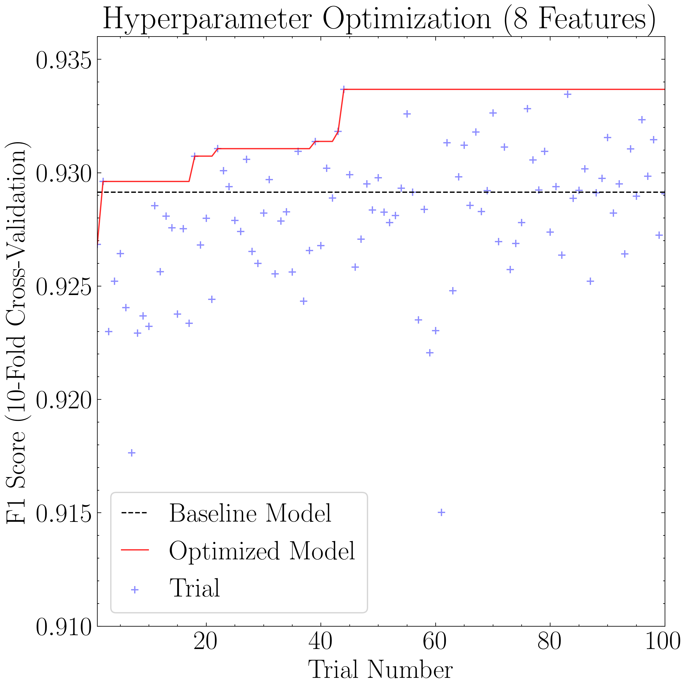
|

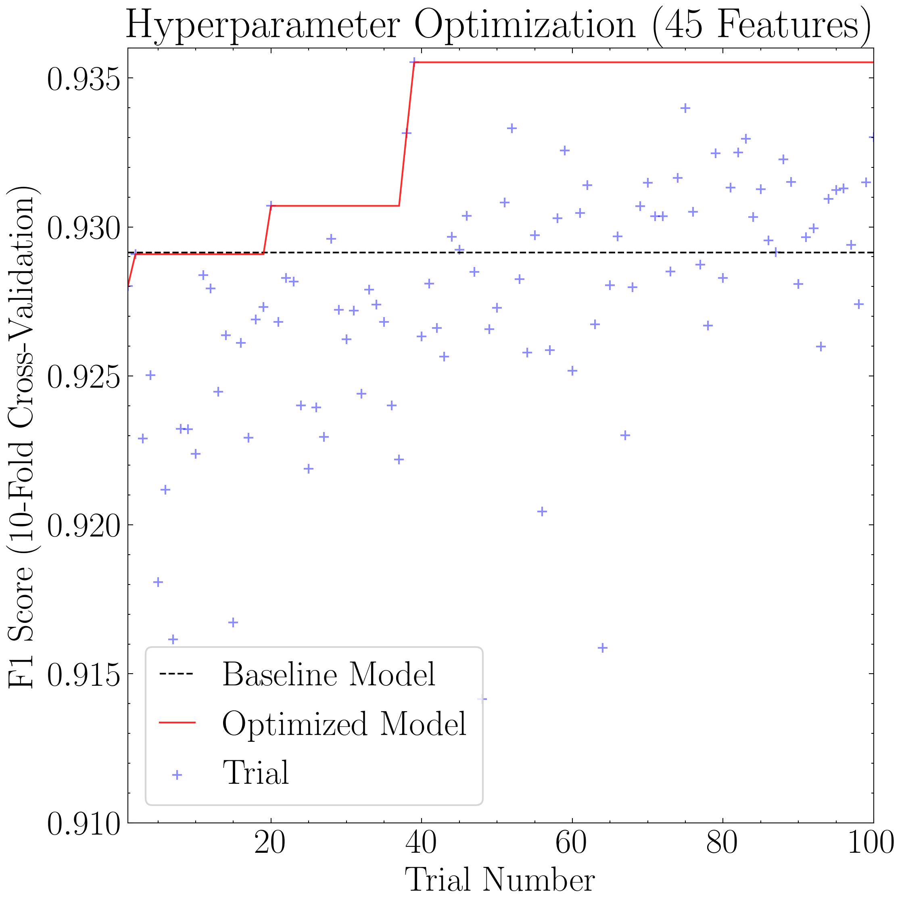
|

Boötes Morphological Catalog
-----------

With the optimal models saved, we now extract the features using the `Catalog <https://pybia.readthedocs.io/en/latest/autoapi/pyBIA/catalog/index.html#pyBIA.catalog.Catalog>`_ class for all 2 million OTHER objects in the entire dataset. We have compiled the positional catalog information in the following dataframe: `Other_Objects_Catalog <https://drive.google.com/file/d/1_Hl8Rgvc_x1n0EBP9XSY1WE27NQkaOiV/view?usp=sharing>`_.

Using this file we can now construct a catalog for the entire dataset so as to perform the XGBoost classification (note that this excludes the 866 LAB objects in the provided training set).

.. code-block:: python
	
	import os
	import numpy as np
	import pandas as pd
	from astropy.io import fits
	from pyBIA import catalog

	other_catalog = pd.read_csv('Other_Objects_Catalog.csv')

	data_path = 'NDWFS/fits_images/Bw_FITS/'
	data_error_path = 'NDWFS_Bootes/Error_Maps/Bw/'

	sig = 0.32 # The optimal noise-detection threshold to apply

	# Loop through all the fields and save the field catalogs to avoid memory issues
	counter = 0
	for fieldname in np.unique(np.array(other_catalog['field_name'])):
		counter += 1
		print(fieldname, f'{counter} out of 27')
		# Load the field data
		data_hdu, error_map = fits.open(data_path+fieldname+'_Bw_03_fix.fits'), fits.getdata(data_error_path+fieldname+'_Bw_03_rms.fits.fz')
		# Extract the data and corresponding ZP and exptime
		data_map, zeropoint, exptime = data_hdu[0].data, data_hdu[0].header['MAGZERO'], data_hdu[0].header['EXPTIME']
		# Select only the samples from this subfield
		subfield_index = np.where(other_catalog['field_name']==fieldname)[0]
		xpix, ypix = other_catalog[['xpix', 'ypix']].iloc[subfield_index].values.T
		objname, field, flag = other_catalog[['obj_name', 'field_name', 'flag']].iloc[subfield_index].values.T
		# Create the catalog object
		cat = catalog.Catalog(
			data_map, 
			error=error_map, 
			x=xpix, 
			y=ypix, 
			zp=zeropoint, 
			exptime=exptime, 
			nsig=sig, 
			flag=flag, 
			obj_name=objname, 
			field_name=field, 
			invert=True) # Invert is used to flip x/y coordinates, for ease in handling standard .fits coord system
		# Generate the catalog and save the subfield catalog, after which it is appended to the master frame 
		cat.create(save_file=True, filename='Cat_BW_Subfield_'+fieldname)

	# Now load each subfield individually and create one master catalog
	fnames = [i for i in os.listdir() if 'Cat_BW_Subfield_' in i]

	frame = [] #To store all 27 subfields
	for fname in fnames:
		cat = pd.read_csv(fname)
		frame.append(cat)

	# Combine all 27 sub-catalogs into one master frame and save
	frame = pd.concat(frame, axis=0, join='inner')
	frame.to_csv(f'Other_Catalog_Master_{sig}', chunksize=1000)    
                                               

This master catalog as genereated above is available for download `here <https://drive.google.com/file/d/1cJMafmaT4NwbWbjY0xPB9fk9La065eQ6/view?usp=sharing>`_.

Using this catalog, we can now load the optimal models to make the predictions. The predictions will be made using both the base and optimal models so as to compare the distribution of probability predictions. 

Predictions & LOO CV
-----------

In the following script we perform the model predictions on the entire NDWFS Boötes field to generate the candidate catalogs (i.e., sources with probability predictions greater than 0.5). 

These candidate catalogs do not include the 866 LAB training objects as these were deliberately removed from the source catalog. While the randomly selected objects that composed our OTHER class are included in the catalog, they were used for training purposes as such cannot be fairly assessed as their presence as an OTHER training instance skews their probability predictions. For this reason, we perform a Leave-out-Out (LOO) cross-validation analysis, once assessing the LAB training set insstances so as to farily assess them and determine an informed probability prediction threshold, and another assessing the OTHER objects in our training set so as to include those that would have been predicted as LAB had they not been present in the training set. These two LOO routines are also executed below:

.. code-block:: python

	import numpy as np
	import numpy as np
	import pandas as pd
	from pyBIA import ensemble_model, data_processing

	# Load all 2 million catalog objects and create a sub-catalog of LAB candidates #
	# LoO Analysis is performed on the training data in order to determine which of these sources would be considered new candidates

	# Where the training set files were saved
	nsig_path = 'nsigs/'

	# First load the training data
	sig = 0.32 #The optimal sig threshold to apply as per Figure 2
	df = pd.read_csv(f'{nsig_path}_Bw_training_set_nsig_{sig}')

	# Log-transform the Hu moments
	hu_cols = ['Hu1', 'Hu2', 'Hu3', 'Hu4', 'Hu5', 'Hu6', 'Hu7']
	df[hu_cols] = df[hu_cols].apply(data_processing.signed_log_transform)

	# Omit any non-detections (nan mags (~10%) and nan Hu moments (~0.02%))
	mask = np.where((df['area'] != -999) & np.isfinite(df['mag']) & np.all(np.isfinite(df[[f'Hu{i}' for i in range(1, 8)]]), axis=1))[0]

	# Balance both classes to be of same size
	blob_index = np.where(df['flag'].iloc[mask] == 1)[0]
	other_index = np.where(df['flag'].iloc[mask] == 0)[0]
	df_filtered = df.iloc[mask[np.concatenate((blob_index, other_index[:len(blob_index)]))]]

	#These are the features to use, note that the catalog includes more than this!
	columns = [
	    'mag', 'mag_err',
	    'M00', 'M10', 'M01', 'M20', 'M11', 'M02', 'M30', 'M21', 'M12', 'M03',
	    'mu20', 'mu11', 'mu02', 'mu30', 'mu21', 'mu12', 'mu03',
	    'G10', 'G01', 'G20', 'G11', 'G02', 'G30', 'G21', 'G12', 'G03',
	    'Hu1', 'Hu2', 'Hu3', 'Hu4', 'Hu5', 'Hu6', 'Hu7',
	    'L00', 'L10', 'L01', 'L20', 'L11', 'L02', 'L30', 'L21', 'L12', 'L03',
	    'area', 'covar_sigx2', 'covar_sigy2', 'covar_sigxy', 'covariance_eigval1', 'covariance_eigval2',
	    'cxx', 'cxy', 'cyy', 'eccentricity', 'ellipticity', 'elongation',
	    'equivalent_radius', 'fwhm', 'gini', 'orientation', 'perimeter',
	    'semimajor_sigma', 'semiminor_sigma', 'max_value', 'min_value'
	]

	# Training data arrays
	data_x, data_y = np.array(df_filtered[columns]), np.array(df_filtered['flag'])

	clf = 'xgb' # The classification model 
	impute = False # Will not impute NaN values, as they should not be present after masking non-detections

	# This is the base model, no hyperparameter optimization, uses all the features
	base_model = ensemble_model.Classifier(data_x, data_y, clf=clf, impute=impute)
	base_model.create()

	# These are the optimized models
	xgboost_8_model = ensemble_model.Classifier(data_x, data_y, clf=clf, impute=impute)
	xgboost_8_model.load('/Users/daniel/Desktop/pyBIA_PLOTS/ensemble_model_xgb_boruta_xgb')

	xgboost_45_model = ensemble_model.Classifier(data_x, data_y, clf=clf, impute=impute)
	xgboost_45_model.load('/Users/daniel/Desktop/pyBIA_PLOTS/ensemble_model_xgb_boruta_rf')

	# Load the catalog containing all 2 million other objects, extracted using sig=0.32
	other_all = pd.read_csv('/Users/daniel/Desktop/pyBIA_PLOTS/Other_Catalog_Master_0.32')

	# Remove the 859 OTHER objects that are present in the training set, we will assess these individually using LoO
	other_all = other_all[~other_all['obj_name'].isin(df_filtered['obj_name'])]

	# Log transform the Hu moments
	other_all[hu_cols] = other_all[hu_cols].apply(data_processing.signed_log_transform)

	# Omit non-detections
	mask = np.where((other_all['area'] != -999) & np.isfinite(other_all['mag']) & np.all(np.isfinite(other_all[[f'Hu{i}' for i in range(1, 8)]]), axis=1))[0]

	other_all = other_all.iloc[mask]

	# Create the data_x array
	other_data_x = np.array(other_all[columns])

	# Predict all samples to create a candidates catalog
	predictions_base_model = base_model.predict(other_data_x)
	predictions_xgboost_8 = xgboost_8_model.predict(other_data_x)
	predictions_xgboost_45 = xgboost_45_model.predict(other_data_x)

	# Select LAB detections (flag = 1)
	index_base = np.where(predictions_base_model[:,0] == 1)[0]
	index_xgboost_8 = np.where(predictions_xgboost_8[:,0] == 1)[0]
	index_xgboost_45 = np.where(predictions_xgboost_45[:,0] == 1)[0]

	# Index the catalog to select only the positive detections
	candidate_catalog_base = other_all.iloc[index_base]
	candidate_catalog_xgboost_8 = other_all.iloc[index_xgboost_8]
	candidate_catalog_xgboost_45 = other_all.iloc[index_xgboost_45]

	# Save the probability predictions as a new columns
	candidate_catalog_base['proba'] = predictions_base_model[index_base][:,1]
	candidate_catalog_xgboost_8['proba'] = predictions_xgboost_8[index_xgboost_8][:,1]
	candidate_catalog_xgboost_45['proba'] = predictions_xgboost_45[index_xgboost_45][:,1]

	# Leave-one-Out Cross validation #

	# Remove one OTHER object as the LAB will be cross-validated using LoO
	other_training = df_filtered[df_filtered.flag == 0].iloc[1:]
	LAB_training =  df_filtered[df_filtered.flag == 1]

	# The probas of the five confirmed blobs will be saved according to their published names
	LABd05, PRG1, PRG2, PRG3, PRG4 = [],[],[],[],[]

	# To store the probas of all the other LAB objects as well as their catalog names
	all_LAB_base_probas, all_LAB_xboost_8_probas, all_LAB_xboost_45_probas, names = [],[],[],[]

	#Leave-one-Out cross-validating the LAB class
	for i in range(len(LAB_training)):
		print(f"{i+1} of {len(LAB_training)}")
		
		# This will be the individual LAB sample to assess
		leave_one = np.array(LAB_training[columns].iloc[i])
		
		# Removing this validation sample from the overall LAB training bag
		remaining = np.delete(np.array(LAB_training[columns]), i, axis=0)
		
		# Setting the new training data, flag of 1 corresponds to LAB, 0 is OTHER
		data_x = np.r_[remaining, np.array(other_training[columns])]
		data_y = np.r_[[1]*len(remaining), [0]*len(other_training)]
		
		# Training the new base model
		new_base_model = base_model.model.fit(data_x, data_y)
		
		# Training the new optimized models, note that the feats_to_use attribute from the feat selection is invoked
		new_xgboost_8_model = xgboost_8_model.model.fit(data_x[:,xgboost_8_model.feats_to_use], data_y)
		new_xgboost_45_model = xgboost_45_model.model.fit(data_x[:,xgboost_45_model.feats_to_use], data_y)
		
		# Assess the left-out LAB sample using both the base and optimized models
		proba_base = new_base_model.predict_proba(leave_one.reshape(1,-1))
		proba_new_xgboost_8 = new_xgboost_8_model.predict_proba(leave_one[xgboost_8_model.feats_to_use].reshape(1,-1))
		proba_new_xgboost_45 = new_xgboost_45_model.predict_proba(leave_one[xgboost_45_model.feats_to_use].reshape(1,-1))
		
		# Save only the probability prediction that the object is LAB
		if LAB_training.obj_name.iloc[i] == 'NDWFS_J143410.9+331730':
			LABd05.append(float(proba_base[:,1])); LABd05.append(float(proba_new_xgboost_8[:,1])); LABd05.append(float(proba_new_xgboost_45[:,1]))
		elif LAB_training.obj_name.iloc[i] == 'NDWFS_J143512.2+351108': 
			PRG1.append(float(proba_base[:,1])); PRG1.append(float(proba_new_xgboost_8[:,1])); PRG1.append(float(proba_new_xgboost_45[:,1]))
		elif LAB_training.obj_name.iloc[i] == 'NDWFS_J142623.0+351422':
			PRG2.append(float(proba_base[:,1])); PRG2.append(float(proba_new_xgboost_8[:,1])); PRG2.append(float(proba_new_xgboost_45[:,1]))
		elif LAB_training.obj_name.iloc[i] == 'NDWFS_J143412.7+332939':
			PRG3.append(float(proba_base[:,1])); PRG3.append(float(proba_new_xgboost_8[:,1])); PRG3.append(float(proba_new_xgboost_45[:,1]))
		elif LAB_training.obj_name.iloc[i] == 'NDWFS_J142653.1+343856':
			PRG4.append(float(proba_base[:,1])); PRG4.append(float(proba_new_xgboost_8[:,1])); PRG4.append(float(proba_new_xgboost_45[:,1]))
		else:
			all_LAB_base_probas.append(float(proba_base[:,1]))
			all_LAB_xboost_8_probas.append(float(proba_new_xgboost_8[:,1]))
			all_LAB_xboost_45_probas.append(float(proba_new_xgboost_45[:,1]))
			names.append(LAB_training.obj_name.iloc[i])

	# The first index is the base model probability predictions, the second is the optimized model's
	five_names = ['LABd05', 'PRG1', 'PRG2', 'PRG3', 'PRG4']
	five_LAB_base_probas = np.c_[LABd05[0], PRG1[0], PRG2[0], PRG3[0], PRG4[0]][0]
	five_LAB_xgboost_8_probas = np.c_[LABd05[1], PRG1[1], PRG2[1], PRG3[1], PRG4[1]][0]
	five_LAB_xgboost_45_probas = np.c_[LABd05[2], PRG1[2], PRG2[2], PRG3[2], PRG4[2]][0]

	# Save the base and optimized probabilities
	np.savetxt('LoO_Confirmed_LAB', np.c_[five_names, five_LAB_base_probas, five_LAB_xgboost_8_probas, five_LAB_xgboost_45_probas], header="Names, Base_Model, xgboost_8_Model, xgboost_45_Model", fmt='%s')
	np.savetxt('LoO_LAB', np.c_[names, all_LAB_base_probas, all_LAB_xboost_8_probas, all_LAB_xboost_45_probas], header="Names, Base_Model, xgboost_8_Model, xgboost_45_Model", fmt='%s')

	
	# Repeat the same LoO process but evaluate the OTHER training for fair assessment of these objects
	# Positive detections from this LoO will be added to the candidates catalog that was created above

	# Remove one LAB object as this time the OTHER class will be cross-validated using LoO
	other_training = df_filtered[df_filtered.flag == 0]
	LAB_training =  df_filtered[df_filtered.flag == 1].iloc[1:]

	# To store the probas of all LAB objects as well as their catalog names
	other_base_probas, other_xgboost_8_probas, other_xgboost_45_probas, names = [],[],[],[]

	#Leave-one-Out cross-validating the OTHER class
	for i in range(len(other_training)):
		print(f"{i+1} of {len(other_training)}")
		
		# This will be the individual OTHER sample to assess
		leave_one = np.array(other_training[columns].iloc[i])
		
		# Removing this validation sample from the overall OTHER training bag
		remaining = np.delete(np.array(other_training[columns]), i, axis=0)
		
		# Setting the new training data
		data_x = np.r_[remaining, np.array(LAB_training[columns])]
		data_y = np.r_[[0]*len(remaining), [1]*len(LAB_training)]
		
		# Training the new base model
		new_base_model = base_model.model.fit(data_x, data_y)
		
		# Training the new optimized models
		new_xgboost_8_model = xgboost_8_model.model.fit(data_x[:,xgboost_8_model.feats_to_use], data_y)
		new_xgboost_45_model = xgboost_45_model.model.fit(data_x[:,xgboost_45_model.feats_to_use], data_y)
		
		# Assess the left-out OTHER sample using the base and optimized model
		proba_base = new_base_model.predict_proba(leave_one.reshape(1,-1))
		proba_new_xgboost_8 = new_xgboost_8_model.predict_proba(leave_one[xgboost_8_model.feats_to_use].reshape(1,-1))
		proba_new_xgboost_45 = new_xgboost_45_model.predict_proba(leave_one[xgboost_45_model.feats_to_use].reshape(1,-1))
		
		# Save only the probability prediction that the object is LAB
		other_base_probas.append(float(proba_base[:,1]))
		other_xgboost_8_probas.append(float(proba_new_xgboost_8[:,1]))
		other_xgboost_45_probas.append(float(proba_new_xgboost_45[:,1]))
		names.append(other_training.obj_name.iloc[i])

	# Save the base and optimized probabilities
	np.savetxt('LoO_OTHER', np.c_[names, other_base_probas, other_xgboost_8_probas, other_xgboost_45_probas], header="Names, Base_Model, xgboost_8_Model, xgboost_45_Model", fmt='%s')

	# Find these OTHER objects that were classified as LAB (probas greater than or equal to 50%)
	indices = []

	# Identify these positive detections
	index = np.where(np.array(other_base_probas) >= 0.5)[0]
	for name in np.array(names)[index]:
		indices.append(np.where(other_training.obj_name == name)[0][0])

	# Add to the master base candidate catalog
	df_filtered_base = other_training.iloc[indices]
	df_filtered_base['proba'] = np.array(other_base_probas)[index]
	candidate_catalog_base = pd.concat([candidate_catalog_base, df_filtered_base], ignore_index=True)

	# Now do the same for the optimized catalog (XGBoost-8)
	indices = []

	index = np.where(np.array(other_xgboost_8_probas) >= 0.5)[0]
	for name in np.array(names)[index]:
		indices.append(np.where(other_training.obj_name == name)[0][0])

	# Add to the master optimized candidate catalog
	df_filtered_xgboost_8 = other_training.iloc[indices]
	df_filtered_xgboost_8['proba'] = np.array(other_xgboost_8_probas)[index]
	candidate_catalog_xgboost_8 = pd.concat([candidate_catalog_xgboost_8, df_filtered_xgboost_8], ignore_index=True)

	# Now do the same for the optimized catalog (XGBoost-45)
	indices = []

	index = np.where(np.array(other_xgboost_45_probas) >= 0.5)[0]
	for name in np.array(names)[index]:
		indices.append(np.where(other_training.obj_name == name)[0][0])

	# Add to the master optimized candidate catalog
	df_filtered_xgboost_45 = other_training.iloc[indices]
	df_filtered_xgboost_45['proba'] = np.array(other_xgboost_45_probas)[index]
	candidate_catalog_xgboost_45 = pd.concat([candidate_catalog_xgboost_45, df_filtered_xgboost_45], ignore_index=True)

	# Save LAB candidate catalogs
	candidate_catalog_base.to_csv('candidate_catalog_base.csv')
	candidate_catalog_xgboost_8.to_csv('candidate_catalog_optimized_xgboost_8.csv')
	candidate_catalog_xgboost_45.to_csv('candidate_catalog_optimized_xgboost_45.csv')

The three LOO analysis files are available here: 

- :download:`LoO_Confirmed_LAB <LoO_Confirmed_LAB>`
- :download:`LoO_LAB <LoO_LAB>`
- :download:`LoO_OTHER <LoO_OTHER>`

The three candidate catalogs are available for download:

- `candidate_catalog_base <https://drive.google.com/file/d/12_uhZaF1cqeDpa_tQPvtmaXcxxFrHDhu/view?usp=sharing>`_
- `candidate_catalog_optimized_xgboost_8 <https://drive.google.com/file/d/1q_1NbRcfi89iVUCXIcEff4UzDFfn5fdt/view?usp=sharing>`_
- `candidate_catalog_optimized_xgboost_45 <https://drive.google.com/file/d/17rYf_Mx-eFHWsHYtmeMUeh6wMZLRrd-P/view?usp=sharing>`_

t-SNE Projections
-----------

With the LOO CV results we can generate t-SNE projections and scale the points by the probability prediction. 

First we generate the t-SNE projections and save the scatter point positions. This can be done using the built-in methods in the `Classifier <https://pybia.readthedocs.io/en/latest/autoapi/pyBIA/ensemble_model/index.html#pyBIA.ensemble_model.Classifier>`_ class.

.. code-block:: python

	import numpy as np
	import pandas as pd
	from pyBIA import ensemble_model, data_processing

	# Where the training set files were saved
	nsig_path = 'nsigs/'

	sig = 0.32 #The optimal sig threshold to apply as per Figure 2
	df = pd.read_csv(f'{nsig_path}_Bw_training_set_nsig_{sig}')

	# Log-transform the Hu moments
	hu_cols = ['Hu1', 'Hu2', 'Hu3', 'Hu4', 'Hu5', 'Hu6', 'Hu7']
	df[hu_cols] = df[hu_cols].apply(data_processing.signed_log_transform)

	# Omit any non-detections
	mask = np.where((df['area'] != -999) & np.isfinite(df['mag']) & np.all(np.isfinite(df[[f'Hu{i}' for i in range(1, 8)]]), axis=1))[0]

	# Balance both classes to be of same size
	blob_index = np.where(df['flag'].iloc[mask] == 1)[0]
	other_index = np.where(df['flag'].iloc[mask] == 0)[0]
	df_filtered = df.iloc[mask[np.concatenate((blob_index, other_index[:len(blob_index)]))]]

	#These are the features to use, note that the catalog includes more than this!
	columns = [
	    'mag', 'mag_err',
	    'M00', 'M10', 'M01', 'M20', 'M11', 'M02', 'M30', 'M21', 'M12', 'M03',
	    'mu20', 'mu11', 'mu02', 'mu30', 'mu21', 'mu12', 'mu03',
	    'G10', 'G01', 'G20', 'G11', 'G02', 'G30', 'G21', 'G12', 'G03',
	    'Hu1', 'Hu2', 'Hu3', 'Hu4', 'Hu5', 'Hu6', 'Hu7',
	    'L00', 'L10', 'L01', 'L20', 'L11', 'L02', 'L30', 'L21', 'L12', 'L03',
	    'area', 'covar_sigx2', 'covar_sigy2', 'covar_sigxy', 'covariance_eigval1', 'covariance_eigval2',
	    'cxx', 'cxy', 'cyy', 'eccentricity', 'ellipticity', 'elongation',
	    'equivalent_radius', 'fwhm', 'gini', 'orientation', 'perimeter',
	    'semimajor_sigma', 'semiminor_sigma', 'max_value', 'min_value'
	]

	# Training data arrays
	data_x, data_y = np.array(df_filtered[columns]), np.array(df_filtered['flag'])
	df_names = np.array(df_filtered.obj_name)

	# Load the LoO Analysis results
	loo_confirmed_lab = np.loadtxt('LoO_Confirmed_LAB', dtype=str)
	loo_lab = np.loadtxt('LoO_LAB', dtype=str)
	loo_other = np.loadtxt('LoO_OTHER', dtype=str)

	#The names of our confirmed LABs as they appaer in the NDWFS Catalog: 'LABd05', 'PRG1', 'PRG2', 'PRG3', 'PRG4'
	confirmed_LAB_cat_names = ['NDWFS_J143410.9+331730','NDWFS_J143512.2+351108','NDWFS_J142623.0+351422','NDWFS_J143412.7+332939', 'NDWFS_J142653.1+343856']

	# Concat the data from all three models (base, xgboost-8, xgboost-45)
	# The first column contains the na,es the second the baseline model data, 3rd column is xgboost-8, fourth is xgboost-45
	names = np.r_[loo_lab[:,0], confirmed_LAB_cat_names, loo_other[:,0]]
	probas_xgboost_8 = np.r_[loo_lab[:,2], loo_confirmed_lab[:,2], loo_other[:,2]]
	probas_xgboost_45 = np.r_[loo_lab[:,3], loo_confirmed_lab[:,3], loo_other[:,3]]

	# Sort in order of the training data (df_filtered)
	indices = []
	for i in range(len(df_names)):
	    indices.append(np.where(names == df_names[i])[0][0])

	names = names[indices]
	probas_xgboost_8, probas_xgboost_45 = probas_xgboost_8[indices].astype('float'), probas_xgboost_45[indices].astype('float')

	# Load the models (saved in earlier code)
	clf = 'xgb' # The classification model 
	impute = False # Will not impute NaN values, as they should not be present after masking non-detections
	xgboost_8_model = ensemble_model.Classifier(data_x, data_y, clf=clf, impute=impute)
	xgboost_8_model.load('ensemble_model_xgb_boruta_xgb')

	xgboost_45_model = ensemble_model.Classifier(data_x, data_y, clf=clf, impute=impute)
	xgboost_45_model.load('ensemble_model_xgb_boruta_rf')

	# For plotting purposes change the labels from numeric to text
	y_labels = ['LAB' if flag == 1 else 'OTHER' for flag in data_y]

	# For plotting purposes, re-name the five confirmed blobs to Confirmed LyAlpha
	confirmed_names = np.loadtxt('confirmed_LAB_names.txt', dtype=str)

	# Identify the confirmed LABs and re-name 
	for name in confirmed_names:
	    index = np.where(df_filtered.obj_name == name)[0][0]
	    y_labels[index] = r'Confirmed_Ly$\alpha$'

	# The t-SNE projection with custom y_data labels, highlighting the scatter points for the confirmed blobs
	# For now we only need to generate the t-SNE projection and save the scatter point positions
	return_data = True # Whether to also return the x and y coordinates of the scatter points (will correspond to the order of the feature matrix (i.e., your labels in `data_y`))

	x_8, y_8 = xgboost_8_model.plot_tsne(data_y=y_labels, return_data=return_data)
	x_45, y_45 = xgboost_45_model.plot_tsne(data_y=y_labels, return_data=return_data)

	np.savetxt('tsne_scatter_data_8_feats.txt', np.c_[x_8, y_8, y_labels, names, probas_xgboost_8],fmt='%s',header='x, y, labels, names, probas')
	np.savetxt('tsne_scatter_data_45_feats.txt', np.c_[x_45, y_45, y_labels, names, probas_xgboost_45],fmt='%s',header='x, y, labels, names, probas')

The t-SNE projection data files are available here: 

- :download:`tsne_scatter_data_8_feats.txt <tsne_scatter_data_8_feats.txt>`
- :download:`tsne_scatter_data_45_feats.txt <tsne_scatter_data_45_feats.txt>`

Now we can plot the probability-scaled t-SNE projections.

.. code-block:: python

	import numpy as np
	import matplotlib.pyplot as plt
	import matplotlib as mpl
	import scienceplots
	plt.style.use('science')
	plt.rcParams.update({'font.size': 21})

	# Loop runs twice, once with model='xgboost_8' and the other with model='xgboost_45'
	for model in ['xgboost_8', 'xgboost_45']:

		fname = 'tsne_scatter_data_8_feats.txt' if model == 'xgboost_8' else '/Users/daniel/Desktop/pyBIA_PLOTS/tsne_scatter_data_45_feats.txt'

		# Load the t-SNE data saved in code above
		xgb_results = np.loadtxt(fname, dtype=str)
		x, y = xgb_results[:, 0].astype(float), xgb_results[:, 1].astype(float)
		labels = xgb_results[:, 2]
		names = xgb_results[:, 3]
		probas = xgb_results[:, 4].astype(float)

		marker_dict = {'LAB': 'o', 'OTHER': 's'}
		cmap, norm = plt.get_cmap('magma'), mpl.colors.Normalize(0, 1)

		# To track the confirmed LABs
		special_objects = {
		    'NDWFS_J143410.9+331730': 'LABd05',
		    'NDWFS_J143512.2+351108': 'PRG1',
		    'NDWFS_J142623.0+351422': 'PRG2',
		    'NDWFS_J143412.7+332939': 'PRG3',
		    'NDWFS_J142653.1+343856': 'PRG4'
		}

		special_colors  = ['blue', 'green', 'cyan', 'purple', 'red']
		special_markers = ['p', 'P', '>', 'v', '^']

		# PLOT
		legend_space = 5.3
		fig, ax = plt.subplots(figsize=(8, 8 + legend_space))
		fig.subplots_adjust(bottom=legend_space / (8 + legend_space))

		# Don't plot the confirmed LABs these are done separately
		for cls in np.unique(labels):
		    # Skip the confirmed LABs
		    if cls == 'Confirmed_Ly$\\alpha$': 
		        continue  

		    mask = labels == cls
		    ax.scatter(x[mask], y[mask], c=probas[mask], cmap=cmap, norm=norm, marker=marker_dict[cls], s=120, edgecolor='black', linewidth=.5, alpha=.4)

		# Now include the confirmed LABs
		for i, (name, short) in enumerate(special_objects.items()):
		    mask = names == name
		    ax.scatter(x[mask], y[mask], c=probas[mask], cmap=cmap, norm=norm, marker=special_markers[i], s=200, edgecolor=special_colors[i], linewidth=3.5, alpha=.9)

		sm = mpl.cm.ScalarMappable(norm=norm, cmap=cmap)
		sm.set_array([])
		cbar = fig.colorbar(sm, ax=ax)#, extend='none')
		cbar.set_label(r"$P(y=\mathrm{LAB}\mid\mathbf{X})$")

		handles = [
		    mpl.lines.Line2D([], [], marker='o', mfc='none', mec='black', markersize=9, linestyle='None', label=f"LAB [{probas[labels=='LAB'].mean():.2f}]"),
		    mpl.lines.Line2D([], [], marker='s', mfc='none', mec='black', markersize=9, linestyle='None', label=f"OTHER [{probas[labels=='OTHER'].mean():.2f}]")
		]

		for i, (name, short) in enumerate(special_objects.items()):
		    p = probas[names == name][0]
		    handles.append(mpl.lines.Line2D([], [], marker=special_markers[i], mfc='none', mec=special_colors[i], markeredgewidth=3., markersize=11, linestyle='None', label=f"{short} [{p:.2f}]"))

		fig.legend(handles=handles, loc='lower center', bbox_to_anchor=(0.5, legend_space / 2 / (8 + legend_space)), ncol=3, frameon=True, fancybox=True, columnspacing=0.05, handletextpad=0, title=r'Class [$P(y=\mathrm{LAB}\mid\mathbf{X})$]')

		if model == 'xgboost_8':
		    ax.set_xlim(-20, 18.5); ax.set_ylim(-20.1, 20.1)
		else:
		    ax.set_xlim(-22.3, 22.1); ax.set_ylim(-22., 21.2)

		ax.set_title("Vector Space (8 Features)" if model == 'xgboost_8' else "Vector Space (45 Features)")
		ax.set_xlabel("t-SNE Dimension 1")
		ax.set_ylabel("t-SNE Dimension 2")

		plt.savefig(f'tsne_new_{"45" if model == 'xgboost_45' else "8"}.png', dpi=300, bbox_inches='tight')
		plt.show()

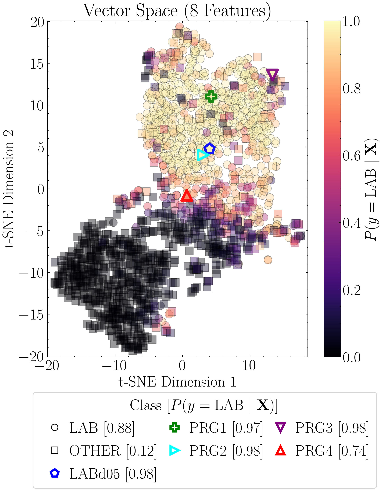
|

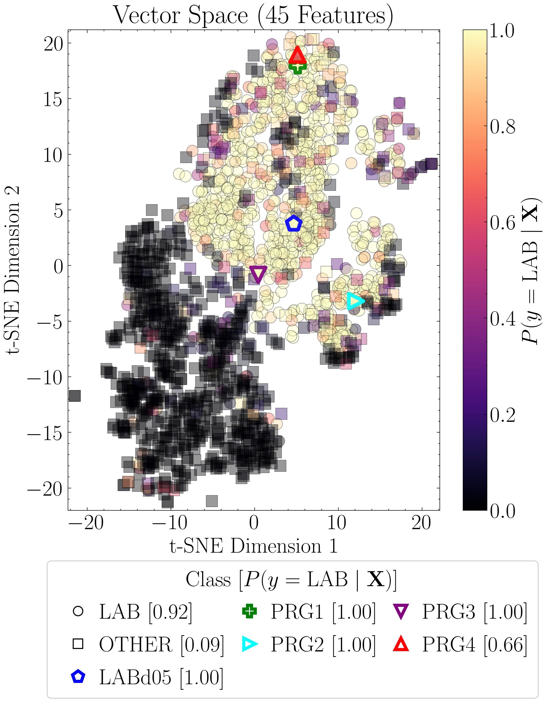
|

Next we re-do the t-SNE projections but now scale the points by the feature values, looking at the top three features. Each projection is accompanied by the Gaussian kernel density estimate (KDE) of that feature for LAB and OTHER, normalized to unit height, to summarize the class-wise distributions.

.. code-block:: python

	import re
	import numpy as np
	import pandas as pd
	from scipy.stats import gaussian_kde
	import matplotlib as mpl
	from matplotlib.lines import Line2D
	import matplotlib.pyplot as plt
	import scienceplots
	plt.style.use('science')
	plt.rcParams.update({'font.size': 21})

	# Where the training set files were saved
	nsig_path = 'nsigs/'

	# Load training data
	sig = 0.32
	df = pd.read_csv(f'{nsig_path}_Bw_training_set_nsig_{sig}')
	mask = np.where((df['area'] != -999) & np.isfinite(df['mag']) & np.isfinite(df['mag_err']))[0]
	blob_index = np.where(df['flag'].iloc[mask] == 1)[0]
	other_index = np.where(df['flag'].iloc[mask] == 0)[0]
	df_filtered = df.iloc[mask[np.concatenate((blob_index, other_index[:len(blob_index)]))]]

	# Load t-SNE projection data
	xgb_results = np.loadtxt('tsne_scatter_data_8_feats.txt', dtype=str)
	x = xgb_results[:, 0].astype(float)
	y = xgb_results[:, 1].astype(float)
	y_labels = xgb_results[:, 2]

	# For the labels
	special_objects = {
	    'NDWFS_J143410.9+331730': 'LABd05',
	    'NDWFS_J143512.2+351108': 'PRG1',
	    'NDWFS_J142623.0+351422': 'PRG2',
	    'NDWFS_J143412.7+332939': 'PRG3',
	    'NDWFS_J142653.1+343856': 'PRG4'
	}
	special_colors = ['blue', 'green', 'cyan', 'purple', 'red']
	special_markers = ['p', 'P', '>', 'v', '^']

	# Top features to show
	important_cols = ['mag', 'gini', 'covariance_eigval1']
	titles = [r'$B_W$ Mag', 'Gini Index', r'$\rm \log_{10}$($\lambda_1$) ($\rm arcsec^2$)']

	# Pix to arcsec conversion factor for NDWFS Bootes
	pix_conversion = 3.8961 
	pix_to_arcsec2 = pix_conversion ** 2

	def process_feature_array(values, col):
	    # To log-scale and convert to physical units
	    v = values.astype(float)
	    if col == 'covariance_eigval1':
	        v = v / pix_to_arcsec2
	        v = np.log10(v)
	    return v

	def process_single_value(val, col):
	    # To log-scale and convert to physical units (for confirmed LABs only)
	    t = float(val)
	    if col == 'covariance_eigval1':
	        t = t / pix_to_arcsec2
	        t = np.log10(t)
	    return t

	# Loop and plot each one separately
	for col_, title_ in zip(important_cols, titles):
	    
	    if col_ == 'mag':
	        cmap_to_use = 'coolwarm'
	    elif col_ == 'gini':
	        cmap_to_use = 'PiYG'
	    else:
	        cmap_to_use = 'viridis'

	    raw_feature_vals = np.array(df_filtered[col_])
	    feature_vals = process_feature_array(raw_feature_vals, col_)

	    lo, hi = np.percentile(feature_vals, [3, 97])
	    norm = mpl.colors.Normalize(vmin=lo, vmax=hi, clip=True)

	    marker_dict = {'Confirmed_Ly$\\alpha$': '*', 'LAB': 'o', 'OTHER': 's'}
	    label_dict = {'LAB': 'LAB', 'OTHER': 'OTHER'}

	    fig, (ax_kde, ax_tsne) = plt.subplots(ncols=2, figsize=(16, 8), gridspec_kw={'width_ratios': [1, 1.2]})

	    lab_mask = (y_labels == 'Confirmed_Ly$\\alpha$') | (y_labels == 'LAB')
	    other_mask = (y_labels == 'OTHER')

	    x_grid = np.linspace(lo, hi, 200)
	    density_lab = np.zeros_like(x_grid)
	    density_other = np.zeros_like(x_grid)

	    if np.sum(lab_mask) > 1:
	        dl = gaussian_kde(feature_vals[lab_mask])(x_grid)
	        if dl.max() > 0: density_lab = dl / dl.max()
	    if np.sum(other_mask) > 1:
	        do = gaussian_kde(feature_vals[other_mask])(x_grid)
	        if do.max() > 0: density_other = do / do.max()

	    ax_kde.plot(x_grid, density_lab, label='LAB', color='tab:blue', lw=2)
	    ax_kde.plot(x_grid, density_other, label='OTHER', color='tab:orange', lw=2)
	    ax_kde.set_xlabel(title_)
	    ax_kde.set_ylabel('Normalized Kernel Density Estimate')
	    ax_kde.legend(loc=('upper left' if col_ == 'covariance_eigval1' else 'upper right'), frameon=True, fancybox=True, handlelength=1)

	    for i, (obj_name, label_obj) in enumerate(special_objects.items()):
	        arr = df_filtered.loc[df_filtered['obj_name'] == obj_name, col_].values
	        if arr.size > 0:
	            sval = process_single_value(arr[0], col_)
	            color_special = mpl.cm.viridis(norm(sval))
	            ax_kde.plot(sval, 0, marker=special_markers[i], markersize=20,
	                        markerfacecolor=color_special, markeredgecolor=special_colors[i],
	                        linewidth=3.5, markeredgewidth=3., alpha=0.6)

	    cmap = plt.get_cmap(cmap_to_use)
	    for cls in np.unique(y_labels)[::-1]:

	        if cls == 'Confirmed_Ly$\\alpha$':
	            continue

	        cls_mask = (y_labels == cls)
	        ax_tsne.scatter(
	            x[cls_mask], y[cls_mask],
	            c=feature_vals[cls_mask],
	            cmap=cmap, norm=norm,
	            marker=marker_dict.get(cls, 'o'),
	            s=120, edgecolor='black', linewidth=0.5, alpha=0.9
	        )

	    for i, (obj_name, label_obj) in enumerate(special_objects.items()):
	        tsne_mask = (np.array(xgb_results[:, 3]) == obj_name)
	        if tsne_mask.any():
	            ax_tsne.scatter(
	                x[tsne_mask], y[tsne_mask],
	                c=feature_vals[tsne_mask],
	                cmap=cmap, norm=norm,
	                marker=special_markers[i],
	                s=200, edgecolor=special_colors[i],
	                linewidth=3.5, alpha=0.9
	            )

	    sm = mpl.cm.ScalarMappable(norm=norm, cmap=cmap)
	    sm.set_array([])
	    cbar = fig.colorbar(sm, ax=ax_tsne, extend='both')

	    if col_ == 'mag':
	        cbar.ax.invert_yaxis()

	    cbar.set_label(title_)

	    ax_tsne.set_xlabel("t-SNE Dimension 1")
	    ax_tsne.set_ylabel("t-SNE Dimension 2")
	    ax_tsne.set_xlim(-20, 18.5)
	    ax_tsne.set_ylim(-20.1, 20.1)

	    tsne_handles, tsne_labels = [], []
	    for cls in np.unique(y_labels)[::-1]:

	        if cls == 'Confirmed_Ly$\\alpha$':
	            continue

	        cls_mask = (y_labels == cls)
	        mean_val = np.mean(feature_vals[cls_mask]) if np.any(cls_mask) else np.nan
	        m = marker_dict.get(cls, 'o')
	        line = Line2D([], [], marker=m, color='black', markerfacecolor='none', linestyle='None', linewidth=1, markersize=np.sqrt(200))
	        tsne_handles.append(line)
	        tsne_labels.append(f"{label_dict.get(cls, cls)} [{mean_val:.2f} (Avg.)]")

	    for i, (obj_name, label_obj) in enumerate(special_objects.items()):
	        tsne_mask = (np.array(xgb_results[:, 3]) == obj_name)
	        if tsne_mask.any():
	            val_for_obj = feature_vals[tsne_mask][0]
	            line = Line2D([], [], marker=special_markers[i], color=special_colors[i],
	                          markerfacecolor='none', markeredgewidth=3., linestyle='None',
	                          linewidth=1., markersize=np.sqrt(200))
	            tsne_handles.append(line)
	            tsne_labels.append(f"{label_obj} [{val_for_obj:.2f}]")

	    ncols = 4
	    row1_desired = ['OTHER', 'LABd05', 'PRG1', 'PRG2']
	    row2_desired = ['LAB', 'PRG3', 'PRG4']

	    def _base_name(lbl): return re.split(r'\s*\[', lbl)[0].strip()

	    name_to_idx = {}
	    for i, lbl in enumerate(tsne_labels):
	        nm = _base_name(lbl)
	        if nm not in name_to_idx:
	            name_to_idx[nm] = i

	    order_names, used = [], set()
	    for j in range(ncols):
	        if j < len(row1_desired): order_names.append(row1_desired[j])
	        if j < len(row2_desired): order_names.append(row2_desired[j])

	    ordered_handles, ordered_labels = [], []
	    for nm in order_names:
	        if nm in name_to_idx and nm not in used:
	            k = name_to_idx[nm]
	            ordered_handles.append(tsne_handles[k])
	            ordered_labels.append(tsne_labels[k])
	            used.add(nm)

	    fig.legend(handles=ordered_handles, labels=ordered_labels,
	               loc='upper center', ncol=ncols, frameon=True, fancybox=True,
	               columnspacing=0.6, handletextpad=0.3,
	               title=fr'Feature Distribution [{title_}]',
	               bbox_to_anchor=(0.5, 1.08))

	    plt.savefig(f'kde_tsne_new_8_{col_}.png', dpi=300, bbox_inches='tight')
	    plt.show()
	    plt.clf()
	    plt.close()

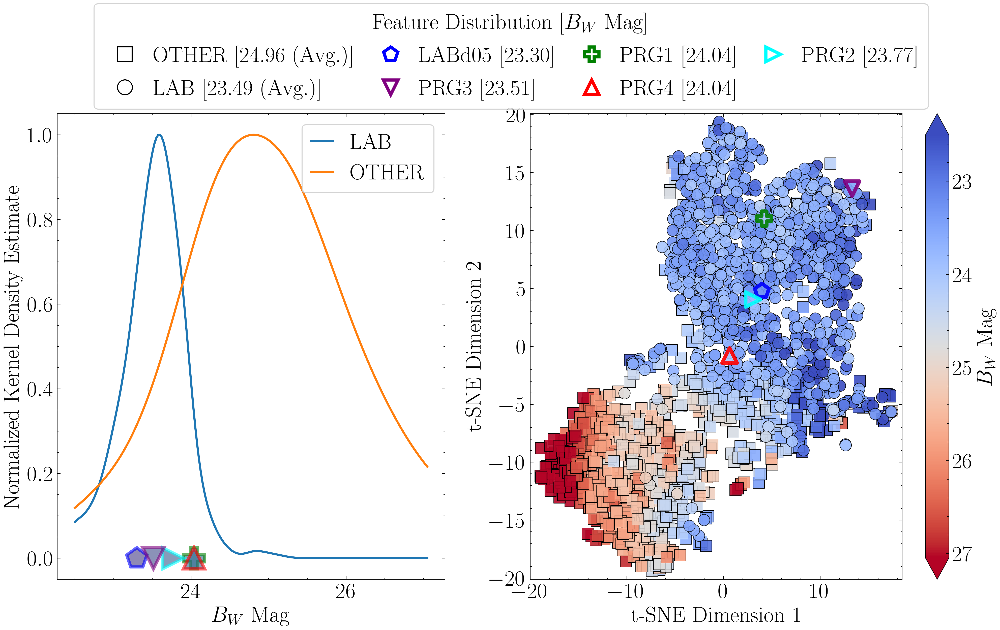
|

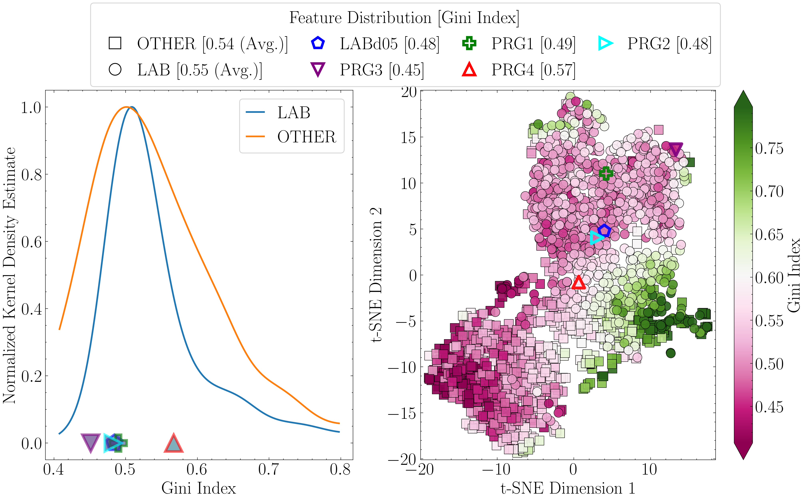
|

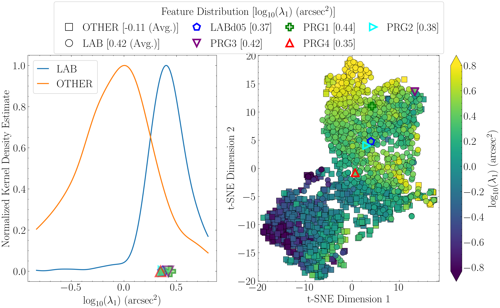
|

XGBoost Model Performance
-----------

We now assess the performance of the three XGBoost models. First we make a ROC Curve, assessed via 10-Fold CV.

.. code-block:: python

	import numpy as np
	import pandas as pd
	from sklearn.model_selection import StratifiedKFold
	from sklearn.metrics import roc_curve, auc
	from pyBIA import ensemble_model, data_processing
	import matplotlib.pyplot as plt
	import scienceplots
	plt.style.use('science')
	plt.rcParams.update({'font.size': 21})

	# Where the training set files were saved
	nsig_path = 'nsigs/'

	sig = 0.32 #The optimal sig threshold to apply as per Figure 2
	df = pd.read_csv(f'{nsig_path}_Bw_training_set_nsig_{sig}')
	hu_cols = ['Hu1', 'Hu2', 'Hu3', 'Hu4', 'Hu5', 'Hu6', 'Hu7']
	df[hu_cols] = df[hu_cols].apply(data_processing.signed_log_transform)

	# Omit any non-detections
	mask = np.where((df['area'] != -999) & np.isfinite(df['mag']) & np.all(np.isfinite(df[[f'Hu{i}' for i in range(1, 8)]]), axis=1))[0]

	# Balance both classes to be of same size
	blob_index = np.where(df['flag'].iloc[mask] == 1)[0]
	other_index = np.where(df['flag'].iloc[mask] == 0)[0]
	df_filtered = df.iloc[mask[np.concatenate((blob_index, other_index[:len(blob_index)]))]]

	#These are the features to use, note that the catalog includes more than this!
	columns = [
	    'mag', 'mag_err',
	    'M00', 'M10', 'M01', 'M20', 'M11', 'M02', 'M30', 'M21', 'M12', 'M03',
	    'mu20', 'mu11', 'mu02', 'mu30', 'mu21', 'mu12', 'mu03',
	    'G10', 'G01', 'G20', 'G11', 'G02', 'G30', 'G21', 'G12', 'G03',
	    'Hu1', 'Hu2', 'Hu3', 'Hu4', 'Hu5', 'Hu6', 'Hu7',
	    'L00', 'L10', 'L01', 'L20', 'L11', 'L02', 'L30', 'L21', 'L12', 'L03',
	    'area', 'covar_sigx2', 'covar_sigy2', 'covar_sigxy', 'covariance_eigval1', 'covariance_eigval2',
	    'cxx', 'cxy', 'cyy', 'eccentricity', 'ellipticity', 'elongation',
	    'equivalent_radius', 'fwhm', 'gini', 'orientation', 'perimeter',
	    'semimajor_sigma', 'semiminor_sigma', 'max_value', 'min_value'
	]

	df_names = np.array(df_filtered.obj_name)

	# Training data arrays
	data_x, data_y = np.array(df_filtered[columns]), np.array(df_filtered['flag'])

	# This is the base model, no hyperparameter optimization, uses all the features
	clf = 'xgb' # The classification model that will be trined
	impute = False # Whether to impute missing values (NaN)
	base_model = ensemble_model.Classifier(data_x, data_y, clf=clf, impute=impute)
	base_model.create()
	BASE_M = base_model.model

	# This is the optimized model trained with 8 features
	xgboost_8_model = ensemble_model.Classifier(data_x, data_y, clf=clf, impute=impute)
	xgboost_8_model.load('ensemble_model_xgb_boruta_xgb')
	OPT_M1 = xgboost_8_model.model

	# This is the optimized model trained with 45 features
	xgboost_45_model = ensemble_model.Classifier(data_x, data_y, clf=clf, impute=impute)
	xgboost_45_model.load('ensemble_model_xgb_boruta_rf')
	OPT_M2 = xgboost_45_model.model

	# Plot ROC Curves with 10-fold cross-validation 

	# Define a dictionary mapping model names to model objects.
	models = {
	    "Base XGBoost": BASE_M,
	    "XGBoost-8": OPT_M1,
	    "XGBoost-45": OPT_M2,
	}

	# Choose different colors and line styles for each model.
	model_colors = {
	    "Base XGBoost": "blue",
	    "XGBoost-8": "green",
	    "XGBoost-45": "orange",
	}

	model_linestyles = {
	    "Base XGBoost": "-",
	    "XGBoost-8": "--",
	    "XGBoost-45": "-.",
	}

	# Set up 10-fold cross-validation
	opt_cv = 10 # Will perform 10-fold cross validation
	SEED_NO = 1909 # Random seed for the CV

	cv = StratifiedKFold(n_splits=opt_cv, shuffle=True, random_state=SEED_NO)

	# Define a common grid of false positive rates at which we will interpolate the TPR
	mean_fpr = np.linspace(0, 1, 100)

	plt.figure(figsize=(8, 8))

	# Loop over the three models.
	for model_name, model in models.items():
	    
	    # To store TPR and corresponding AUC
	    tprs, aucs = [], []
	    
	    # Loop over the CV folds.
	    for train_idx, test_idx in cv.split(data_x, data_y):

	        # Fit the model on the training fold
	        model.fit(data_x[train_idx], data_y[train_idx])
	        
	        # Get the predicted probabilities for the positive class on the test fold
	        y_proba = model.predict_proba(data_x[test_idx])[:, 1]
	        
	        # Compute the ROC curve and AUC for this fold
	        fpr, tpr, _ = roc_curve(data_y[test_idx], y_proba)
	        fold_auc = auc(fpr, tpr)
	        aucs.append(fold_auc)
	        
	        # Interpolate the TPR at the mean_fpr points
	        interp_tpr = np.interp(mean_fpr, fpr, tpr)
	        interp_tpr[0] = 0.0 # Ensure the curve starts at 0
	        tprs.append(interp_tpr)
	    
	    # Compute the mean and std TPR values across folds.
	    mean_tpr = np.mean(tprs, axis=0)
	    mean_tpr[-1] = 1.0 # To ensure the curve ends at 1
	    std_tpr = np.std(tprs, axis=0)

	    # Compute the mean and std AUC.
	    mean_auc = np.mean(aucs) # average of the per‑fold AUCs
	    std_auc = np.std(aucs)
	    
	    # Plot the mean ROC curve for this model.
	    plt.plot(
	        mean_fpr,
	        mean_tpr,
	        color=model_colors[model_name],
	        linestyle=model_linestyles[model_name],
	        lw=1.6,
	        label=fr"{model_name} (AUC = {mean_auc:0.4f} $\pm$ {std_auc:0.4f})"
	    )

	    # Plot the standard deviation shaded region
	    tpr_upper = np.minimum(mean_tpr + std_tpr, 1)
	    tpr_lower = np.maximum(mean_tpr - std_tpr, 0)
	    plt.fill_between(mean_fpr, tpr_lower, tpr_upper, color=model_colors[model_name], alpha=0.2)

	plt.xlim([0, 1]); plt.ylim([0, 1])
	plt.xlabel("False Positive Rate")
	plt.ylabel("True Positive Rate")
	plt.title("XGBoost Model Comparison")
	plt.legend(loc="center right", handlelength=1, frameon=True, fancybox=True)
	plt.savefig('new_rocs.png', dpi=300, bbox_inches='tight')
	plt.show()

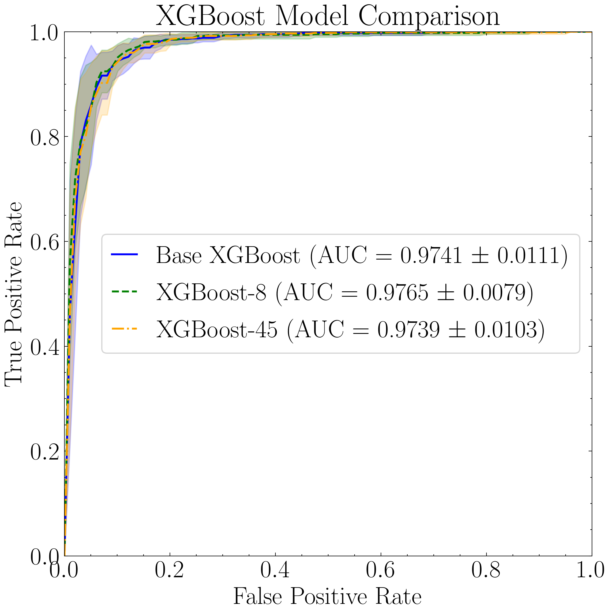
|

Next we generate the eCDFs to assess how many positive detections each model yields as a function of probability prediction, both for the candidate catalogs (saved before, the positively classified objects in the NDWFS Bootes field) and the LAB training instances that were also positively classified.

.. code-block:: python

	import numpy as np
	import pandas as pd
	from pyBIA import data_processing
	import matplotlib.pyplot as plt
	import scienceplots
	plt.style.use("science")
	plt.rcParams.update({"font.size": 21})

	# First load the master catalog and count how many objects there are (for normalization)
	other_all = pd.read_csv('Other_Catalog_Master_0.32')

	# Omit non-detections and record total number of detections 
	mask = np.where((other_all['area'] != -999) & np.isfinite(other_all['mag']) & np.all(np.isfinite(other_all[[f'Hu{i}' for i in range(1, 8)]]), axis=1))[0]
	total_no = len(mask)

	def ecdf_common(data, x_grid):
	    """Compute the eCDF evaluated on a common grid."""
	    sorted_data = np.sort(data)
	    # For each value in the common grid, count the fraction of data points <= x.
	    counts = np.searchsorted(sorted_data, x_grid, side='right')
	    return counts / len(sorted_data)

	# Load the candidate catalogs and LOO analysis results saved before

	# Model 1: Baseline XGBoost
	# Candidate probabilities
	df_model1 = pd.read_csv('candidate_catalog_base.csv')
	probas_cand_m1 = np.array(df_model1.proba)

	# Load results from Leave-one-Out analysis
	LoO_LAB = np.loadtxt('LoO_LAB', dtype=str)
	LoO_Confirmed_LAB = np.loadtxt('LoO_Confirmed_LAB', dtype=str)

	# For Baseline XGBoost, probas saved in second column
	train_m1 = np.r_[LoO_LAB[:, 1].astype(float), LoO_Confirmed_LAB[:, 1].astype(float)]

	# Model 2: XGBoost-8
	# Candidate probabilities
	df_model2 = pd.read_csv('candidate_catalog_optimized_xgboost_8.csv')
	probas_cand_m2 = np.array(df_model2.proba)

	# For XGBoost-8, probas saved in third column
	train_m2 = np.r_[LoO_LAB[:, 2].astype(float), LoO_Confirmed_LAB[:, 2].astype(float)]

	# Model 3: XGBoost-45
	# Candidate probabilities
	df_model3 = pd.read_csv('candidate_catalog_optimized_xgboost_45.csv')
	probas_cand_m3 = np.array(df_model3.proba)

	# For XGBoost-45, probas saved in third column
	train_m3 = np.r_[LoO_LAB[:, 3].astype(float), LoO_Confirmed_LAB[:, 3].astype(float)]

	# Define a common x-grid (from 0.5 to 1.0) for all eCDF curves.
	common_x = np.linspace(0.5, 1.0, 500)

	# Compute eCDF for Candidates
	ecdf_m1_cand = ecdf_common(probas_cand_m1, common_x)
	ecdf_m2_cand = ecdf_common(probas_cand_m2, common_x)
	ecdf_m3_cand = ecdf_common(probas_cand_m3, common_x)

	# Compute eCDF for LAB training samples (which already include confirmed values)
	ecdf_m1_lab = ecdf_common(train_m1, common_x)
	ecdf_m2_lab = ecdf_common(train_m2, common_x)
	ecdf_m3_lab = ecdf_common(train_m3, common_x)

	# Set a common color for the curves
	common_color =  ['blue', 'green', 'orange']

	# Plot the Candidates eCDF
	fig1, ax1 = plt.subplots(figsize=(8, 8))

	# Plot using different line styles for clarity.
	ax1.plot(common_x, ecdf_m1_cand, linestyle='-',  color=common_color[0], lw=1.6,
	         label=f'Base XGBoost (n={len(probas_cand_m1):,}, {np.round(100*len(probas_cand_m1)/total_no,1)}\\%)')
	ax1.plot(common_x, ecdf_m2_cand, linestyle='--', color=common_color[1], lw=1.6,
	         label=f'XGBoost-8 (n={len(probas_cand_m2):,}, {np.round(100*len(probas_cand_m2)/total_no,1)}\\%)')
	ax1.plot(common_x, ecdf_m3_cand, linestyle=':',  color=common_color[2], lw=1.6,
	         label=f'XGBoost-45 (n={len(probas_cand_m3):,}, {np.round(100*len(probas_cand_m3)/total_no,1)}\\%)')

	ax1.set_xlabel(r"$P(y =$ LAB $\mid \mathbf{{X}})$")
	ax1.set_ylabel('Empirical Cumulative Distribution Function')# (ECDFs)')
	ax1.set_title('Classification Results: Initial Candidates')
	ax1.legend(loc='upper left', frameon=True, fancybox=True, handlelength=1.8)
	plt.tight_layout()
	plt.savefig('Candidates_eCDF.png', bbox_inches='tight', dpi=300)
	plt.show()

	# Plot the LAB eCDF
	fig2, ax2 = plt.subplots(figsize=(8, 8))

	# Plot the LAB eCDF curves for the three models.
	ax2.plot(common_x, ecdf_m1_lab, linestyle='-',  color=common_color[0], lw=1.6,
	         label=f'Base XGBoost (n={len(np.where(train_m1>=0.5)[0])}, {np.round(100*len(np.where(train_m1>=0.5)[0])/859,1)}\\%)')
	ax2.plot(common_x, ecdf_m2_lab, linestyle='--', color=common_color[1], lw=1.6,
	         label=f'XGBoost-8 (n={len(np.where(train_m2>=0.5)[0])}, {np.round(100*len(np.where(train_m2>=0.5)[0])/859,1)}\\%)')
	ax2.plot(common_x, ecdf_m3_lab, linestyle=':',  color=common_color[2], lw=1.6,
	         label=f'XGBoost-45 (n={len(np.where(train_m3>=0.5)[0])}, {np.round(100*len(np.where(train_m3>=0.5)[0])/859,1)}\\%)')

	ax2.set_xlabel(r"$P(y =$ LAB $\mid \mathbf{X})$ (Leave-one-Out CV)")
	ax2.set_ylabel('Empirical Cumulative Distribution Function')# (ECDFs)')
	ax2.set_title('LAB Classification Analysis')
	#ax2.set_xlim(0.5, 1.0)
	ax2.legend(loc='upper left', frameon=True, fancybox=True, handlelength=1.8)
	plt.tight_layout()
	plt.savefig('LAB_eCDF.png', bbox_inches='tight', dpi=300)
	plt.show()

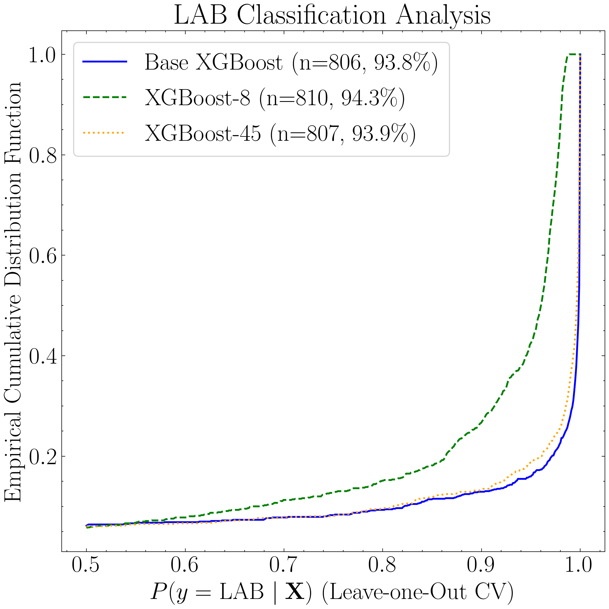
|

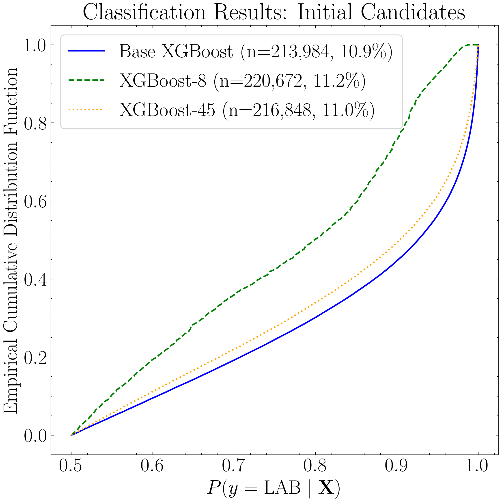
|

XGBoost Classification Analysis
-----------

Now that we have determined that in this context an XGBoost model trained with 8 features performs best, we proceed with analysing what drives the predictions. Here we plot the classification output as a function of the top three features.

Since the previous candidate catalogs only saved LAB objects, we need to re-run the classification to capture non-LAB objects. The original LOO analysis code missed these non-LAB sources from the ~2M original entries, so the new code reconstructs this catalog and concatenates at the end because the master catalog omits the negative training class.

.. code-block:: python

	# Only need to do this for the model we chose, XGBoost-8
	import numpy as np
	import pandas as pd
	from pyBIA import ensemble_model, data_processing

	# Where the training set files were saved
	nsig_path = 'nsigs/'

	# Load the original training data from the optimal nsig
	sig = 0.32 #The optimal sig threshold to apply as per Figure 2
	df = pd.read_csv(f'{nsig_path}_Bw_training_set_nsig_{sig}')                                                                                                                                                                                                                         

	# Log-transform the Hu moments
	hu_cols = ['Hu1', 'Hu2', 'Hu3', 'Hu4', 'Hu5', 'Hu6', 'Hu7']
	df[hu_cols] = df[hu_cols].apply(data_processing.signed_log_transform)

	# Omit any non-detections
	mask = np.where((df['area'] != -999) & np.isfinite(df['mag']) & np.all(np.isfinite(df[[f'Hu{i}' for i in range(1, 8)]]), axis=1))[0]

	# Balance both classes to be of same size
	blob_index = np.where(df['flag'].iloc[mask] == 1)[0]
	other_index = np.where(df['flag'].iloc[mask] == 0)[0]
	df_filtered = df.iloc[mask[np.concatenate((blob_index, other_index[:len(blob_index)]))]]

	#These are the features to use, note that the catalog includes more than this!
	columns = [
	    'mag', 'mag_err',
	    'M00', 'M10', 'M01', 'M20', 'M11', 'M02', 'M30', 'M21', 'M12', 'M03',
	    'mu20', 'mu11', 'mu02', 'mu30', 'mu21', 'mu12', 'mu03',
	    'G10', 'G01', 'G20', 'G11', 'G02', 'G30', 'G21', 'G12', 'G03',
	    'Hu1', 'Hu2', 'Hu3', 'Hu4', 'Hu5', 'Hu6', 'Hu7',
	    'L00', 'L10', 'L01', 'L20', 'L11', 'L02', 'L30', 'L21', 'L12', 'L03',
	    'area', 'covar_sigx2', 'covar_sigy2', 'covar_sigxy', 'covariance_eigval1', 'covariance_eigval2',
	    'cxx', 'cxy', 'cyy', 'eccentricity', 'ellipticity', 'elongation',
	    'equivalent_radius', 'fwhm', 'gini', 'orientation', 'perimeter',
	    'semimajor_sigma', 'semiminor_sigma', 'max_value', 'min_value'
	]

	# Training data arrays
	data_x, data_y = np.array(df_filtered[columns]), np.array(df_filtered['flag'])

	# This is the optimized model (XGBoost-8)
	clf = 'xgb' # The classification model 
	impute = False # Will not impute NaN values, as they should not be present after masking non-detections
	optimized_model = ensemble_model.Classifier(data_x, data_y, clf=clf, impute=impute)
	optimized_model.load('ensemble_model_xgb_boruta_xgb')

	# Load the catalog containing all 2 million other objects, extracted using sig=0.32
	other_all = pd.read_csv('Other_Catalog_Master_0.32')

	# Remove the 859 OTHER objects that are present in the training set, we will assess these individually using LoO
	other_all = other_all[~other_all['obj_name'].isin(df_filtered['obj_name'])]

	# Log transform the Hu moments
	other_all[hu_cols] = other_all[hu_cols].apply(data_processing.signed_log_transform)

	# Omit non-detections
	mask = np.where((other_all['area'] != -999) & np.isfinite(other_all['mag']) & np.all(np.isfinite(other_all[[f'Hu{i}' for i in range(1, 8)]]), axis=1))[0]

	other_all = other_all.iloc[mask]

	# Create the data_x array
	other_data_x = np.array(other_all[columns])

	# Predict all samples to create a candidates catalog
	predictions_optimized_model = optimized_model.predict(other_data_x)

	# Select Non-LAB detections (flag = 0)
	index_optimized = np.where(predictions_optimized_model[:,0] == 0)[0]

	# Index the catalog to select only the positive detections
	candidate_catalog_optimized = other_all.iloc[index_optimized]

	# Save the probability predictions as a new columns (note these are probas that object is NOT an LAB)
	candidate_catalog_optimized['proba'] = predictions_optimized_model[index_optimized][:,1]

	# Repeat the same LoO process but evaluate the OTHER training for fair assessment of these objects
	# Positive detections from this LoO will be added to the candidates catalog that was created above

	# Remove one LAB object as this time the OTHER class will be cross-validated using LoO
	other_training = df_filtered[df_filtered.flag == 0]
	LAB_training =  df_filtered[df_filtered.flag == 1].iloc[1:]

	# To store the probas of all LAB objects as well as their catalog names
	other_optimized_probas, names = [],[] #other_base_probas

	#Leave-one-Out cross-validating the OTHER class
	for i in range(len(other_training)):
		print(f"{i+1} of {len(other_training)}")
		# This will be the individual OTHER sample to assess
		leave_one = np.array(other_training[columns].iloc[i])
		# Removing this validation sample from the overall OTHER training bag
		remaining = np.delete(np.array(other_training[columns]), i, axis=0)
		# Setting the new training data
		data_x = np.r_[remaining, np.array(LAB_training[columns])]
		data_y = np.r_[[0]*len(remaining), [1]*len(LAB_training)]
		# Training the new optimized model
		new_optimized_model = optimized_model.model.fit(data_x[:,optimized_model.feats_to_use], data_y)
		# Assess the left-out OTHER sample using the base and optimized model
		proba_optimized = new_optimized_model.predict_proba(leave_one[optimized_model.feats_to_use].reshape(1,-1))
		# Save only the probability prediction that the object is LAB
		other_optimized_probas.append(float(proba_optimized[:,1]))
		names.append(other_training.obj_name.iloc[i])

	indices = []

	index = np.where(np.array(other_optimized_probas) < 0.5)[0] 
	for name in np.array(names)[index]:
		indices.append(np.where(other_training.obj_name == name)[0][0])

	# Add to the master optimized candidate catalog
	df_filtered_optimized = other_training.iloc[indices]
	df_filtered_optimized['proba'] = 1 - np.array(other_optimized_probas)[index] # Inverse because this catalog contains the proba of it NOT being an LAB
	candidate_catalog_optimized = pd.concat([candidate_catalog_optimized, df_filtered_optimized], ignore_index=True)

	# Save candidate catalogs
	candidate_catalog_optimized.to_csv('non_candidate_catalog_xgboost_8.csv')

This catalog of non-LAB candidates (i.e., classified as OTHER) can be `downloaded here <https://drive.google.com/file/d/12d4ijXq55P6cVxFuoLXAlQDATUmZSRN_/view?usp=sharing>`_.

In conjunction with the candidate catalog saved before we can now assess how the feature values influces the XGBoost model classification.

.. code-block:: python

	import numpy as np
	import pandas as pd
	import matplotlib.pyplot as plt
	import scienceplots  
	plt.style.use("science")
	plt.rcParams.update({"font.size": 21})

	# Candidate probabilities (candidate catalog first)
	initial_candidates1 = pd.read_csv('candidate_catalog_optimized_xgboost_8.csv')

	# Non-candidate catalog, so invert probabilities since this contains probabiliy of being OTHER
	initial_candidates2 = pd.read_csv('non_candidate_catalog_xgboost_8.csv')
	initial_candidates2['proba'] = 1 - initial_candidates2['proba']

	# Combine candidates and non-candidates
	initial_candidates = pd.concat([initial_candidates1,initial_candidates2])

	initial_candidates_names = np.array(initial_candidates.obj_name)
	initial_candidates_probas = np.array(initial_candidates.proba)

	initial_candidates_mag = np.array(initial_candidates.mag)
	initial_candidates_gini = np.array(initial_candidates.gini)
	initial_candidates_eigval1 = np.array(initial_candidates.covariance_eigval1)

	# LAB candidate probabilities from LOOCV, only need the results from XGBoost-8 (third column)
	confirmed = np.loadtxt('LoO_Confirmed_LAB', dtype=str)
	confirmed_names_PRG = confirmed[:, 0]
	confirmed_probas = confirmed[:, 2].astype(float)

	other_LAB = np.loadtxt('LoO_LAB', dtype=str)
	other_LAB_names = other_LAB[:,0]
	other_LAB_probas = other_LAB[:, 2].astype(float)

	# The confirmed LABs in our sample
	confirmed_names = [
	    'NDWFS_J143410.9+331730',
	    'NDWFS_J143512.2+351108',
	    'NDWFS_J142623.0+351422',
	    'NDWFS_J143412.7+332939',
	    'NDWFS_J142653.1+343856'
	]

	# Load the training data

	# Where the training set files were saved
	nsig_path = 'nsigs/'

	sig = 0.32 #The optimal sig threshold to apply as per Figure 2
	df = pd.read_csv(f'{nsig_path}_Bw_training_set_nsig_{sig}')

	indices_confirmed = []
	for i in range(len(confirmed_names)):
	    index = np.where(df.obj_name == confirmed_names[i])[0]
	    indices_confirmed.append(index)

	indices_confirmed = np.hstack(indices_confirmed)
	confirmed_mag = np.array(df.mag.iloc[indices_confirmed])
	confirmed_gini = np.array(df.gini.iloc[indices_confirmed])
	confirmed_eigval1 = np.array(df.covariance_eigval1.iloc[indices_confirmed])

	indices_LAB = []
	for i in range(len(other_LAB_names)):
	    index = np.where(df.obj_name == other_LAB_names[i])[0]
	    indices_LAB.append(index)

	indices_LAB = np.hstack(indices_LAB)
	LAB_mag = np.array(df.mag.iloc[indices_LAB])
	LAB_gini = np.array(df.gini.iloc[indices_LAB])
	LAB_eigval1 = np.array(df.covariance_eigval1.iloc[indices_LAB])

	# Both distributions will have same number of bins to ensure equal bin width
	no_bins = int(np.sqrt(len(df))) 

	for property_to_plot in ['mag', 'gini', 'covariance_eigval1']:

	    pix_conversion = 3.8961 # NDWFS survey pixel-per-arcsecond 

	    # Map the chosen property to the corresponding arrays
	    if property_to_plot == 'mag':
	        prop_init = initial_candidates_mag.copy()
	        prop_LAB = LAB_mag.copy()
	        prop_confirmed = confirmed_mag.copy()
	    elif property_to_plot == 'gini':
	        prop_init = initial_candidates_gini.copy()
	        prop_LAB = LAB_gini.copy()
	        prop_confirmed = confirmed_gini.copy()
	    elif property_to_plot == 'covariance_eigval1':
	        prop_init = initial_candidates_eigval1.copy() / pix_conversion**2
	        prop_LAB = LAB_eigval1.copy() / pix_conversion**2
	        prop_confirmed = confirmed_eigval1.copy() / pix_conversion**2

	    # Figure showing histograms, only do it the first time in loop
	    if property_to_plot == 'mag':
	        fig_hist, ax_hist = plt.subplots(figsize=(8, 8))

	        # Histogram for initial candidates on main y-axis
	        bins_init = np.linspace(initial_candidates_probas.min(), initial_candidates_probas.max(), 50)
	        weights_init = np.ones_like(initial_candidates_probas) / len(initial_candidates_probas)
	        ax_hist.hist(initial_candidates_probas, bins=bins_init, weights=weights_init,
	                     histtype='step', color='Magenta', linewidth=1.6,
	                     label=f'Boötes Field Catalog ({len(initial_candidates_probas):,})')

	        ax_hist.set_ylabel('Fraction of Objects')

	        # Combine LAB and confirmed for LAB class histogram
	        prob_lab = np.concatenate([other_LAB_probas, confirmed_probas])
	        bins_lab = np.linspace(prob_lab.min(), prob_lab.max(), 50)
	        weights_lab = np.ones_like(prob_lab) / len(prob_lab)

	        ax_hist.hist(prob_lab, bins=bins_lab, weights=weights_lab,
	                          histtype='step', color='k', linewidth=1.6,
	                          label=f'LAB Class (n={len(prob_lab)})')

	        special_colors = ['blue', 'green', 'cyan', 'purple', 'red']  
	        special_markers = ['p', 'P', '>', "v", "^"]

	        for i in range(len(confirmed_probas)):
	            ax_hist.scatter(confirmed_probas[i], [0.01],
	                           color=special_colors[i % len(special_colors)], facecolors='none',
	                           s=250, label=np.array(confirmed_names_PRG)[i], linewidth=3.5, 
	                           edgecolor=special_colors[i % len(special_colors)], alpha=0.8, marker=special_markers[i])

	        ax_hist.axvline(x=0.9, color='grey', linestyle='--')

	        # Vertical text with rightward arrow
	        ax_hist.text(0.91, 0.43, r"Initial Candidates $\downarrow$", color='grey',
	                rotation=90, verticalalignment='center', horizontalalignment='left')

	        # Combine legends from both axes
	        lines1, labels1 = ax_hist.get_legend_handles_labels()
	        ax_hist.legend(lines1, labels1, loc='upper center', handlelength=0.7, frameon=True, fancybox=True)

	        ax_hist.set_title('XGBoost-8 Classification Analysis')

	        plt.tight_layout()
	        plt.savefig('hist_xgb.png', dpi=300, bbox_inches='tight')
	        plt.show()

	    # Figure showing the binned averages with shaded std error
	    fig_avg, ax_avg = plt.subplots(figsize=(8, 8))

	    # The candidates and non-candidates
	    bin_centers_init = (bins_init[:-1] + bins_init[1:]) / 2
	    avg_prop_init = []
	    std_prop_init = []
	    for i in range(len(bins_init) - 1):

	        mask_bin = (initial_candidates_probas >= bins_init[i]) & (initial_candidates_probas < bins_init[i+1])
	        
	        if np.sum(mask_bin) > 0:
	            avg_prop_init.append(np.mean(prop_init[mask_bin]))
	            std_prop_init.append(np.std(prop_init[mask_bin]))
	        else:
	            avg_prop_init.append(np.nan)
	            std_prop_init.append(np.nan)

	    avg_prop_init = np.array(avg_prop_init)
	    std_prop_init = np.array(std_prop_init)

	    ax_avg.plot(bin_centers_init, avg_prop_init, color='Magenta', lw=1.6, alpha=0.9, label=f'Boötes Field Catalog')
	    ax_avg.fill_between(bin_centers_init,
	                        avg_prop_init - std_prop_init,
	                        avg_prop_init + std_prop_init,
	                        color='Magenta', alpha=0.3)

	    # For the LAB sample, plotting individual points as open circles
	    ax_avg.scatter(other_LAB_probas, prop_LAB, color='k',
	                   facecolors='none', edgecolors='k', alpha=0.3,
	                   s=120, label=f'LAB Class')

	    # Scatter plot for confirmed objects
	    for i in range(len(confirmed_probas)):
	        ax_avg.scatter(confirmed_probas[i], prop_confirmed[i],
	                       color=special_colors[i % len(special_colors)], facecolors='none',
	                       s=200, label=np.array(confirmed_names_PRG)[i], linewidth=3.5, 
	                       edgecolor=special_colors[i % len(special_colors)], alpha=0.9, marker=special_markers[i])

	    ax_avg.set_xlabel(r"$P(y =$ LAB $\mid \mathbf{X})$") if property_to_plot == 'covariance_eigval1' else None

	    if property_to_plot == 'covariance_eigval1':
	        ax_avg.set_ylabel(r'$\lambda_1$ ($\rm arcsec^2$)')
	    elif property_to_plot == 'mag':
	        ax_avg.set_ylabel(r'$B_W$ Mag')
	    elif property_to_plot == 'gini':
	        ax_avg.set_ylabel('Gini Index')

	    ax_avg.axvline(x=0.9, color='grey', linestyle='--')

	    # Invert axis for magnitudes
	    if property_to_plot == 'mag':
	        ax_avg.invert_yaxis()
	        ax_avg.legend(loc='lower right', ncol=2, handlelength=0.7, frameon=True, fancybox=True)

	    plt.savefig(f'{property_to_plot}.png', dpi=300, bbox_inches='tight')
	    plt.show()

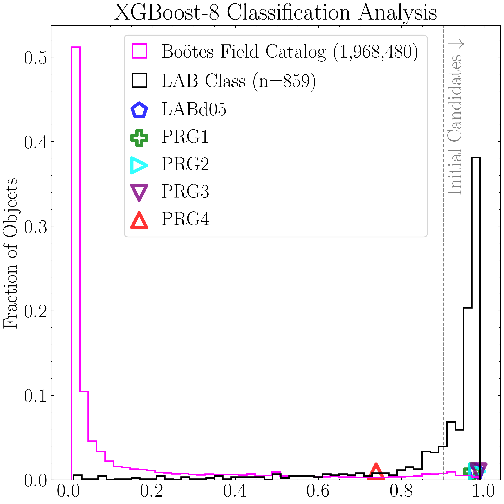
|

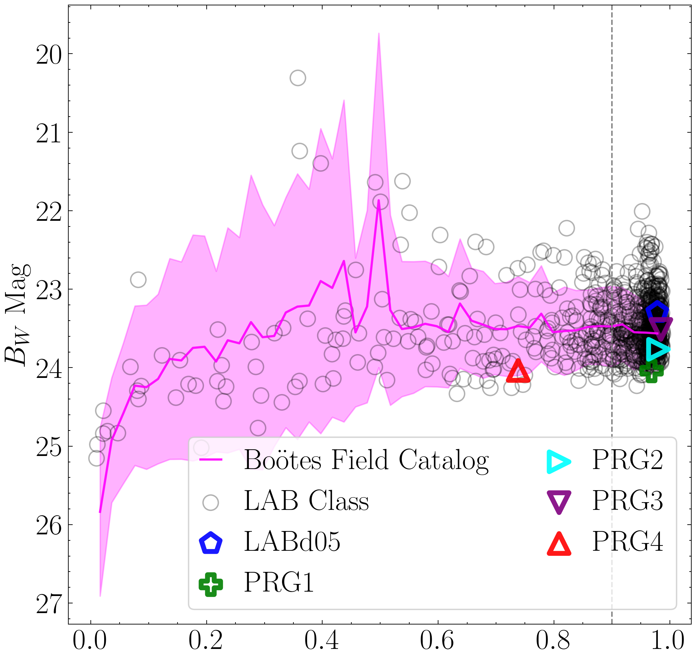
|

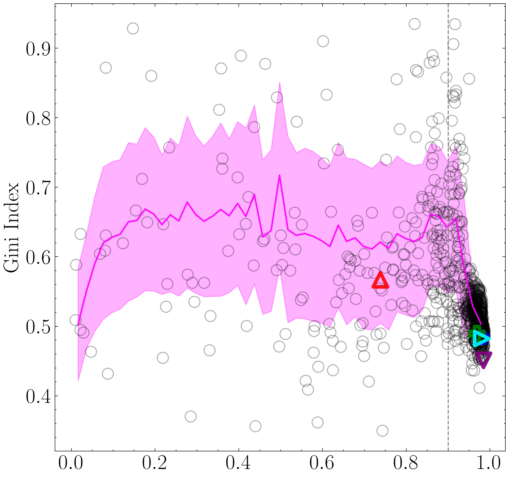
|

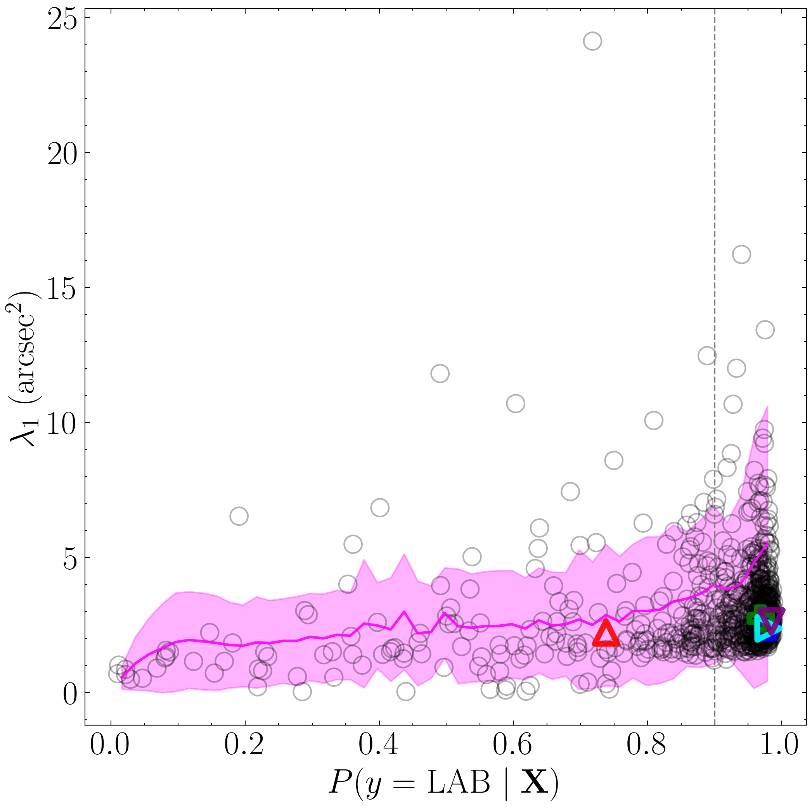
|

Image Extraction
-----------

To facilitate the training of the outlier detection algorithm as well as the CNN, we now extract the multi-band imaging of our candidates, which includes only those output with probability predictions greater than or equal to 0.9.

