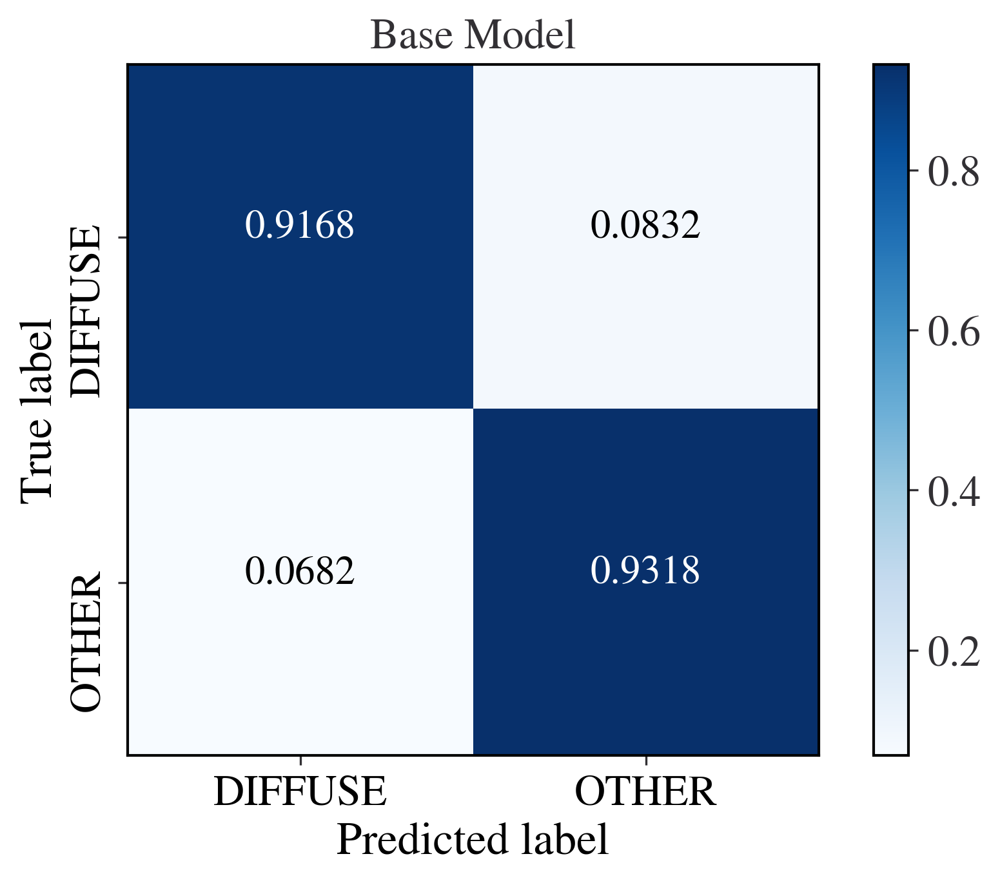
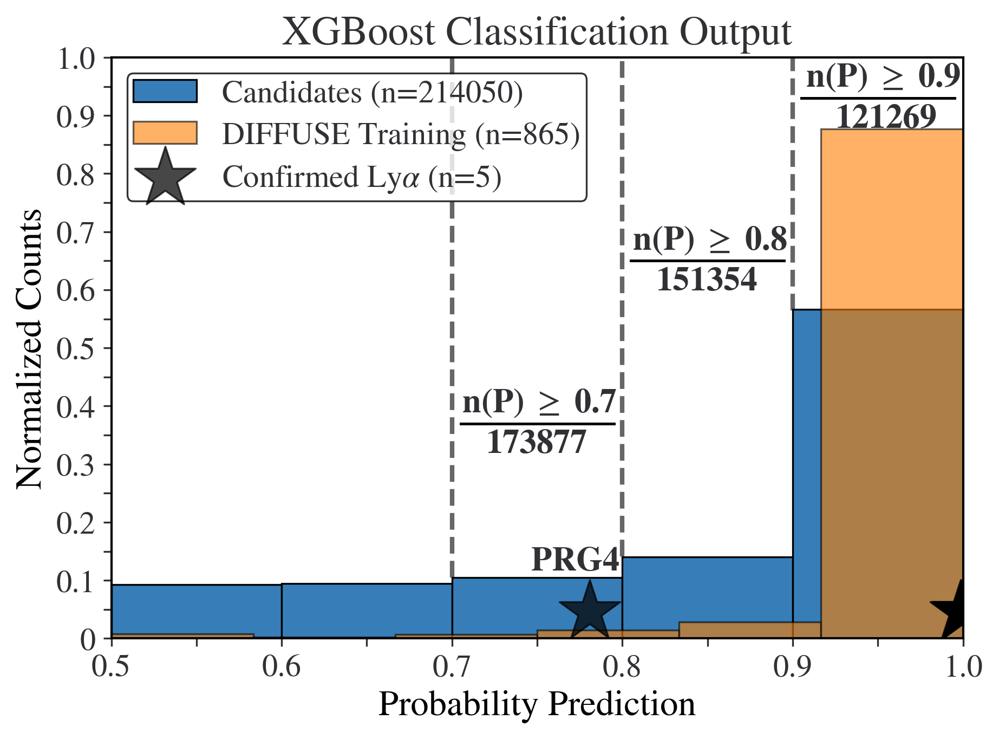
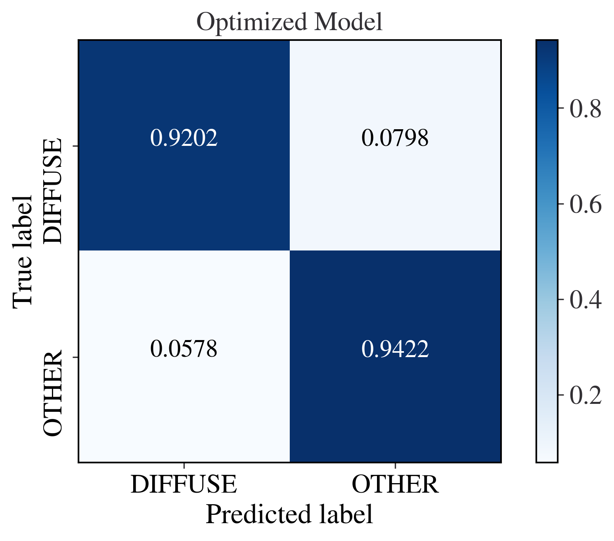
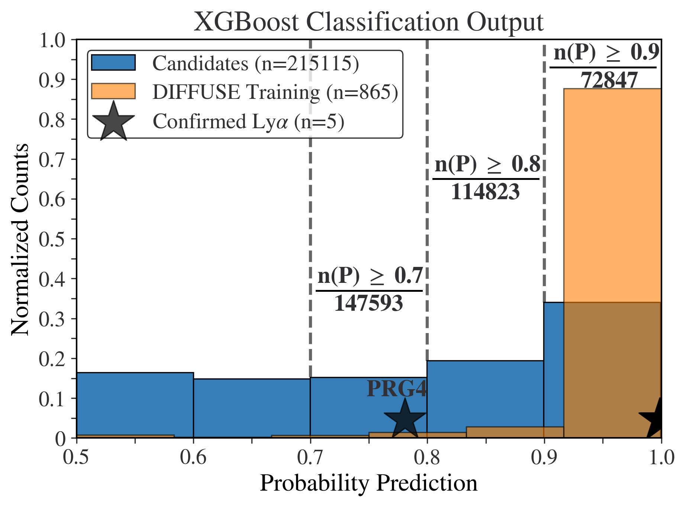

.. _godines_et_al:

Godines et al. 2025
===========

.. admonition:: Under Construction (last updated 2025-09-17)

   This documentation is still being written and may change frequently!

Image Segmentation
-----------

The multi-band data (Bw and R) for the five broadband-selected Lyman-alpha blobs (LABs) from `Prescott et al 2012 <https://ui.adsabs.harvard.edu/abs/2012ApJ...748..125P/abstract>`_ can be :download:`downloaded here <confirmed_LAB.npy>`.

The corresponding names for these five objects (as cataloged in the NDWFS Bootes Survey) can be :download:`downloaded here <confirmed_LAB_names.txt>`.

To visualize the affect the sigma detection threshold has on the image segmentation object, we can use the `plot_objects_segmentation <https://pybia.readthedocs.io/en/latest/autoapi/pyBIA/catalog/index.html#pyBIA.catalog.plot_objects_segmentation>`_ function available in the `catalog <https://pybia.readthedocs.io/en/latest/autoapi/pyBIA/catalog/index.html>`_ module.

.. code-block:: python

	import numpy as np
	from pyBIA import catalog

	# Load the five broadband-selected LABs from Prescott+12
	five_confirmed = np.load('confirmed_LAB.npy')

	# These are the Bw images, second axis contains the R-band data
	five_confirmed_bw = five_confirmed[:,:,:,0]

	# The corresponding cataloged names
	names = np.loadtxt('confirmed_LAB_names.txt', dtype=str)

	# Index the images of each LAB according to its cataloged name
	PRG1 = five_confirmed_bw[(names == 'NDWFS_J143512.2+351108')][0]
	PRG2 = five_confirmed_bw[(names == 'NDWFS_J142623.0+351422')][0]
	PRG3 = five_confirmed_bw[(names == 'NDWFS_J143412.7+332939')][0]
	PRG4 = five_confirmed_bw[(names == 'NDWFS_J142653.1+343856')][0]
	LABd05 = five_confirmed_bw[(names == 'NDWFS_J143410.9+331730')][0]

	# Plotting parameters
	median_bkg = 0 # Whether to subtract the background (set to None if background subtraction required)
	pix_conversion = 3.8961 # NDWFS survey pixel-per-arcsecond (for setting the axes)
	crop_size = 100 # Will crop the image to be of this size, otherwise set to None
	xpix = ypix = five_confirmed.shape[1] // 2 # Cropped image will be centered about these coords, if not cropping set to None

	# Figure parameters
	fig_title = r'Image Segmentation Example ($B_W$ Imaging)' # Figure suptitle
	sup_titles = ['LABd05', 'PRG1','PRG2','PRG3','PRG4'] # Title(s) above each individual panel
	cmap = 'viridis' # Colormap to use when displaying input image, the segmentation patches always use binary

	# Segm detection parameters
	sigma_vals = [0.1, 0.3, 0.7, 1.3] # The detection threshold(s) to apply
	deblend = False # Whether to deblend detected sources
	kernel_size = 21 # Gaussian filter kernel size used to convolve the data prior to segmentation
	npixels = 9 # Required number of pixels above the sigma threshold required to detect a source
	connectivity = 8 # Scheme to determine how pixels are grouped into a detected source, either 4 (touch along edges) or 8 (edges and corners)
	threshold = 10 # Will plot the closest object within a circular mask of radius 10 (pixels) within the center 
	savefig = True # Whether to save the figure, it False it will show instead
	savepath = 'segm_example_LAB.png' # Path (and/or filename) to save in/as

	# This function takes in up to 5 images, and plots the detection thresholds (up to 4 thresholds allowed)
	catalog.plot_objects_segmentation(
	    np.flip(LABd05, axis=0), 
	    np.flip(PRG1, axis=0), 
	    np.flip(PRG2, axis=0), 
	    np.flip(PRG3, axis=0), 
	    np.flip(PRG4, axis=0),
	    pix_conversion=pix_conversion, 
	    sigma_values=sigma_vals, 
	    deblend=deblend,
	    kernel_size=kernel_size, 
	    npixels=npixels, 
	    connectivity=connectivity, 
	    threshold=threshold,
	    titles=sup_titles, 
	    suptitle=fig_title, 
	    cmap=cmap,
	    xpix=xpix, 
	    ypix=ypix, 
	    size=crop_size, 
	    median_bkg=median_bkg, 
	    savefig=savefig, 
	    savepath='segm_example_LAB.png'
	    )

.. figure:: _static/segm_example_LAB.png
    :align: center
|
|

Training Morphological Catalog
-----------

To download the images used in this study please visit the `NoirLab <https://noirlab.edu/science/data-services/other/ndwfs>`_ website. We utilized the Bootes field data, from which there are 27 total subfields to download, in addition to the corresponding error maps. The data avaialable are in .fits format.

The training set objects used in our study can be :download:`downloaded here <training_set.csv>`_. This dataframe contains catalog information on the 866 LAB candidates compiled by `Prescott et al 2012 <https://ui.adsabs.harvard.edu/abs/2012ApJ...748..125P/abstract>`_, as well as 3200 randomly selected OTHER sources from the same dataset. 

The code below demonstrates how we conducted our detection threshold analysis. Using the catalog information available in the provided training set, we extracted the morphological features using image segmentation at different thresholds, between 0.1 to 1.5 standard deviations above the background rms.

.. code-block:: python

	import numpy as np 
	import pandas as pd
	from astropy.io import fits 
	from sklearn.model_selection import cross_validate
	from pyBIA import catalog, ensemble_model

	### Create the Data Files to Generate Figure 2 ###

	# This is where the subfield fits files are stored including the error maps
	data_path = 'NDWFS/fits_images/Bw_FITS/'
	data_error_path = 'NDWFS_Bootes/Error_Maps/Bw/'

	#866 LAB candidates from Prescott et al. (2012) plus 3200 randomly selected OTHER objects
	training_set = pd.read_csv('training_set.csv')

	# The training features will be computed using the following varying sigma thresholds
	sigs = np.around(np.arange(0.1, 1.51, 0.01), decimals=2)

	# Where the training set files will be saved
	nsig_path = 'nsigs/'

	deblend = False # Whether to deblend detected sources
	kernel_size = 21 # Gaussian filter kernel size used to convolve the data prior to segmentation
	npixels = 9 # Required number of pixels above the sigma threshold required to detect a source
	connectivity = 8 # Scheme to determine how pixels are grouped into a detected source, either 4 (touch along edges) or 8 (edges and corners)
	threshold = 10 # Will plot the closest object within a circular mask of radius 10 (pixels) within the center 
	invert = True # Flips the (x, y) input order when cropping sub-images

	for sig in sigs:
		print(sig)
		frame = [] #To store all 27 subfields
		for fieldname in np.unique(np.array(training_set['field_name'])):
			
			# Load the field data
			data_hdu, error_map = fits.open(data_path+fieldname+'_Bw_03_fix.fits'), fits.getdata(data_error_path+fieldname+'_Bw_03_rms.fits.fz')
			
			# Extract the data and corresponding ZP
			data_map, zeropoint, exptime = data_hdu[0].data, data_hdu[0].header['MAGZERO'], data_hdu[0].header['EXPTIME']
			
			# Select only the samples from this subfield
			subfield_index = np.where(training_set['field_name']==fieldname)[0]
			xpix, ypix = training_set[['xpix', 'ypix']].iloc[subfield_index].values.T
			objname, field, flag = training_set[['obj_name', 'field_name', 'flag']].iloc[subfield_index].values.T
			
			# Create the catalog object
			cat = catalog.Catalog(
				data_map, 
				error=error_map, 
				x=xpix, 
				y=ypix, 
				zp=zeropoint, 
				exptime=exptime, 
				nsig=sig, 
				flag=flag, 
				obj_name=objname, 
				field_name=field, 
				deblend=deblend, 
				kernel_size=kernel_size, 
				npixels=npixels, 
				connectivity=connectivity, 
				threshold=threshold, 
				invert=invert
				)

			# Generate the catalog and append the ``cat`` attribute to the frame list
			cat.create(save_file=False)
			frame.append(cat.cat)

		# Combine all 27 sub-catalogs into one master frame and save
		frame = pd.concat(frame, axis=0, join='inner')
		frame.to_csv(f'{nsig_path}_Bw_training_set_nsig_{sig}.csv', index=False)

These 141 nsig files are available for `download here <https://drive.google.com/file/d/12tg-bsbAVTNUWdL3yGadehPZMKOp52UJ/view?usp=sharing>`_.

Baseline Classification Models
-----------

The files generated above will be used to create baseline classifiers:

.. code-block:: python

	###  Read the Data Files ###
	import numpy as np 
	import pandas as pd
	from sklearn.model_selection import cross_validate, StratifiedKFold
	from pyBIA import data_processing, ensemble_model, optimization

	SEED_NO = 1909  # Fixed seed to initialize all random processes, including NumPy's RNG

	# The training features were computed using the following varying sigma thresholds
	sigs = np.around(np.arange(0.1, 1.51, 0.01), decimals=2)

	# Where the training set files were saved
	nsig_path = 'nsigs/'

	#These are the features to use, note that the catalog includes more than this!
	#Removing mu00 and G00 since these will be the same as M00
	#Also removing mu10 and mu01 since these should be zero but in practice they are not but are very small 
	#due to floating-point precision errors and minor asymmetries in the image; thus contribute little meaningful variance for classification.
	columns = [
	    'mag', 'mag_err',
	    'M00', 'M10', 'M01', 'M20', 'M11', 'M02', 'M30', 'M21', 'M12', 'M03',
	    'mu20', 'mu11', 'mu02', 'mu30', 'mu21', 'mu12', 'mu03',
	    'G10', 'G01', 'G20', 'G11', 'G02', 'G30', 'G21', 'G12', 'G03',
	    'Hu1', 'Hu2', 'Hu3', 'Hu4', 'Hu5', 'Hu6', 'Hu7',
	    'L00', 'L10', 'L01', 'L20', 'L11', 'L02', 'L30', 'L21', 'L12', 'L03',
	    'area', 'covar_sigx2', 'covar_sigy2', 'covar_sigxy', 'covariance_eigval1', 'covariance_eigval2',
	    'cxx', 'cxy', 'cyy', 'eccentricity', 'ellipticity', 'elongation',
	    'equivalent_radius', 'fwhm', 'gini', 'orientation', 'perimeter',
	    'semimajor_sigma', 'semiminor_sigma', 'max_value', 'min_value'
	]

	# To store the baseline performance as a function of sigma threshold for all classifiers, note that nn corresponds to MLP in the paper
	classifiers = ['tree', 'rf', 'xgb', 'logreg', 'svc', 'nn']
	all_metrics = {clf: {'nsig': [], 'accuracy': [], 'f1': [], 'precision': [], 'recall': [], 'roc_auc': []} for clf in classifiers}

	blob_nondetect, other_nondetect = [], [] # To store the number of non-detections (Right Panel of Figure 2)
	impute = False # Will not impute NaN values, as they should not be present after masking non-detections
	num_cv_folds = 10 # Will assess the model's accuracy using 10-fold CV

	###  Read the Data Files ###
	for sig in sigs:
		print(sig)
		# Load the corresponding nsig file
		df = pd.read_csv(f'{nsig_path}_Bw_training_set_nsig_{sig}')

		# Log-transform the Hu moments
		hu_cols = ['Hu1', 'Hu2', 'Hu3', 'Hu4', 'Hu5', 'Hu6', 'Hu7']
		df[hu_cols] = df[hu_cols].apply(data_processing.signed_log_transform)

		# Omit any non-detections (nan mags (~10%) and nan Hu moments (~0.02%))
		mask = np.where((df['area'] != -999) & np.isfinite(df['mag']) & np.all(np.isfinite(df[[f'Hu{i}' for i in range(1, 8)]]), axis=1))[0]
		
		# Balance both classes to be of same size
		blob_index = np.where(df['flag'].iloc[mask] == 1)[0]
		other_index = np.where(df['flag'].iloc[mask] == 0)[0]
		df_filtered = df.iloc[mask[np.concatenate((blob_index, other_index[:len(blob_index)]))]]

		# Feature matrix and labels array
		data_x, data_y = np.array(df_filtered[columns]), np.array(df_filtered['flag'])

		# Instantiate the Classifier class
		model = ensemble_model.Classifier(data_x, data_y, impute=impute)

		for clf_name in all_metrics.keys():
			# The last three in the list, these classifiers require the training data to be standardized
			if clf_name in ['logreg', 'svc', 'nn']:
				model.data_x = optimization.standardize_data(data_x, method='standard', return_scaler=False)
			else:
				model.data_x = data_x  
				
			model.clf = clf_name
			model.create(overwrite_training=False)
			
			# 10 fold CV, save multiple metrics
			cv_splitter = StratifiedKFold(n_splits=num_cv_folds, shuffle=True, random_state=SEED_NO)
			cross_val = cross_validate(model.model, model.data_x, model.data_y, cv=cv_splitter, scoring=['accuracy', 'f1', 'precision', 'recall', 'roc_auc'])
			
			# Append nsig and scores
			all_metrics[clf_name]['nsig'].append(sig)
			for metric in ['accuracy', 'f1', 'precision', 'recall', 'roc_auc']:
				all_metrics[clf_name][metric].append(np.mean(cross_val[f'test_{metric}']))

		# This checks how many normalized non-detections occurred at this threshold
		blob_index, other_index = np.where(df['flag'] == 1)[0], np.where(df['flag'] == 0)[0]
		blob_nondetect.append(len(np.where(df.area.iloc[blob_index] == -999)[0]) / len(blob_index))
		other_nondetect.append(len(np.where(df.area.iloc[other_index] == -999)[0]) / len(other_index))

	rows = []
	for clf_name, metrics in all_metrics.items():
	    for i, nsig in enumerate(metrics['nsig']):
	        rows.append({
	            'classifier': clf_name,
	            'nsig': nsig,
	            'accuracy': metrics['accuracy'][i],
	            'f1': metrics['f1'][i],
	            'precision': metrics['precision'][i],
	            'recall': metrics['recall'][i],
	            'roc_auc': metrics['roc_auc'][i]
	        })

	df_metrics = pd.DataFrame(rows)
	df_metrics.to_csv('baseline_classifiers.csv', index=False)
		
	non_detect_data = np.c_[sigs, blob_nondetect, other_nondetect]
	np.savetxt('non_detections_Bw', non_detect_data, header="nsigs, blob_non_detections, other_non_detections")

The two files generated above can be downloaded: 

- :download:`baseline_classifiers.csv <baseline_classifiers.csv>`
- :download:`non_detections_Bw <non_detections_Bw>`

We can now plot the non-detections and performance as a function of detection threshold:

.. code-block:: python

	### Generate the Plots ###
	import numpy as np
	import pandas as pd
	import matplotlib.pyplot as plt
	from matplotlib.ticker import FuncFormatter
	from matplotlib.lines import Line2D
	import scienceplots
	plt.style.use('science')
	plt.rcParams.update({'font.size': 21, 'lines.linewidth':1.5})

	# Load the data saved in previous script
	df_metrics = pd.read_csv('baseline_classifiers.csv')
	non_detect_data = np.loadtxt('non_detections_Bw')

	# Query best classifier according to the F1 score at chosen sigma
	metric = 'f1'
	best_sigma = 0.32  # The highest F1 score is at sigma=0.38 but comparable at 0.32 which yields more detections
	subdf = df_metrics[df_metrics['nsig'] == best_sigma]
	chosen_row = subdf[subdf[metric] == subdf[metric].max()].iloc[0]
	best_clf = chosen_row['classifier']
	best_f1 = chosen_row[metric]

	# Plots
	fig1, ax1 = plt.subplots(figsize=(8, 8))

	# Line styles
	colors = plt.cm.tab10.colors  
	linestyles = ['-', '--', '-.', ':', (0, (4, 2, 1, 2, 1, 2)), (0, (1, 3))]

	# The classifiers in order so they show from best to worst in legend (top left to bottom right)
	clf_order = ['xgb', 'nn', 'rf', 'logreg', 'svc', 'tree']
	clf_display = {'xgb': 'XGBoost', 'nn': 'MLP', 'rf': 'RF', 'logreg': 'LogReg', 'svc': 'SVC', 'tree': 'Tree'}

	for i, clf in enumerate(clf_order):
	    subdf = df_metrics[df_metrics['classifier'] == clf]
	    ax1.plot(subdf['nsig'], subdf[metric], label=clf_display[clf], color=colors[i % 10], linestyle=linestyles[i % len(linestyles)])

	# Highlight the optimal detection threshold
	ax1.axvline(best_sigma, linestyle=(0, (2, 2)), alpha=0.75, color='gray')
	ax1.annotate(f'Optimal: {clf_display[best_clf]}\n' + r'$\sigma_{\rm det}$ = ' + f'{best_sigma:.2f}', 
	    xy=(best_sigma, 0.881), 
	    xytext=(0.47, 0), 
	    textcoords='offset points',
	    ha='center', va='top',
	    color='gray', rotation=90)

	ax1.set_title('Baseline Classification Performance')
	ax1.set_xlabel(r'Segmentation Detection Threshold ($\sigma_{\rm det}$)')
	ax1.set_ylabel('F1 Score (10-Fold Cross-Validation)')
	ax1.set_xlim((0.1, 1.5)); ax1.set_ylim(0.82, 0.932)
	ax1.legend(loc='lower center', ncol=3, handlelength=1, handletextpad=0.3, columnspacing=0.7, labelspacing=0.3, frameon=True, fancybox=True)
	fig1.savefig('nsigs_f1_all_classifiers.png', dpi=300, bbox_inches='tight')
	plt.show()

	# Plot the non-detections
	fig2, ax2 = plt.subplots(figsize=(8, 8))

	lns1, = ax2.plot(non_detect_data[:, 0], non_detect_data[:, 2], linestyle='--', label='OTHER', color='tab:blue')
	lns2, = ax2.plot(non_detect_data[:, 0], non_detect_data[:, 1], linestyle='-', label='LAB', color='tab:orange')

	ax2.axvline(best_sigma, linestyle=(0, (2, 2)), alpha=0.75, color='gray')
	ax2.annotate(f'Optimal: {clf_display[best_clf]}\n' + r'$\sigma_{\rm det}$ = ' + f'{best_sigma:.2f}',
	    xy=(best_sigma, 0.4), 
	    xytext=(0.47, 0), 
	    textcoords='offset points',
	    ha='center', va='top',
	    color='gray', rotation=90)

	ax2.legend(handles=[lns2, lns1], labels=['LAB', 'OTHER'], loc='upper center', ncol=2, handlelength=1,  handletextpad=0.3, columnspacing=0.7, labelspacing=0.3, frameon=True, fancybox=True)

	ax2.set_title('Segmentation Non-Detections')
	ax2.set_xlabel(r'Segmentation Detection Threshold ($\sigma_{\rm det}$)')
	ax2.set_ylabel('Fraction of Instances')
	ax2.set_xlim((0.1, 1.5)); ax2.set_ylim(0, 0.7)
	ax2.yaxis.set_major_formatter(FuncFormatter(lambda x, _: f'{x:.2f}'))

	fig2.savefig('nsigs_normalized_non_detections.png', dpi=300, bbox_inches='tight')
	plt.show()

.. figure:: _static/nsigs_f1_all_classifiers.png
    :align: center
    :class: with-shadow with-border
    :width: 600px
|

.. figure:: _static/nsigs_normalized_non_detections.png
    :align: center
    :class: with-shadow with-border
    :width: 600px
|

Baseline XGBoost Model
-----------

We now re-train the optimal model (XGBoost) and the optimal detection threshold of 0.32 to plot the corresponding confusion matrix.

.. code-block:: python

	import numpy as np
	import pandas as pd
	from pyBIA import ensemble_model, data_processing

	sig = 0.32 #The optimal sig threshold to apply as per Figure 2
	df = pd.read_csv(f'nsigs/_Bw_training_set_nsig_{sig}')

	# Log-transform the Hu moments
	hu_cols = ['Hu1', 'Hu2', 'Hu3', 'Hu4', 'Hu5', 'Hu6', 'Hu7']
	df[hu_cols] = df[hu_cols].apply(data_processing.signed_log_transform)

	# Omit any non-detections (nan mags (~10%) and nan Hu moments (~0.02%))
	mask = np.where((df['area'] != -999) & np.isfinite(df['mag']) & np.all(np.isfinite(df[[f'Hu{i}' for i in range(1, 8)]]), axis=1))[0]

	# Balance both classes to be of same size
	blob_index = np.where(df['flag'].iloc[mask] == 1)[0]
	other_index = np.where(df['flag'].iloc[mask] == 0)[0]
	df_filtered = df.iloc[mask[np.concatenate((blob_index, other_index[:len(blob_index)]))]]

	#These are the features to use, note that the catalog includes more than this!
	columns = [
	    'mag', 'mag_err',
	    'M00', 'M10', 'M01', 'M20', 'M11', 'M02', 'M30', 'M21', 'M12', 'M03',
	    'mu20', 'mu11', 'mu02', 'mu30', 'mu21', 'mu12', 'mu03',
	    'G10', 'G01', 'G20', 'G11', 'G02', 'G30', 'G21', 'G12', 'G03',
	    'Hu1', 'Hu2', 'Hu3', 'Hu4', 'Hu5', 'Hu6', 'Hu7',
	    'L00', 'L10', 'L01', 'L20', 'L11', 'L02', 'L30', 'L21', 'L12', 'L03',
	    'area', 'covar_sigx2', 'covar_sigy2', 'covar_sigxy', 'covariance_eigval1', 'covariance_eigval2',
	    'cxx', 'cxy', 'cyy', 'eccentricity', 'ellipticity', 'elongation',
	    'equivalent_radius', 'fwhm', 'gini', 'orientation', 'perimeter',
	    'semimajor_sigma', 'semiminor_sigma', 'max_value', 'min_value'
	]

	# Training data arrays
	data_x, data_y = np.array(df_filtered[columns]), np.array(df_filtered['flag'])

	# Classifier object
	SEED_NO = 1909 # Seed No for shuffling the data when assessing the classifier
	impute = False # No need to impute, no NaN should be present
	optimize = False # Disabling optimization routine, this is the baseline model
	opt_cv = 10 # Will assess performance using 10Fold CV
	clf = 'xgb' # Will train an XGBoost model (optimal model)

	model = ensemble_model.Classifier(
		data_x, 
		data_y, 
		clf=clf, 
		impute=impute, 
		optimize=optimize, 
		opt_cv=opt_cv, 
		SEED_NO=SEED_NO
		)

	model.create()

	# Plot confusion matrix with text class labels (instead of numerical) for the confusion matrix
	data_y_labels = ['LAB' if i == 1 else 'OTHER' for i in data_y]
	model.plot_conf_matrix(data_y=data_y_labels, title=r'XGBoost Model Performance ($\sigma_{\rm det} = 0.32$)', savefig=True)

.. figure:: _static/Ensemble_Confusion_Matrix_base_xgboost.png
    :align: center
    :class: with-shadow with-border
    :width: 600px
|

Optimized XGBoost Models
-----------

We now proceed with the generated training set at the optimal detection threshold. As the above analysis trained base models, at this step we invoke our optimization routine to select the optimal features to use as well as the best hyperparameters for our XGBoost engine. Note that in the below code, two distinct models are optimized, one using the `boruta_model`='rf' option and another with the 'xgb' option (more conservative feature selection).

.. code-block:: python

	import numpy as np
	import pandas as pd
	from pyBIA import ensemble_model, data_processing

	sig = 0.32 #The optimal sig threshold to apply as per Figure 2
	df = pd.read_csv(f'nsigs/_Bw_training_set_nsig_{sig}')
	hu_cols = ['Hu1', 'Hu2', 'Hu3', 'Hu4', 'Hu5', 'Hu6', 'Hu7']
	df[hu_cols] = df[hu_cols].apply(data_processing.signed_log_transform)

	# Omit any non-detections
	mask = np.where((df['area'] != -999) & np.isfinite(df['mag']) & np.all(np.isfinite(df[[f'Hu{i}' for i in range(1, 8)]]), axis=1))[0]

	# Balance both classes to be of same size
	blob_index = np.where(df['flag'].iloc[mask] == 1)[0]
	other_index = np.where(df['flag'].iloc[mask] == 0)[0]
	df_filtered = df.iloc[mask[np.concatenate((blob_index, other_index[:len(blob_index)]))]]

	#These are the features to use, note that the catalog includes more than this!
	columns = [
	    'mag', 'mag_err',
	    'M00', 'M10', 'M01', 'M20', 'M11', 'M02', 'M30', 'M21', 'M12', 'M03',
	    'mu20', 'mu11', 'mu02', 'mu30', 'mu21', 'mu12', 'mu03',
	    'G10', 'G01', 'G20', 'G11', 'G02', 'G30', 'G21', 'G12', 'G03',
	    'Hu1', 'Hu2', 'Hu3', 'Hu4', 'Hu5', 'Hu6', 'Hu7',
	    'L00', 'L10', 'L01', 'L20', 'L11', 'L02', 'L30', 'L21', 'L12', 'L03',
	    'area', 'covar_sigx2', 'covar_sigy2', 'covar_sigxy', 'covariance_eigval1', 'covariance_eigval2',
	    'cxx', 'cxy', 'cyy', 'eccentricity', 'ellipticity', 'elongation',
	    'equivalent_radius', 'fwhm', 'gini', 'orientation', 'perimeter',
	    'semimajor_sigma', 'semiminor_sigma', 'max_value', 'min_value'
	]

	# Training data arrays
	data_x, data_y = np.array(df_filtered[columns]), np.array(df_filtered['flag'])

	# Will run the optimization routine all at once, feature selection first followed by engine hyperparameter optimization
	# Enabling 10-fold cross validation which increases the hyperparameter optimization time ten-fold

	# XGB-BASED BorutaSHAP
	SEED_NO = 1909 # The seed number that will initialize the stochastic process (e.g., model training)
	clf = 'xgb' # The classification model that will be trined, options are: 'xgb', 'rf' and 'nn'
	impute = False # Whether to impute missing values (NaN)
	optimize = True # Will enable the optimization routine
	scoring_metric = 'f1' # The optimization trials will be assessed according to the F1 Score
	opt_cv = 10 # The number of folds to perform during cross validation, ONLY used during optimization (`optimize`=True)
	boruta_trials = 100 # Number of feature selection trials to perform (This is fast especially with `boruta_model`='xgb')
	boruta_model = 'xgb' # The model to use when assessing feautre importances during feature selection (either 'rf' or 'xgb', DOES NOT have to match the `clf`)
	n_iter = 100 # Number of hyperparameter optimization trials to perform, can set to 0 to disable hyperparam tuning
	limit_search = True # Set to False to expand the hyperparameter search space (will take longer)

	# Instantiate the Classifier
	model = ensemble_model.Classifier(
		data_x, 
		data_y, 
		clf=clf, 
		impute=impute, 
		optimize=optimize, 
		boruta_trials=boruta_trials, 
		boruta_model=boruta_model, 
		n_iter=n_iter, 
		scoring_metric=scoring_metric, 
		opt_cv=opt_cv, 
		limit_search=limit_search, 
		SEED_NO=SEED_NO
		)

	# Tune and train the model 
	model.create()

	# Save the model
	model.save(dirname=f'ensemble_model_xgb_boruta_{boruta_model}')

	boruta_model = 'rf' # Change to RF-based feature importance ranking during optimization

	# RF-BASED BorutaSHAP
	model = ensemble_model.Classifier(
		data_x, 
		data_y, 
		clf=clf, 
		impute=impute, 
		optimize=optimize, 
		boruta_trials=boruta_trials, 
		boruta_model=boruta_model, 
		n_iter=n_iter, 
		scoring_metric=scoring_metric, 
		opt_cv=opt_cv, 
		limit_search=limit_search, 
		SEED_NO=SEED_NO
		)

	model.create()
	model.save(dirname=f'ensemble_model_xgb_boruta_{boruta_model}')

The XGBoost model optimized with RF-based feature importance (to compute the SHAP values) can be :download:`download hereed <ensemble_model_xgb_boruta_rf.zip>`.

The XGBoost model optimized with XGBoost-based feature importance (to compute the SHAP values) can be :download:`downloaded here <ensemble_model_xgb_boruta_xgb.zip>`.

**NOTE: These models were saved using Python3.12, to avoid pickle dependecny issues, load them using Python3.12.**

Below we plot the optimization results (feature selection results from the BorutaSHAP algorithm and the subsequent Optuna-based hyperparameter optimization) using the built-in class methods, 

.. code-block:: python

	import numpy as np
	from pyBIA import ensemble_model, data_processing
	import pandas as pd

	sig = 0.32 #The optimal sig threshold to apply as per Figure 2
	df = pd.read_csv('nsigs/_Bw_training_set_nsig_'+str(sig))

	# Log-transform the Hu moments
	hu_cols = ['Hu1', 'Hu2', 'Hu3', 'Hu4', 'Hu5', 'Hu6', 'Hu7']
	df[hu_cols] = df[hu_cols].apply(data_processing.signed_log_transform)

	# Omit any non-detections (nan mags (~10%) and nan Hu moments (~0.02%))
	mask = np.where((df['area'] != -999) & np.isfinite(df['mag']) & np.all(np.isfinite(df[[f'Hu{i}' for i in range(1, 8)]]), axis=1))[0]

	# Balance both classes to be of same size
	blob_index = np.where(df['flag'].iloc[mask] == 1)[0]
	other_index = np.where(df['flag'].iloc[mask] == 0)[0]
	df_filtered = df.iloc[mask[np.concatenate((blob_index, other_index[:len(blob_index)]))]]

	#These are the features to use, note that the catalog includes more than this!
	columns = [
	    'mag', 'mag_err',
	    'M00', 'M10', 'M01', 'M20', 'M11', 'M02', 'M30', 'M21', 'M12', 'M03',
	    'mu20', 'mu11', 'mu02', 'mu30', 'mu21', 'mu12', 'mu03',
	    'G10', 'G01', 'G20', 'G11', 'G02', 'G30', 'G21', 'G12', 'G03',
	    'Hu1', 'Hu2', 'Hu3', 'Hu4', 'Hu5', 'Hu6', 'Hu7',
	    'L00', 'L10', 'L01', 'L20', 'L11', 'L02', 'L30', 'L21', 'L12', 'L03',
	    'area', 'covar_sigx2', 'covar_sigy2', 'covar_sigxy', 'covariance_eigval1', 'covariance_eigval2',
	    'cxx', 'cxy', 'cyy', 'eccentricity', 'ellipticity', 'elongation',
	    'equivalent_radius', 'fwhm', 'gini', 'orientation', 'perimeter',
	    'semimajor_sigma', 'semiminor_sigma', 'max_value', 'min_value'
	]

	# Training data arrays
	data_x, data_y = np.array(df_filtered[columns]), np.array(df_filtered['flag'])

	#LOAD THE SAVED MODELS AND PLOT THE OPTIMIZATION RESULTS
	#XGB-Based BorutaSHAP

	clf = 'xgb' # The classification model 
	impute = False # Will not impute NaN values, as they should not be present after masking non-detections

	# Instantiate the classifier and load the saved model

	# First load the model that was optimized using XGBoost-based feature selection (10 features selected)
	xgboost8_model = ensemble_model.Classifier(data_x, data_y, clf=clf, impute=impute)
	xgboost8_model.load('ensemble_model_xgb_boruta_xgb')

	# Next load the model that was optimized using RF-based feature selection (47 features selected)
	xgboost45_model = ensemble_model.Classifier(data_x, data_y, clf=clf, impute=impute)
	xgboost45_model.load('ensemble_model_xgb_boruta_rf')

	# Plot the feature selection results

	#Setting custom column names for plotting purposes 
	columns_formatted = [
		r'$B_W$ Mag', r'$B_W$ MagErr', 
		r'$M_{00}$', r'$M_{10}$', r'$M_{01}$', r'$M_{20}$', r'$M_{11}$', r'$M_{02}$', r'$M_{30}$', r'$M_{21}$', r'$M_{12}$', r'$M_{03}$', 
		r'$\mu_{20}$', r'$\mu_{11}$', r'$\mu_{02}$', r'$\mu_{30}$', r'$\mu_{21}$', r'$\mu_{12}$', r'$\mu_{03}$', 
		r'$G_{10}$', r'$G_{01}$', r'$G_{20}$', r'$G_{11}$', r'$G_{02}$', r'$G_{30}$', r'$G_{21}$', r'$G_{12}$', r'$G_{03}$',
		r'$h_1$', r'$h_2$', r'$h_3$', r'$h_4$', r'$h_5$', r'$h_6$', r'$h_7$', 
		r'$L_{00}$', r'$L_{10}$', r'$L_{01}$', r'$L_{20}$', r'$L_{11}$', r'$L_{02}$', r'$L_{30}$', r'$L_{21}$', r'$L_{12}$', r'$L_{03}$', 
		'Area', r'$\sigma^2(x)$', r'$\sigma^2(y)$', r'$\sigma^2(xy)$', r'$\lambda_1$', r'$\lambda_2$', r'$C_{xx}$', r'$C_{xy}$', r'$C_{yy}$', 
		'Eccentricity', 'Ellipticity', 'Elongation', 'Equiv. Radius', 'FWHM', 'Gini Index', 'Orientation', 'Perimeter', 
		r'$\sigma_{\rm major}$', r'$\sigma_{\rm minor}$', 'Max Value', 'Min Value'
	]

	top = 'all' # Will show all accepted features
	include_other = True # The other accepted will be shown as a single point (combined Z-Scores)
	include_shadow = True # Whether to include a 'random performance' benchmark (i.e., the "shadow" feature)
	include_rejected = False # Whether to show the features that were not deemed important
	flip_axes = True # Set to False to plot the features on the x-axis (if you're plotting a lot of them)
	title = 'Feature Importance (8 Features)' # Figure title
	save_data = False # Whether to save the feature importances to a csv file
	savefig = False # Whether to save the figure (note that current version of program always saves with same figname so careful with overwrites)

	# First plot the XGBoost-based feature selection results
	xgboost8_model.plot_feature_opt(
		feat_names=columns_formatted, 
		top=top, 
		include_other=include_other, 
		include_shadow=include_shadow, 
		include_rejected=include_rejected, 
		flip_axes=flip_axes, 
		save_data=save_data, 
		title=title, 
		savefig=savefig
		)

	# Next plot the RF-based feature selection results
	top = 15 # Only plot the top 15 accepted features
	title = 'Feature Importance (45 Features)' # Figure title

	xgboost45_model.plot_feature_opt(
		feat_names=columns_formatted, 
		top=top, 
		include_other=include_other, 
		include_shadow=include_shadow, 
		include_rejected=include_rejected, 
		flip_axes=flip_axes, 
		save_data=save_data, 
		title=title, 
		savefig=savefig
		)

	# Plot the hyperparameter optimization results
	baseline = 0.92914 # The maximum XGBoost baseline accuracy as per Figure 2
	xlim = (1, 100) # xlim axes
	ylim = (0.91, 0.936) # ylim axes
	xlog = False # Whether to log-scale x-axis
	ylog = False # Whether to log-scale y-axis
	ylabel = 'F1 Score (10-Fold Cross-Validation)'
	loc = 'lower left' # Legend location
	ncol = 1 # No of columns in legend
	savefig = True # Whether to save the figure (note that current version of program always saves with same figname so careful about overwrites)

	# First plot the results from the XGBoost model trained with 10 features
	title = 'Hyperparameter Optimization (8 Features)' # Fig title

	xgboost8_model.plot_hyper_opt(
		baseline=baseline, 
		xlim=xlim, 
		ylim=ylim,
		xlog=xlog, 
		ylog=ylog, 
		title=title,
		ylabel=ylabel, 
		loc=loc,
		ncol=ncol,
		savefig=savefig
		)

	# First plot the results from the XGBoost model trained with 47 features
	title = 'Hyperparameter Optimization (45 Features)' # Fig title

	xgboost45_model.plot_hyper_opt(
		baseline=baseline, 
		xlim=xlim, 
		ylim=ylim,
		xlog=xlog, 
		ylog=ylog, 
		ylabel=ylabel,
		title=title,
		loc=loc,
		ncol=ncol,
		savefig=savefig
		)

.. figure:: _static/Feature_Importance_8.png
    :align: center
    :class: with-shadow with-border
    :width: 600px
|

.. figure:: _static/Feature_Importance_45.png
    :align: center
    :class: with-shadow with-border
    :width: 600px
|

.. figure:: _static/Ensemble_Hyperparameter_Optimization_8.png
    :align: center
    :class: with-shadow with-border
    :width: 600px
|

.. figure:: _static/Ensemble_Hyperparameter_Optimization_45.png
    :align: center
    :class: with-shadow with-border
    :width: 600px
|

Boötes Morphological Catalog
-----------

With the optimal models saved, we now extract the features using the `Catalog <https://pybia.readthedocs.io/en/latest/autoapi/pyBIA/catalog/index.html#pyBIA.catalog.Catalog>`_ class for all 2 million OTHER objects in the entire dataset. We have compiled the positional catalog information in the following dataframe: `Other_Objects_Catalog <https://drive.google.com/file/d/1_Hl8Rgvc_x1n0EBP9XSY1WE27NQkaOiV/view?usp=sharing>`_.

Using this file we can now construct a catalog for the entire dataset so as to perform the XGBoost classification (note that this excludes the 866 LAB objects in the provided training set).

.. code-block:: python
	
	import os
	import numpy as np
	import pandas as pd
	from astropy.io import fits
	from pyBIA import catalog

	other_catalog = pd.read_csv('Other_Objects_Catalog.csv')

	data_path = 'NDWFS/fits_images/Bw_FITS/'
	data_error_path = 'NDWFS_Bootes/Error_Maps/Bw/'

	sig = 0.32 # The optimal noise-detection threshold to apply

	# Loop through all the fields and save the field catalogs to avoid memory issues
	counter = 0
	for fieldname in np.unique(np.array(other_catalog['field_name'])):
		counter += 1
		print(fieldname, f'{counter} out of 27')
		# Load the field data
		data_hdu, error_map = fits.open(data_path+fieldname+'_Bw_03_fix.fits'), fits.getdata(data_error_path+fieldname+'_Bw_03_rms.fits.fz')
		# Extract the data and corresponding ZP and exptime
		data_map, zeropoint, exptime = data_hdu[0].data, data_hdu[0].header['MAGZERO'], data_hdu[0].header['EXPTIME']
		# Select only the samples from this subfield
		subfield_index = np.where(other_catalog['field_name']==fieldname)[0]
		xpix, ypix = other_catalog[['xpix', 'ypix']].iloc[subfield_index].values.T
		objname, field, flag = other_catalog[['obj_name', 'field_name', 'flag']].iloc[subfield_index].values.T
		# Create the catalog object
		cat = catalog.Catalog(
			data_map, 
			error=error_map, 
			x=xpix, 
			y=ypix, 
			zp=zeropoint, 
			exptime=exptime, 
			nsig=sig, 
			flag=flag, 
			obj_name=objname, 
			field_name=field, 
			invert=True) # Invert is used to flip x/y coordinates, for ease in handling standard .fits coord system
		# Generate the catalog and save the subfield catalog, after which it is appended to the master frame 
		cat.create(save_file=True, filename='Cat_BW_Subfield_'+fieldname)

	# Now load each subfield individually and create one master catalog
	fnames = [i for i in os.listdir() if 'Cat_BW_Subfield_' in i]

	frame = [] #To store all 27 subfields
	for fname in fnames:
		cat = pd.read_csv(fname)
		frame.append(cat)

	# Combine all 27 sub-catalogs into one master frame and save
	frame = pd.concat(frame, axis=0, join='inner')
	frame.to_csv(f'Other_Catalog_Master_{sig}', chunksize=1000)    
                                               

This master catalog as genereated above is available for download `here <https://drive.google.com/file/d/1cJMafmaT4NwbWbjY0xPB9fk9La065eQ6/view?usp=sharing>`_.

Using this catalog, we can now load the optimal models to make the predictions. The predictions will be made using both the base and optimal models so as to compare the distribution of probability predictions. 

Classifications & LOO CV
-----------

In the following script we perform the model predictions on the entire NDWFS Boötes field to generate the candidate catalogs (i.e., sources with probability predictions greater than 0.5). 

These candidate catalogs do not include the 866 LAB training objects as these were deliberately removed from the source catalog. While the randomly selected objects that composed our OTHER class are included in the catalog, they were used for training purposes as such cannot be fairly assessed as their presence as an OTHER training instance skews their probability predictions. For this reason, we perform a Leave-out-Out (LOO) cross-validation analysis, once assessing the LAB training set insstances so as to farily assess them and determine an informed probability prediction threshold, and another assessing the OTHER objects in our training set so as to include those that would have been predicted as LAB had they not been present in the training set. These two LOO routines are also executed below:

.. code-block:: python

	import numpy as np
	import numpy as np
	import pandas as pd
	from pyBIA import ensemble_model, data_processing

	# Load all 2 million catalog objects and create a sub-catalog of LAB candidates #
	# LoO Analysis is performed on the training data in order to determine which of these sources would be considered new candidates

	# First load the training data
	sig = 0.32 #The optimal sig threshold to apply as per Figure 2
	df = pd.read_csv(f'/Users/daniel/Desktop/pyBIA_PLOTS/nsigs/_Bw_training_set_nsig_{sig}')

	# Log-transform the Hu moments
	hu_cols = ['Hu1', 'Hu2', 'Hu3', 'Hu4', 'Hu5', 'Hu6', 'Hu7']
	df[hu_cols] = df[hu_cols].apply(data_processing.signed_log_transform)

	# Omit any non-detections (nan mags (~10%) and nan Hu moments (~0.02%))
	mask = np.where((df['area'] != -999) & np.isfinite(df['mag']) & np.all(np.isfinite(df[[f'Hu{i}' for i in range(1, 8)]]), axis=1))[0]

	# Balance both classes to be of same size
	blob_index = np.where(df['flag'].iloc[mask] == 1)[0]
	other_index = np.where(df['flag'].iloc[mask] == 0)[0]
	df_filtered = df.iloc[mask[np.concatenate((blob_index, other_index[:len(blob_index)]))]]

	#These are the features to use, note that the catalog includes more than this!
	columns = [
	    'mag', 'mag_err',
	    'M00', 'M10', 'M01', 'M20', 'M11', 'M02', 'M30', 'M21', 'M12', 'M03',
	    'mu20', 'mu11', 'mu02', 'mu30', 'mu21', 'mu12', 'mu03',
	    'G10', 'G01', 'G20', 'G11', 'G02', 'G30', 'G21', 'G12', 'G03',
	    'Hu1', 'Hu2', 'Hu3', 'Hu4', 'Hu5', 'Hu6', 'Hu7',
	    'L00', 'L10', 'L01', 'L20', 'L11', 'L02', 'L30', 'L21', 'L12', 'L03',
	    'area', 'covar_sigx2', 'covar_sigy2', 'covar_sigxy', 'covariance_eigval1', 'covariance_eigval2',
	    'cxx', 'cxy', 'cyy', 'eccentricity', 'ellipticity', 'elongation',
	    'equivalent_radius', 'fwhm', 'gini', 'orientation', 'perimeter',
	    'semimajor_sigma', 'semiminor_sigma', 'max_value', 'min_value'
	]

	# Training data arrays
	data_x, data_y = np.array(df_filtered[columns]), np.array(df_filtered['flag'])

	clf = 'xgb' # The classification model 
	impute = False # Will not impute NaN values, as they should not be present after masking non-detections

	# This is the base model, no hyperparameter optimization, uses all the features
	base_model = ensemble_model.Classifier(data_x, data_y, clf=clf, impute=impute)
	base_model.create()

	# These are the optimized models
	xgboost_8_model = ensemble_model.Classifier(data_x, data_y, clf=clf, impute=impute)
	xgboost_8_model.load('/Users/daniel/Desktop/pyBIA_PLOTS/ensemble_model_xgb_boruta_xgb')

	xgboost_45_model = ensemble_model.Classifier(data_x, data_y, clf=clf, impute=impute)
	xgboost_45_model.load('/Users/daniel/Desktop/pyBIA_PLOTS/ensemble_model_xgb_boruta_rf')

	# Load the catalog containing all 2 million other objects, extracted using sig=0.32
	other_all = pd.read_csv('/Users/daniel/Desktop/pyBIA_PLOTS/Other_Catalog_Master_0.32')

	# Remove the 859 OTHER objects that are present in the training set, we will assess these individually using LoO
	other_all = other_all[~other_all['obj_name'].isin(df_filtered['obj_name'])]

	# Log transform the Hu moments
	other_all[hu_cols] = other_all[hu_cols].apply(data_processing.signed_log_transform)

	# Omit non-detections
	mask = np.where((other_all['area'] != -999) & np.isfinite(other_all['mag']) & np.all(np.isfinite(other_all[[f'Hu{i}' for i in range(1, 8)]]), axis=1))[0]

	other_all = other_all.iloc[mask]

	# Create the data_x array
	other_data_x = np.array(other_all[columns])

	# Predict all samples to create a candidates catalog
	predictions_base_model = base_model.predict(other_data_x)
	predictions_xgboost_8 = xgboost_8_model.predict(other_data_x)
	predictions_xgboost_45 = xgboost_45_model.predict(other_data_x)

	# Select LAB detections (flag = 1)
	index_base = np.where(predictions_base_model[:,0] == 1)[0]
	index_xgboost_8 = np.where(predictions_xgboost_8[:,0] == 1)[0]
	index_xgboost_45 = np.where(predictions_xgboost_45[:,0] == 1)[0]

	# Index the catalog to select only the positive detections
	candidate_catalog_base = other_all.iloc[index_base]
	candidate_catalog_xgboost_8 = other_all.iloc[index_xgboost_8]
	candidate_catalog_xgboost_45 = other_all.iloc[index_xgboost_45]

	# Save the probability predictions as a new columns
	candidate_catalog_base['proba'] = predictions_base_model[index_base][:,1]
	candidate_catalog_xgboost_8['proba'] = predictions_xgboost_8[index_xgboost_8][:,1]
	candidate_catalog_xgboost_45['proba'] = predictions_xgboost_45[index_xgboost_45][:,1]

	# Leave-one-Out Cross validation #

	# Remove one OTHER object as the LAB will be cross-validated using LoO
	other_training = df_filtered[df_filtered.flag == 0].iloc[1:]
	LAB_training =  df_filtered[df_filtered.flag == 1]

	# The probas of the five confirmed blobs will be saved according to their published names
	LABd05, PRG1, PRG2, PRG3, PRG4 = [],[],[],[],[]

	# To store the probas of all the other LAB objects as well as their catalog names
	all_LAB_base_probas, all_LAB_xboost_8_probas, all_LAB_xboost_45_probas, names = [],[],[],[]

	#Leave-one-Out cross-validating the LAB class
	for i in range(len(LAB_training)):
		print(f"{i+1} of {len(LAB_training)}")
		
		# This will be the individual LAB sample to assess
		leave_one = np.array(LAB_training[columns].iloc[i])
		
		# Removing this validation sample from the overall LAB training bag
		remaining = np.delete(np.array(LAB_training[columns]), i, axis=0)
		
		# Setting the new training data, flag of 1 corresponds to LAB, 0 is OTHER
		data_x = np.r_[remaining, np.array(other_training[columns])]
		data_y = np.r_[[1]*len(remaining), [0]*len(other_training)]
		
		# Training the new base model
		new_base_model = base_model.model.fit(data_x, data_y)
		
		# Training the new optimized models, note that the feats_to_use attribute from the feat selection is invoked
		new_xgboost_8_model = xgboost_8_model.model.fit(data_x[:,xgboost_8_model.feats_to_use], data_y)
		new_xgboost_45_model = xgboost_45_model.model.fit(data_x[:,xgboost_45_model.feats_to_use], data_y)
		
		# Assess the left-out LAB sample using both the base and optimized models
		proba_base = new_base_model.predict_proba(leave_one.reshape(1,-1))
		proba_new_xgboost_8 = new_xgboost_8_model.predict_proba(leave_one[xgboost_8_model.feats_to_use].reshape(1,-1))
		proba_new_xgboost_45 = new_xgboost_45_model.predict_proba(leave_one[xgboost_45_model.feats_to_use].reshape(1,-1))
		
		# Save only the probability prediction that the object is LAB
		if LAB_training.obj_name.iloc[i] == 'NDWFS_J143410.9+331730':
			LABd05.append(float(proba_base[:,1])); LABd05.append(float(proba_new_xgboost_8[:,1])); LABd05.append(float(proba_new_xgboost_45[:,1]))
		elif LAB_training.obj_name.iloc[i] == 'NDWFS_J143512.2+351108': 
			PRG1.append(float(proba_base[:,1])); PRG1.append(float(proba_new_xgboost_8[:,1])); PRG1.append(float(proba_new_xgboost_45[:,1]))
		elif LAB_training.obj_name.iloc[i] == 'NDWFS_J142623.0+351422':
			PRG2.append(float(proba_base[:,1])); PRG2.append(float(proba_new_xgboost_8[:,1])); PRG2.append(float(proba_new_xgboost_45[:,1]))
		elif LAB_training.obj_name.iloc[i] == 'NDWFS_J143412.7+332939':
			PRG3.append(float(proba_base[:,1])); PRG3.append(float(proba_new_xgboost_8[:,1])); PRG3.append(float(proba_new_xgboost_45[:,1]))
		elif LAB_training.obj_name.iloc[i] == 'NDWFS_J142653.1+343856':
			PRG4.append(float(proba_base[:,1])); PRG4.append(float(proba_new_xgboost_8[:,1])); PRG4.append(float(proba_new_xgboost_45[:,1]))
		else:
			all_LAB_base_probas.append(float(proba_base[:,1]))
			all_LAB_xboost_8_probas.append(float(proba_new_xgboost_8[:,1]))
			all_LAB_xboost_45_probas.append(float(proba_new_xgboost_45[:,1]))
			names.append(LAB_training.obj_name.iloc[i])

	# The first index is the base model probability predictions, the second is the optimized model's
	five_names = ['LABd05', 'PRG1', 'PRG2', 'PRG3', 'PRG4']
	five_LAB_base_probas = np.c_[LABd05[0], PRG1[0], PRG2[0], PRG3[0], PRG4[0]][0]
	five_LAB_xgboost_8_probas = np.c_[LABd05[1], PRG1[1], PRG2[1], PRG3[1], PRG4[1]][0]
	five_LAB_xgboost_45_probas = np.c_[LABd05[2], PRG1[2], PRG2[2], PRG3[2], PRG4[2]][0]

	# Save the base and optimized probabilities
	np.savetxt('LoO_Confirmed_LAB', np.c_[five_names, five_LAB_base_probas, five_LAB_xgboost_8_probas, five_LAB_xgboost_45_probas], header="Names, Base_Model, xgboost_8_Model, xgboost_45_Model", fmt='%s')
	np.savetxt('LoO_LAB', np.c_[names, all_LAB_base_probas, all_LAB_xboost_8_probas, all_LAB_xboost_45_probas], header="Names, Base_Model, xgboost_8_Model, xgboost_45_Model", fmt='%s')

	
	# Repeat the same LoO process but evaluate the OTHER training for fair assessment of these objects
	# Positive detections from this LoO will be added to the candidates catalog that was created above

	# Remove one LAB object as this time the OTHER class will be cross-validated using LoO
	other_training = df_filtered[df_filtered.flag == 0]
	LAB_training =  df_filtered[df_filtered.flag == 1].iloc[1:]

	# To store the probas of all LAB objects as well as their catalog names
	other_base_probas, other_xgboost_8_probas, other_xgboost_45_probas, names = [],[],[],[]

	#Leave-one-Out cross-validating the OTHER class
	for i in range(len(other_training)):
		print(f"{i+1} of {len(other_training)}")
		
		# This will be the individual OTHER sample to assess
		leave_one = np.array(other_training[columns].iloc[i])
		
		# Removing this validation sample from the overall OTHER training bag
		remaining = np.delete(np.array(other_training[columns]), i, axis=0)
		
		# Setting the new training data
		data_x = np.r_[remaining, np.array(LAB_training[columns])]
		data_y = np.r_[[0]*len(remaining), [1]*len(LAB_training)]
		
		# Training the new base model
		new_base_model = base_model.model.fit(data_x, data_y)
		
		# Training the new optimized models
		new_xgboost_8_model = xgboost_8_model.model.fit(data_x[:,xgboost_8_model.feats_to_use], data_y)
		new_xgboost_45_model = xgboost_45_model.model.fit(data_x[:,xgboost_45_model.feats_to_use], data_y)
		
		# Assess the left-out OTHER sample using the base and optimized model
		proba_base = new_base_model.predict_proba(leave_one.reshape(1,-1))
		proba_new_xgboost_8 = new_xgboost_8_model.predict_proba(leave_one[xgboost_8_model.feats_to_use].reshape(1,-1))
		proba_new_xgboost_45 = new_xgboost_45_model.predict_proba(leave_one[xgboost_45_model.feats_to_use].reshape(1,-1))
		
		# Save only the probability prediction that the object is LAB
		other_base_probas.append(float(proba_base[:,1]))
		other_xgboost_8_probas.append(float(proba_new_xgboost_8[:,1]))
		other_xgboost_45_probas.append(float(proba_new_xgboost_45[:,1]))
		names.append(other_training.obj_name.iloc[i])

	# Save the base and optimized probabilities
	np.savetxt('LoO_OTHER', np.c_[names, other_base_probas, other_xgboost_8_probas, other_xgboost_45_probas], header="Names, Base_Model, xgboost_8_Model, xgboost_45_Model", fmt='%s')

	# Find these OTHER objects that were classified as LAB (probas greater than or equal to 50%)
	indices = []

	# Identify these positive detections
	index = np.where(np.array(other_base_probas) >= 0.5)[0]
	for name in np.array(names)[index]:
		indices.append(np.where(other_training.obj_name == name)[0][0])

	# Add to the master base candidate catalog
	df_filtered_base = other_training.iloc[indices]
	df_filtered_base['proba'] = np.array(other_base_probas)[index]
	candidate_catalog_base = pd.concat([candidate_catalog_base, df_filtered_base], ignore_index=True)

	# Now do the same for the optimized catalog (XGBoost-8)
	indices = []

	index = np.where(np.array(other_xgboost_8_probas) >= 0.5)[0]
	for name in np.array(names)[index]:
		indices.append(np.where(other_training.obj_name == name)[0][0])

	# Add to the master optimized candidate catalog
	df_filtered_xgboost_8 = other_training.iloc[indices]
	df_filtered_xgboost_8['proba'] = np.array(other_xgboost_8_probas)[index]
	candidate_catalog_xgboost_8 = pd.concat([candidate_catalog_xgboost_8, df_filtered_xgboost_8], ignore_index=True)

	# Now do the same for the optimized catalog (XGBoost-45)
	indices = []

	index = np.where(np.array(other_xgboost_45_probas) >= 0.5)[0]
	for name in np.array(names)[index]:
		indices.append(np.where(other_training.obj_name == name)[0][0])

	# Add to the master optimized candidate catalog
	df_filtered_xgboost_45 = other_training.iloc[indices]
	df_filtered_xgboost_45['proba'] = np.array(other_xgboost_45_probas)[index]
	candidate_catalog_xgboost_45 = pd.concat([candidate_catalog_xgboost_45, df_filtered_xgboost_45], ignore_index=True)

	# Save LAB candidate catalogs
	candidate_catalog_base.to_csv('candidate_catalog_base.csv')
	candidate_catalog_xgboost_8.to_csv('candidate_catalog_optimized_xgboost_8.csv')
	candidate_catalog_xgboost_45.to_csv('candidate_catalog_optimized_xgboost_45.csv')

The three LOO analysis files are available here: 

- :download:`LoO_Confirmed_LAB <LoO_Confirmed_LAB>`
- :download:`LoO_LAB <LoO_LAB>`
- :download:`LoO_OTHER <LoO_OTHER>`

These two candidate catalogs are available for download:

- `candidate_catalog_base_xgb <https://drive.google.com/file/d/1IYbSql6xiTB-hGaM_bLp_ygCIKSyfOb_/view?usp=sharing>`_
- `candidate_catalog_optimized_xgb <https://drive.google.com/file/d/13r0Qq7r4stemAtffEiEX8w-kQI_RjOKY/view?usp=sharing>`_

We can now perform a probability prediction analysis, first with the baseline model (all features, not hyperparameter optimization):

.. code-block:: python

	# Figure 5 Left Panel -- Base Model #

	# Confusion Matrix Plot

	# Create label_y array for plotting purposes
	y_labels = []
	for flag in base_model.data_y:
		y_labels.append('DIFFUSE') if flag == 1 else y_labels.append('OTHER')

	# Assess the accuracies using 10-fold cross-validation and normalize the accuracies
	base_model.plot_conf_matrix(data_y=y_labels, k_fold=10, normalize=True, title='Base Model')

	# Histogram Plot
	candidate_catalog_base = pd.read_csv('candidate_catalog_base_xgb.csv')
	probas_candidates = np.array(candidate_catalog_base.proba)

	# Load the saved LoO data 
	confirmed_diffuse_probas = np.loadtxt('LoO_Confirmed_DIFFUSE_xgb', dtype=str)
	all_diffuse_probas = np.loadtxt('LoO_DIFFUSE_xgb', dtype=str)

	# The second column is the XGBoost baseline probas
	five_diffuse_base_probas = confirmed_diffuse_probas[:,1].astype('float')
	all_diffuse_base_probas = all_diffuse_probas[:,1].astype('float')

	# Inspecting three thresholds, 0.7, 0.8 and 0.9
	index_70, index_80, index_90 = np.where(probas_candidates >= 0.7)[0], np.where(probas_candidates >= 0.8)[0], np.where(probas_candidates >= 0.9)[0]

	# Plot 
	plt.hist(probas_candidates, bins=5, weights=np.ones(len(probas_candidates)) / len(probas_candidates), color='#377eb8', label='Candidates (n='+str(len(probas_candidates))+')')
	plt.hist(all_diffuse_base_probas, bins=12, weights=np.ones(len(all_diffuse_base_probas)) / len(all_diffuse_base_probas), color='#ff7f00', alpha=0.6, label='DIFFUSE Training (n=865)')
	plt.scatter(five_diffuse_base_probas, [0.0458]*len(five_diffuse_base_probas), marker='*', c='k', s=800, alpha=0.72, label=r'Confirmed Ly$\alpha$ (n=5)')

	y=0.12 # Controls the position of the text

	# 70th percentile
	# Dashed vertical line
	plt.axvline(x=0.7, linestyle='--', linewidth=2, alpha=0.6, color='k', ymin=0.105)
	# Text showing number of objects above the threshold
	plt.text(0.701, 0.27+y, s=r" n(P) $\geq$ 0.7", weight="bold")
	plt.axhline(y=0.25+y, linestyle='-', linewidth=1.2, color='k', xmin=0.41, xmax=0.59)
	plt.text(0.72, 0.2+y, s=str(len(index_70)), weight="bold")

	# 80th percentile
	# Dashed vertical line
	plt.axvline(x=0.8, linestyle='--', linewidth=2, alpha=0.6, color='k', ymin=0.1415)
	# Text showing number of objects above the threshold
	plt.text(0.801, 0.55+y, s=r" n(P) $\geq$ 0.8", weight="bold")
	plt.axhline(y=0.53+y, linestyle='-', linewidth=1.2, color='k', xmin=0.61, xmax=0.79)
	plt.text(0.82, 0.48+y, s=str(len(index_80)), weight="bold")

	# 90th percentile
	# Dashed vertical line
	plt.axvline(x=0.9, linestyle='--', linewidth=2, alpha=0.6, color='k', ymin=0.565)
	# Text showing number of objects above the threshold
	plt.text(0.903, 0.83+y, s=r" n(P) $\geq$ 0.9", weight="bold")
	plt.axhline(y=0.81+y, linestyle='-', linewidth=1.2, color='k', xmin=0.81, xmax=0.99)
	plt.text(0.925, 0.76+y, s=str(len(index_90)), weight="bold")

	# Highlighting the lowest performing confirmed blob, PRG4
	plt.text(0.7464, 0.1175, s="PRG4", weight="bold")

	plt.title('XGBoost Classification Output', size=18); plt.xlabel('Probability Prediction', size=16); plt.ylabel('Normalized Counts', size=16)
	plt.xticks(ticks=[0.4,0.45,0.5,0.55,0.6,0.65,0.7,0.75,0.8,0.85,0.9,0.95,1.], 
		labels=['0.4','','0.5','','0.6','','0.7','','0.8','','0.9','','1.0'], size=14)
	plt.yticks(ticks=[0,0.05,0.1,0.15,0.2,0.25,0.3,0.35,0.4,0.45,0.5,0.55,0.6,0.65,0.7,0.75,0.8,0.85,0.9,0.95,1.0], size=14, 
		labels=['0','','0.1','','0.2','','0.3','','0.4','','0.5','','0.6','','0.7','','0.8','','0.9','','1.0'])
	plt.xlim((0.5,1.0)); plt.legend(prop={'size': 14}, loc='upper left')
	plt.show()

|

|

Now we compare with the optimized model:

.. code-block:: python

	# Figure 5 Right Panel Histogram -- Optimized Model #

	# Confusion Matrix Plot
	optimized_model.plot_conf_matrix(data_y=y_labels, k_fold=10, normalize=True, title='Optimized Model')

	# Histogram Plot
	candidate_catalog_optimized = pd.read_csv('candidate_catalog_optimized_xgb.csv')
	probas_candidates = np.array(candidate_catalog_optimized.proba)

	# The third column is the XGBoost optimized probas
	five_diffuse_optimized_probas = confirmed_diffuse_probas[:,2].astype('float')
	all_diffuse_optimized_probas = all_diffuse_probas[:,2].astype('float')

	# Inspecting three thresholds, 0.7, 0.8 and 0.9
	index_70, index_80, index_90 = np.where(probas_candidates >= 0.7)[0], np.where(probas_candidates >= 0.8)[0], np.where(probas_candidates >= 0.9)[0]

	# Plot
	plt.hist(probas_candidates, bins=5, weights=np.ones(len(probas_candidates)) / len(probas_candidates), color='#377eb8', label='Candidates (n='+str(len(probas_candidates))+')')
	plt.hist(all_diffuse_optimized_probas, bins=12, weights=np.ones(len(all_diffuse_base_probas)) / len(all_diffuse_base_probas), color='#ff7f00', alpha=0.6, label='DIFFUSE Training (n=865)')
	plt.scatter(five_diffuse_optimized_probas, [0.0458]*len(five_diffuse_base_probas), marker='*', c='k', s=800, alpha=0.72, label=r'Confirmed Ly$\alpha$ (n=5)')

	y=0.12 # Controls the position of the text

	# 70th percentile
	# Dashed vertical line
	plt.axvline(x=0.7, linestyle='--', linewidth=2, alpha=0.6, color='k', ymin=0.153)
	# Text showing number of objects above the threshold
	plt.text(0.701, 0.27+y, s=r" n(P) $\geq$ 0.7", weight="bold")
	plt.axhline(y=0.25+y, linestyle='-', linewidth=1.2, color='k', xmin=0.41, xmax=0.59)
	plt.text(0.72, 0.2+y, s=str(len(index_70)), weight="bold")

	# 80th percentile
	# Dashed vertical line
	plt.axvline(x=0.8, linestyle='--', linewidth=2, alpha=0.6, color='k', ymin=0.193)
	# Text showing number of objects above the threshold
	plt.text(0.801, 0.55+y, s=r" n(P) $\geq$ 0.8", weight="bold")
	plt.axhline(y=0.53+y, linestyle='-', linewidth=1.2, color='k', xmin=0.61, xmax=0.79)
	plt.text(0.82, 0.48+y, s=str(len(index_80)), weight="bold")

	# 90th percentile
	# Dashed vertical line
	plt.axvline(x=0.9, linestyle='--', linewidth=2, alpha=0.6, color='k', ymin=0.34)
	# Text showing number of objects above the threshold
	plt.text(0.903, 0.83+y, s=r" n(P) $\geq$ 0.9", weight="bold")
	plt.axhline(y=0.81+y, linestyle='-', linewidth=1.2, color='k', xmin=0.81, xmax=0.99)
	plt.text(0.931, 0.76+y, s=str(len(index_90)), weight="bold")

	plt.text(0.6992, 0.1055, s="PRG4", weight="bold")

	plt.title('XGBoost Classification Output', size=18); plt.xlabel('Probability Prediction', size=16); plt.ylabel('Normalized Counts', size=16)
	plt.xticks(ticks=[0.4,0.45,0.5,0.55,0.6,0.65,0.7,0.75,0.8,0.85,0.9,0.95,1.], 
		labels=['0.4','','0.5','','0.6','','0.7','','0.8','','0.9','','1.0'], size=14)
	plt.yticks(ticks=[0,0.05,0.1,0.15,0.2,0.25,0.3,0.35,0.4,0.45,0.5,0.55,0.6,0.65,0.7,0.75,0.8,0.85,0.9,0.95,1.0], size=14, 
		labels=['0','','0.1','','0.2','','0.3','','0.4','','0.5','','0.6','','0.7','','0.8','','0.9','','1.0'])
	plt.xlim((0.5,1.0)); plt.legend(prop={'size': 14}, loc='upper left')
	plt.savefig('/Users/daniel/Desktop/Final_Histogram_Optimized.png', bbox_inches='tight', dpi=300)
	plt.show()

|

|

Figure 6
-----------

.. code-block:: python

	### Training the CNN ### 

	# Extract Other Images #

	import os 
	import numpy as np
	import pandas as pd
	from astropy.io.fits import getdata
	from astropy.stats import SigmaClip
	from photutils.aperture import ApertureStats, CircularAnnulus
	from pyBIA.data_processing import crop_image, concat_channels 

	# Where the images will be saved (as txt files)
	bw_images_path = 'saved_images/OTHER/Bw/'
	r_images_path = 'saved_images_cps/OTHER/R/'

	# Load the candidate catalog according to the optimized model 
	cat = pd.read_csv('candidate_catalog_optimized_xgb.csv')

	# Select only the candidates with probability predictions greater than or equal to 70%
	index = np.where(cat.proba >= 0.7)[0]
	sample = cat.iloc[index]

	# Saving images as 120x120 pix
	image_size = 120 

	# Setting the apertures for the background subtraction, approximated using the sigma-clipped median within annuli of 20 and 35 pixel radii
	annulus_apertures = CircularAnnulus((int(image_size/2),int(image_size/2)), r_in=20, r_out=35)

	for field_name in np.unique(sample['field_name']):
		# Load the B and R broadband data 
		hdu_bw = fits.open('/Users/daniel/Desktop/Folders/Lyalpha/pyBIA_Paper_1/data_files/NDWFS_Tiles/Bw_FITS/'+field_name+'_Bw_03_fix.fits')
		hdu_r = fits.open('/Users/daniel/Desktop/Folders/Lyalpha/pyBIA_Paper_1/data_files/NDWFS_Tiles/R_FITS/'+field_name+'_R_03_reg_fix.fits')
		# Select only the objects in this subfield
		subfield_index = np.where(sample['field_name'] == field_name)[0] 
		# Loop through these objects, subtract the background using aperture photometry, and save as txt file
		for i in range(len(subfield_index)):
			# Select the object's pixel positions
			xpix, ypix = sample[['xpix', 'ypix']].iloc[subfield_index[i]].values.T
			# Bw first, crop the image from the entire subfield array, and calculate the background in this region
			image = crop_image(hdu_bw[0].data, x=np.array(xpix), y=np.array(ypix), size=image_size, invert=True)
			bkg_stats = ApertureStats(image, annulus_apertures, error=None, sigma_clip=SigmaClip())
			# Subtract the background and then normalize by the exposure time to get counts/sec
			image = (image - bkg_stats.median) / hdu_bw[0].header['EXPTIME']
			np.savetxt(bw_images_path+sample.obj_name.iloc[subfield_index[i]], image)
			# R next, crop the image from the entire subfield array, and calculate the background in this region
			image = crop_image(hdu_r[0].data, x=np.array(xpix), y=np.array(ypix), size=image_size, invert=True)
			bkg_stats = ApertureStats(image, annulus_apertures, error=None, sigma_clip=SigmaClip())
			# Subtract the background and then normalize by the exposure time to get counts/sec
			image = (image - bkg_stats.median) / hdu_r[0].header['EXPTIME']
			np.savetxt(r_images_path+sample.obj_name.iloc[subfield_index[i]], image)

	# Load the object names that were saved
	obj_names = [name for name in os.listdir(bw_images_path) if 'NDWFS' in name]

	# To store the images and save as a single binary file 
	images = []

	# Load each saved file for each individual object and concat to create one single array object
	for name in obj_names:
		# Load each image individually, both filters
		Bw, R = np.loadtxt(bw_images_path+name), np.loadtxt(r_images_path+name)
		# Append as a 3D array, containing Bw-R as the third filter
		images.append(concat_channels(Bw, R, Bw-R))

	# Save the images as a 4-D array for CNN input, as well as the corresponding names
	np.save('/Users/daniel/Desktop/saved_images/xgb_output_images.npy', np.array(images))
	np.savetxt('/Users/daniel/Desktop/saved_images/xgb_output_images_names.txt', obj_names, fmt='%s')

The images as generated above as a binary file are available `here <https://drive.google.com/file/d/1D6TFRlyTWF4lUXJKiZWAcBqOY9qUw11e/view?usp=drive_link>`_. The object names in corresponding order can be :download:`download here. <xgb_output_images_names.txt>`

.. code-block:: python

	# Extract the DIFFUSE Images #

	confirmed_diffuse_images_path_bw = '/Users/daniel/Desktop/saved_images/confirmed_diffuse/Bw/'
	priority_diffuse_images_path_bw = '/Users/daniel/Desktop/saved_images/priority_diffuse/Bw/'
	other_diffuse_images_path_bw = '/Users/daniel/Desktop/saved_images/other_diffuse/Bw/'

	confirmed_diffuse_images_path_r = '/Users/daniel/Desktop/saved_images/confirmed_diffuse/R/'
	priority_diffuse_images_path_r = '/Users/daniel/Desktop/saved_images/priority_diffuse/R/'
	other_diffuse_images_path_r = '/Users/daniel/Desktop/saved_images/other_diffuse/R/'

	# Load the data from the Leave-one-Out cross validation analysis
	diffuse = np.loadtxt('/Users/daniel/Desktop/LoO_DIFFUSE_xgb', dtype=str)
	optimized_probas = diffuse[:,2].astype('float')

	# Select only the DIFFUSE objects that were output with probability predictions greater than 85%, this list includes the 80 priority candidates
	index = np.where(optimized_probas >= 0.85)[0]
	names_to_save = diffuse[:,0][index] 

	# The training set file
	sample = pandas.read_csv('/Users/daniel/Desktop/Folders/Lyalpha/pyBIA_Paper_1/nsigs/BW_NSIG/BW_training_set_nsig_0.31')

	# Will identify the priority candidates as selected by Prescott et al. (2012), so as to save separately
	obj_names_80 = np.loadtxt('/Users/daniel/Desktop/Folders/pyBIA/pyBIA/data/obj_name_80', dtype=str)

	# Will also save the five confirmed blobs
	obj_names_5 = np.loadtxt('/Users/daniel/Desktop/Folders/pyBIA/pyBIA/data/obj_name_5', dtype=str)

	# Saving images as 120x120 pix
	image_size = 120 

	# Setting the apertures for the background subtraction, approximated using the sigma-clipped median within annuli of 20 and 35 pixel radii
	annulus_apertures = CircularAnnulus((int(image_size/2),int(image_size/2)), r_in=20, r_out=35)

	for field_name in np.unique(sample['field_name']):
		# Load the B and R broadband data
		data_bw = getdata('/fs1/scratch/godines/NDWFS_Tiles/Bw/'+field_name+'_Bw_03_fix.fits')
		data_r = getdata('/fs1/scratch/godines/NDWFS_Tiles/R/'+field_name+'_R_03_reg_fix.fits')
		# Select only the objects in this subfield
		subfield_index = np.where(sample['field_name'] == field_name)[0] 
		# Loop through these objects, subtract the background using aperture photometry, and save as txt file
		for i in range(len(subfield_index)):
			if sample.obj_name.iloc[subfield_index[i]] in names_to_save or sample.obj_name.iloc[subfield_index[i]] in obj_names_5:
				xpix, ypix = sample[['xpix', 'ypix']].iloc[subfield_index[i]].values.T
				# Bw first, crop the image from the entire subfield array, and save the bkg subtracted sub-array
				image = crop_image(data_bw, x=np.array(xpix), y=np.array(ypix), size=image_size, invert=True)
				bkg_stats = ApertureStats(image, annulus_apertures, error=None, sigma_clip=SigmaClip())
				if sample.obj_name.iloc[subfield_index[i]] in obj_names_80:
					np.savetxt(priority_diffuse_images_path_bw+sample.obj_name.iloc[subfield_index[i]], image-bkg_stats.median)
				elif sample.obj_name.iloc[subfield_index[i]] in obj_names_5:
					np.savetxt(confirmed_diffuse_images_path_bw+sample.obj_name.iloc[subfield_index[i]], image-bkg_stats.median)
				else:
					np.savetxt(other_diffuse_images_path_bw+sample.obj_name.iloc[subfield_index[i]], image-bkg_stats.median)
				# R next, crop the image from the entire subfield array, and save the bkg subtracted sub-array
				image = crop_image(data_r, x=np.array(xpix), y=np.array(ypix), size=image_size, invert=True)
				bkg_stats = ApertureStats(image, annulus_apertures, error=None, sigma_clip=SigmaClip())
				if sample.obj_name.iloc[subfield_index[i]] in obj_names_80:
					np.savetxt(priority_diffuse_images_path_r+sample.obj_name.iloc[subfield_index[i]], image-bkg_stats.median)
				elif sample.obj_name.iloc[subfield_index[i]] in obj_names_5:
					np.savetxt(confirmed_diffuse_images_path_r+sample.obj_name.iloc[subfield_index[i]], image-bkg_stats.median)
				else:
					np.savetxt(other_diffuse_images_path_r+sample.obj_name.iloc[subfield_index[i]], image-bkg_stats.median)

	# Save the five confirmed diffuse as a single binary file #
	obj_names_confirmed_diffuse = [name for name in os.listdir(confirmed_diffuse_images_path_bw) if 'NDWFS' in name]

	images = []
	for name in obj_names_confirmed_diffuse:
		Bw, R = np.loadtxt(confirmed_diffuse_images_path_bw+name), np.loadtxt(confirmed_diffuse_images_path_r+name)
		images.append(concat_channels(Bw, R, Bw-R))

	np.save('/Users/daniel/Desktop/saved_images/confirmed_diffuse/confirmed_diffuse.npy', np.array(images))
	np.savetxt('/Users/daniel/Desktop/saved_images/confirmed_diffuse/confirmed_diffuse_names.txt', obj_names_confirmed_diffuse, fmt='%s')

	# Save the 80 priority diffuse candidates as a single binary file #
	obj_names_priority_diffuse = [name for name in os.listdir(priority_diffuse_images_path_bw) if 'NDWFS' in name]

	images = []
	for name in obj_names_priority_diffuse:
		Bw, R = np.loadtxt(priority_diffuse_images_path_bw+name), np.loadtxt(priority_diffuse_images_path_r+name)
		images.append(concat_channels(Bw, R, Bw-R))

	np.save('/Users/daniel/Desktop/saved_images/priority_diffuse/priority_diffuse.npy', np.array(images))
	np.savetxt('/Users/daniel/Desktop/saved_images/priority_diffuse/priority_diffuse_names.txt', obj_names_priority_diffuse, fmt='%s')

	# Save the other diffuse candidates as a single binary file #
	obj_names_other_diffuse = [name for name in os.listdir(other_diffuse_images_path_bw) if 'NDWFS' in name]

	images = []
	for name in obj_names_other_diffuse:
		Bw, R = np.loadtxt(other_diffuse_images_path_bw+name), np.loadtxt(other_diffuse_images_path_r+name)
		images.append(concat_channels(Bw, R, Bw-R))

	np.save('/Users/daniel/Desktop/saved_images/other_diffuse/other_diffuse.npy', np.array(images))
	np.savetxt('/Users/daniel/Desktop/saved_images/other_diffuse/other_diffuse_names.txt', obj_names_other_diffuse, fmt='%s')

The binary files containing these other diffuse images are available for download:

.. code-block:: python

	# Optimize the CNN Model #

	import numpy as np
	from pyBIA import cnn_model

	blobs = np.load('/fs1/home/godines/final_npy/blobs_confirmed.npy') 
	val_blobs = blobs[:1]
	blobs = blobs[1:]

	other = np.load('/fs1/scratch/godines/xgb_output_images.npy')
	other_test = other[:1000] # Optional test data, will be used to assess models created during the optimization routine
	other = other[1000:2000] # This will be the negative class data

	# Model creation and optimization

	clf='alexnet' # AlexNet CNN architecture will be used 
	img_num_channels = 3 # Creating a 3-Channel model
	normalize = True # Will min-max normalize the images so all pixels are between 0 and 1

	optimize = True # Activating the optimization routine
	n_iter = 250 # Will run the optimization routine for 250 trials 
	batch_size_min, batch_size_max = 16, 64 # The training batch size will be optimized according to these bounds

	opt_model = limit_search = True # Will also optimize the CNN model architecture but with limit search on, therefore only the pooling type is optimized
	train_epochs = 10 # Each optimization trial will train a model up to 10 epochs
	epochs = 0 # The final model will not be generated, will instead be trained post-processing
	patience = 3 # The model patience which will be applied during optimization
	opt_cv = 5 # Will cross-validate the positive class

	opt_aug = True # Will also optimize the data augmentation procedure (positive class only)
	batch_min, batch_max = 10, 250 # The amount to augment EACH positive sample by
	shift = 10 # Will randomly shift (horizontally & vertically) each augmented image between 0 and 10 pixels
	rotation = horizontal = vertical = True # Will randomly apply rotations (0-360), and horizintal/vertical flips to each augmented image
	zoom_range = (0.9,1.1) # Will randomly apply zooming in/out between plus and minus 10% to each augmented image
	batch_other = 0 # The number of augmentations to perform to the negative class 
	balance = True # Will balance the negative class according to how many positive samples were generated during augmentation

	image_size_min, image_size_max = 50, 100 # Will try different image sizes within these bounds 
	opt_max_min_pix, opt_max_max_pix = 10, 1500 # Will try different normalization values (the max pixel for the min-max normalization), one for each filter

	metric = 'val_loss' # The optimzation routine will operate according to this metric's value at the end of each trial, which must also follow the patience criteria
	average = True # Will average out the above metric across all training epochs, this will be the trial value at the end

	metric2 = 'f1_score' # Optional metric that will stop trials if this doesn't improve according to the patience
	metric3 = 'binary_accuracy' # Optional metric that will stop trials if this doesn't improve according to the patience

	test_acc_threshold = 0.5 # Each created model must yield accuracies greater than or equal to this value, tested against the input test_negative and/or test_positive
	post_metric = False # This test accuracy will not be used to drive the optimization 

	monitor1 = 'binary_accuracy' # Hard stop, trials will be terminated if this metric falls above the specified threshold
	monitor1_thresh = 0.99+1e-6 # Specified threshold, in this case the optimization trial will termiante if the training accuracy falls above this limit

	monitor2 = 'loss' # Hard stop, trials will be terminated if this metric falls below the specified threshold
	monitor2_thresh = 0.01-1e-6 # Specified threshold, in this case the optimization trial will termiante if the training loss falls below this limit

	model = cnn_model.Classifier(positive_class=blobs, negative_class=other, val_positive=val_blobs, img_num_channels=img_num_channels, 
		clf=clf, normalize=normalize, optimize=optimize, n_iter=n_iter, batch_size_min=batch_size_min, batch_size_max=batch_size_max, 
		epochs=epochs, patience=patience, metric=metric, metric2=metric2, metric3=metric3, average=average, test_negative=other_test, 
		test_acc_threshold=test_acc_threshold, post_metric=post_metric, opt_model=opt_model, train_epochs=train_epochs, opt_cv=opt_cv, 
		opt_aug=opt_aug, batch_min=batch_min, batch_max=batch_max, batch_other=batch_other, balance=balance, image_size_min=image_size_min, 
		image_size_max=image_size_max, shift=shift, opt_max_min_pix=opt_max_min_pix, opt_max_max_pix=opt_max_max_pix, rotation=rotation, 
		horizontal=horizontal, vertical=vertical, zoom_range=zoom_range, limit_search=limit_search, monitor1=monitor1, monitor1_thresh=monitor1_thresh, 
		monitor2=monitor2, monitor2_thresh=monitor2_thresh, use_gpu=True, verbose=1)

	model.create()
	model.save(dirname='Optimized_CNN_Model_CV5')

With our CNN model parameters, we will now appem to ly thtrain a final model

.. code-block:: python

	# Load the optimization results and create the final model #

	import numpy as np
	from pyBIA import cnn_model

	blobs = np.load('/Users/daniel/Desktop/saved_images/confirmed_diffuse/confirmed_diffuse.npy') 
	val_blobs = blobs[:1]
	blobs = blobs[1:]

	other = np.load('/Users/daniel/Desktop/saved_images/OTHER/xgb_output_images.npy')
	other_test = other[:1000] # Optional test data, will be used to assess models created during the optimization routine
	other = other[1000:2000] # This will be the negative class data

	model = cnn_model.Classifier(blobs, other, val_blobs)
	model.load('/Users/daniel/Desktop/200gpu')
	model.epochs = 10 # Will train up to 10 epochs with the pre-loaded patience threshold
	model.create()
	model.save()

While the performance plots can be plotted via the built-in class method, plot_performance, we will generate these manually instead so that the legend can be modified to highlight which individual sample from the confirmed blobs was being used for validation

.. code-block:: python

	# Plot model performance #

	import matplotlib.pyplot as plt  
	cnn_model._set_style_()

	train_metrics = np.array(model.model_train_metrics)
	val_metrics = np.array(model.model_val_metrics)
	epochs = np.arange(1, model.epochs+1)

	# Set up markers and colors for each line
	markers = ['o', 's', 'D', 'v', '^']
	colors = ['blue', 'green', 'red', 'purple', 'orange']
	names = ['PRG1', 'PRG2', 'PRG3', 'PRG4', 'LABd05']

	### Plot the f-1 score ###

	column = 2 

	# Plot the training scores
	for i in range(len(train_metrics)):
	    plt.plot(epochs, train_metrics[i][:,column], marker=markers[i], color=colors[i], label=f'Train {i+1}')

	# Plot the validation scores
	for i in range(len(val_metrics)):
	    plt.plot(epochs, val_metrics[i][:,column], marker=markers[i], linestyle='dashed', color=colors[i], label=f'Val {i+1} ({names[i]})')

	plt.xlabel('Epochs'); plt.ylabel('F1-Score')
	plt.xlim((1,10));plt.ylim((-0.01,1.01))
	plt.legend(loc='lower right', frameon=True, ncol=2)
	plt.savefig('/Users/daniel/Desktop/f1_score.png', dpi=300, bbox_inches='tight')

	### Plot the loss ###

	column = 1 

	# Plot the training scores
	for i in range(len(train_metrics)):
	    plt.plot(epochs, train_metrics[i][:,column], marker=markers[i], color=colors[i], label=f'Train {i+1}')

	# Plot the validation scores
	for i in range(len(val_metrics)):
	    plt.plot(epochs, val_metrics[i][:,column], marker=markers[i], linestyle='dashed', color=colors[i], label=f'Val {i+1} ({names[i]})')

	plt.xlabel('Epochs'); plt.ylabel('Loss')
	plt.xlim((1,10)); plt.ylim((0.007,3.5)); plt.yscale('log')
	plt.legend(loc='lower left', frameon=True, ncol=2)
	plt.savefig('/Users/daniel/Desktop/loss.png', dpi=300, bbox_inches='tight')

Figure 7
-----------

.. code-block:: python

	# Do the CNN predictions #

	# Note that the loaded objects below have already met the 85% proba prediction threshold as per the image saving procedure

	# Priority candidates as selected by Prescott et al. 2012
	priority_diffuse = np.load('/Users/daniel/Desktop/saved_images/priority_diffuse/priority_diffuse.npy')
	priority_diffuse_names = np.loadtxt('/Users/daniel/Desktop/saved_images/priority_diffuse/priority_diffuse_names.txt', dtype=str)

	# CNN prediction
	priority_diffuse_predictions = model.predict(priority_diffuse, cv_model='all', return_proba=True)

	#Save only the positive predictions from the CNN
	index = np.where(priority_diffuse_predictions[:,0] == 'DIFFUSE')[0]
	priority_diffuse = priority_diffuse[index]
	priority_diffuse_names = priority_diffuse_names[index]

	#Save in order of highests to lowest probability predictions
	priority_diffuse_probas = priority_diffuse_predictions[:,1][index]
	order = np.argsort(priority_diffuse_probas)[::-1]
	np.save('priority_diffuse_final_candidates', priority_diffuse[order])
	np.savetxt('priority_diffuse_final_candidates_names_probas', np.c_[priority_diffuse_names[order], priority_diffuse_probas[order]], fmt='%s')

	# Other diffuse candidates as selected by Prescott et al. 2012
	other_diffuse = np.load('/Users/daniel/Desktop/saved_images/other_diffuse/other_diffuse.npy') # 
	other_diffuse_names = np.loadtxt('/Users/daniel/Desktop/saved_images/other_diffuse/other_diffuse_names.txt', dtype=str)

	# CNN prediction
	other_diffuse_predictions = model.predict(other_diffuse, cv_model='all', return_proba=True)

	#Save only the positive predictions from the CNN
	index = np.where(other_diffuse_predictions[:,0] == 'DIFFUSE')[0]
	other_diffuse = other_diffuse[index]
	other_diffuse_names = other_diffuse_names[index]

	#Save in order of highests to lowest probability predictions
	other_diffuse_probas = other_diffuse_predictions[:,1][index]
	order = np.argsort(other_diffuse_probas)[::-1]
	np.save('other_diffuse_final_candidates', other_diffuse[order])
	np.savetxt('other_diffuse_final_candidates_names_probas', np.c_[other_diffuse_names[order], other_diffuse_probas[order]], fmt='%s')

	# The OTHER candidates as selected by the XGBoost classifier
	other_candidates = np.load('/Users/daniel/Desktop/saved_images/OTHER/xgb_output_images.npy')
	other_candidates_names = np.loadtxt('/Users/daniel/Desktop/saved_images/OTHER/xgb_output_images_names.txt', dtype=str)

	# CNN prediction
	other_candidates_predictions = model.predict(other_candidates, cv_model='all', return_proba=True)

	#Save only the positive predictions from the CNN
	index = np.where(other_candidates_predictions[:,0] == 'DIFFUSE')[0]
	other_candidates = other_candidates[index]
	other_candidates_names = other_candidates_names[index]

	#Save in order of highests to lowest probas
	other_candidate_probas = other_candidates_predictions[:,1][index]
	order = np.argsort(other_candidate_probas)[::-1]
	np.save('OTHER_final_candidates', other_candidates[order])
	np.savetxt('OTHER_final_candidates_names_probas', np.c_[other_candidates_names[order], other_candidate_probas[order]], fmt='%s')

Now we can create the area vs color plot, byt first a final candidate catalog is created:

.. code-block:: python

	import pandas 
	import numpy as np

	# Load the candidate catalog (~54k objects)
	csv_candidates = pandas.read_csv('/Users/daniel/Desktop/candidate_catalog_optimized_xgb.csv') 

	# Load the names and probabilities of the candidates that were positively classified by the CNN
	candidate_names_probas = np.loadtxt('OTHER_final_candidates_names_probas', dtype=str)

	# Index the csv to only these positive candidates
	candidates_indices = []
	for i in range(len(csv_candidates)):
		if csv_candidates.obj_name.iloc[i] in candidate_names_probas[:,0]:
			candidates_indices.append(i)

	csv_candidates = csv_candidates.iloc[candidates_indices]

	# Load the diffuse training objects 
	sig = 0.31                                                                                                                                                                                                                                
	training_set = pandas.read_csv('/Users/daniel/Desktop/Folders/Lyalpha/pyBIA_Paper_1/nsigs/BW_NSIG/BW_training_set_nsig_'+str(sig))
	blob_index = np.where(training_set['flag'] == 1)[0] # Select only the diffuse objects
	training_set = training_set.iloc[blob_index]

	# Will load the names of the five confirmed blobs to create a subsample dataframe, will be used for color-color selection
	confirmed_diffuse_names = np.loadtxt('/Users/daniel/Desktop/Folders/pyBIA/pyBIA/data/obj_name_5', dtype=str)

	confirmed_diffuse_indices = []
	for i in range(len(training_set)):
		if training_set.obj_name.iloc[i] in confirmed_diffuse_names:
			confirmed_diffuse_indices.append(i)

	confirmed_set = training_set.iloc[confirmed_diffuse_indices]

	# Now load the names of the diffuse training objects selected by the CNN, not including the confirmed blobs
	priority_diffuse_names_probas = np.loadtxt('priority_diffuse_final_candidates_names_probas', dtype=str)
	other_diffuse_names_probas = np.loadtxt('other_diffuse_final_candidates_names_probas', dtype=str)

	diffuse_indices = []
	for i in range(len(training_set)):
		if training_set.obj_name.iloc[i] in np.r_[priority_diffuse_names_probas[:,0], other_diffuse_names_probas[:,0]]:
			diffuse_indices.append(i)

	training_set = training_set.iloc[diffuse_indices]

	# Combine the two dataframes, this is the Bw band, doesn't include the five confirmed
	final_candidate_catalog_bw = pandas.concat([csv_candidates, training_set], ignore_index=True)
	final_candidate_catalog_bw.to_csv('_Bw_final_candidate_catalog.csv', chunksize=1000)

	# Save a dataframe with only the confirmed blobs, to be used for the color-color selection below
	confirmed_set.to_csv('_Bw_final_confirmed_catalog.csv')

Now we will extract the red-band magnitudes using the `Catalog <https://pybia.readthedocs.io/en/latest/autoapi/pyBIA/catalog/index.html#pyBIA.catalog.Catalog>`_ class:

.. code-block:: python

	# Create a new catalog in the R band for the final candidates
	from pyBIA import catalog  
	from astropy.io import fits 

	data_path = '/Users/daniel/Desktop/Folders/Lyalpha/pyBIA_Paper_1/data_files/NDWFS_Tiles/R_FITS/'
	data_error_path = '/Users/daniel/Desktop/Folders/Lyalpha/pyBIA_Paper_1/data_files/NDWFS_Tiles/rms_images/R/npy/'

	sig = 0.31
	frame = [] #To store all 27 subfields
	for fieldname in np.unique(np.array(final_candidate_catalog_bw['field_name'])):
		# Load the field data
		data, error_map = fits.open(data_path+fieldname+'_R_03_reg_fix.fits'), np.load(data_error_path+fieldname+'_R_03_rms.npy')
		# Extract the data and corresponding ZP
		data_map, zeropoint = data[0].data, data[0].header['MAGZERO']
		# Select only the samples from this subfield
		subfield_index = np.where(final_candidate_catalog_bw['field_name']==fieldname)[0]
		xpix, ypix = final_candidate_catalog_bw[['xpix', 'ypix']].iloc[subfield_index].values.T
		objname, field, flag = final_candidate_catalog_bw[['obj_name', 'field_name', 'flag']].iloc[subfield_index].values.T
		# Create the catalog object
		cat = catalog.Catalog(data_map, error=error_map, x=xpix, y=ypix, zp=zeropoint, nsig=sig, flag=flag, obj_name=objname, field_name=field, invert=True)
		# Generate the catalog and append the ``cat`` attribute to the frame list
		cat.create(save_file=False); frame.append(cat.cat)
	# Combine all 27 sub-catalogs into one master frame and save
	frame = pandas.concat(frame, axis=0, join='inner'); frame.to_csv('_R_final_candidate_catalog.csv', chunksize=1000)                                                

	# Create a new catalog in the R band for the five confirmed blobs
	from pyBIA import catalog  
	from astropy.io import fits 

	data_path = '/Users/daniel/Desktop/Folders/Lyalpha/pyBIA_Paper_1/data_files/NDWFS_Tiles/R_FITS/'
	data_error_path = '/Users/daniel/Desktop/Folders/Lyalpha/pyBIA_Paper_1/data_files/NDWFS_Tiles/rms_images/R/npy/'

	sig = 0.31
	frame = [] #To store all 27 subfields
	for fieldname in np.unique(np.array(confirmed_set['field_name'])):
		# Load the field data
		data, error_map = fits.open(data_path+fieldname+'_R_03_reg_fix.fits'), np.load(data_error_path+fieldname+'_R_03_rms.npy')
		# Extract the data and corresponding ZP
		data_map, zeropoint = data[0].data, data[0].header['MAGZERO']
		# Select only the samples from this subfield
		subfield_index = np.where(confirmed_set['field_name']==fieldname)[0]
		xpix, ypix = confirmed_set[['xpix', 'ypix']].iloc[subfield_index].values.T
		objname, field, flag = confirmed_set[['obj_name', 'field_name', 'flag']].iloc[subfield_index].values.T
		# Create the catalog object
		cat = catalog.Catalog(data_map, error=error_map, x=xpix, y=ypix, zp=zeropoint, nsig=sig, flag=flag, obj_name=objname, field_name=field, invert=True)
		# Generate the catalog and append the ``cat`` attribute to the frame list
		cat.create(save_file=False); frame.append(cat.cat)
	# Combine all 27 sub-catalogs into one master frame and save
	frame = pandas.concat(frame, axis=0, join='inner'); frame.to_csv('_R_final_confirmed_catalog.csv')                                                

Now we can create the area vs color plot:

.. code-block:: python

	# Plot #
	import pandas as pd
	import matplotlib.pyplot as plt  
	from pyBIA.cnn_model import _set_style_

	# Load the dataframes, note that the Bw and R csvs do not correspond 1-1, need to sort by obj_name
	final_candidate_catalog_bw = pd.read_csv('_Bw_final_candidate_catalog.csv')
	final_candidate_catalog_r = pd.read_csv('_R_final_candidate_catalog.csv')

	# Sort both dataframes alphabetically by the 'obj_name' column
	final_candidate_catalog_bw.sort_values('obj_name', inplace=True)
	final_candidate_catalog_r.sort_values('obj_name', inplace=True)

	# Reset the indices of both dataframes
	final_candidate_catalog_bw.reset_index(drop=True, inplace=True)
	final_candidate_catalog_r.reset_index(drop=True, inplace=True)

	final_confirmed_catalog_bw = pd.read_csv('_Bw_final_confirmed_catalog.csv')
	final_confirmed_catalog_r = pd.read_csv('_R_final_confirmed_catalog.csv')

	# Sort both dataframes by the 'obj_name' column
	final_confirmed_catalog_bw.sort_values('obj_name', inplace=True)
	final_confirmed_catalog_r.sort_values('obj_name', inplace=True)

	# Reset the indices of both dataframes
	final_confirmed_catalog_bw.reset_index(drop=True, inplace=True)
	final_confirmed_catalog_r.reset_index(drop=True, inplace=True)

	_set_style_()

	plt.scatter(final_confirmed_catalog_bw.mag - final_confirmed_catalog_r.mag, final_confirmed_catalog_bw.area, marker='*', c='red', edgecolors='black', s=300, alpha=0.95, label=r'Confirmed Ly$\alpha$')
	plt.scatter(final_candidate_catalog_bw.mag - final_candidate_catalog_r.mag, final_candidate_catalog_bw.area, marker='.', c='black', s=25, alpha=0.06, label=r'Other Candidates')
	plt.xlabel('BW - R', size=18)
	plt.ylabel('Area', size=18)
	plt.title('Color Cut Final Candidates (n=10299)', size=20)
	#plt.ylim((400,2000)); plt.xlim((-0.6, 0.8))
	#plt.xscale('log')
	#plt.yscale('log')
	plt.legend()

	plt.show()

	index_color = np.where( ((final_candidate_catalog_bw.mag - final_candidate_catalog_r.mag) <= 0.8) & ( (final_candidate_catalog_bw.mag - final_candidate_catalog_r.mag) >= -0.6))[0]
	index_area = np.where( ((final_candidate_catalog_bw.area - final_candidate_catalog_r.area)[index_color] <= 2000) & ( (final_candidate_catalog_bw.area - final_candidate_catalog_r.area)[index_color] >= 400))[0]
	index = index_color[index_area]

	plt.scatter(final_confirmed_catalog_bw.mag - final_confirmed_catalog_r.mag, final_confirmed_catalog_bw.area, marker='*', c='red', edgecolors='black', s=300, alpha=0.95, label=r'Confirmed Ly$\alpha$')
	plt.scatter(final_candidate_catalog_bw.mag.iloc[index] - final_candidate_catalog_r.mag.iloc[index], final_candidate_catalog_bw.area.iloc[index_color_and_area], marker='.', c='black', s=25, alpha=0.06, label=r'Other Candidates')
	plt.xlabel('BW - R', size=18)
	plt.ylabel('Area', size=18)
	plt.title('Color Cut Selected (n=2034)', size=20)
	#plt.xscale('log')
	#plt.yscale('log')
	plt.legend()
	plt.show()

