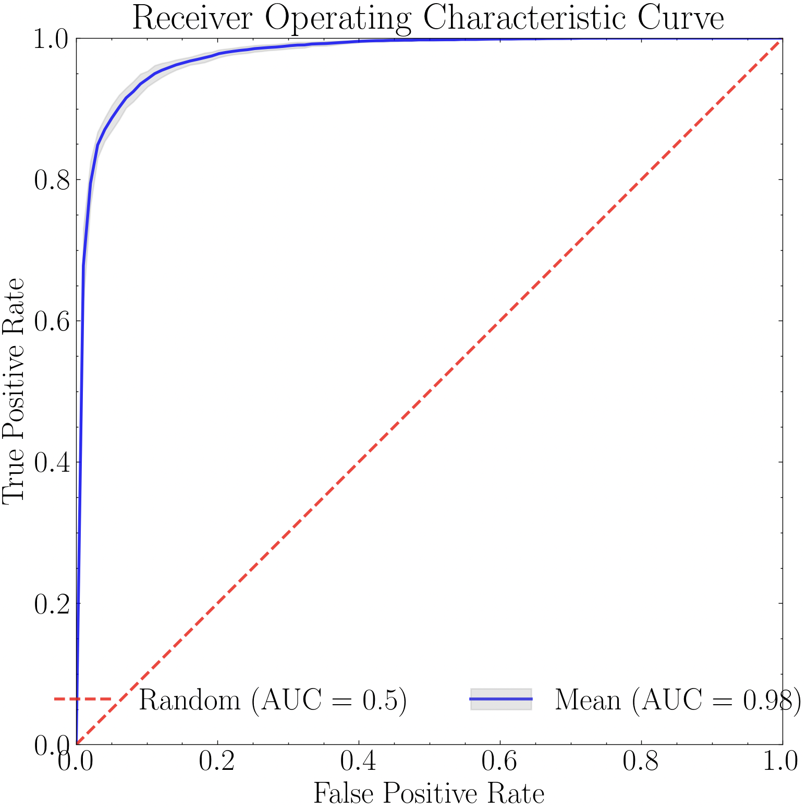

.. _supervised_models:

Supervised Machine Learning
===========

.. admonition:: Documentation status (last updated |today|)

   This documentation is still being written and may change frequently!

Overview
-----------

The `ensemble_model <https://pybia.readthedocs.io/en/latest/autoapi/pyBIA/ensemble_model/index.html>`_ module includes the  `Classifier <https://pybia.readthedocs.io/en/latest/autoapi/pyBIA/ensemble_model/index.html#pyBIA.ensemble_model.Classifier>`_ class, a robust pipeline for training and optimizing popular machine learning classifiers. This module focuses on the use of more interpretable models such as tree-based estimators (Decision Trees, Random Forest, and Extra Trees Classifiers), including gradient-boosted frameworks (Gradient, Adaptive Gradient, eXtreme Gradient, and Histogram-based Gradient Boosting), simple neural networks (Multi-Layer Perceptrons), and other models such as K-Nearest Neighbors, Logistic Regression, Support Vector Classifier (including One-Class SVM), and Gaussian Naive Bayes. These models are specified via the ``clf`` argument when instantiating the class. 

This module handles data imputation (``impute`` and ``imp_method`` arguments), feature selection (``boruta_trials`` and ``boruta_model`` arguments), and hyperparameter optimization (``optimize``, ``opt_cv``, ``scoring_metric``, ``limit_search``, and ``n_iter`` arguments). The seed number (``SEED_NO``) is propagated to all downstream stochastic processes, enabling reproducibility during training and optimization. This is set to 1909 by default, and can be set to ``None`` to enable randomization at every stage.

This pipeline is flexible and can work with any training data, requiring only the feature matrix (``data_x``) and corresponding array of labels (``data_y``). In lieu of these arguments, users can also input a dataframe (``csv_file``), although this requires that a "label" column be present, containing the class labels. All other columns are assumed to be training features. 

Model performance, optimization results, and class separation can be visualized using built-in class methods. These include confusion matrices (``plot_conf_matrix``), ROC curves (``plot_roc_curve``), feature selection results (``plot_feature_opt``), hyperparameter optimization results (``plot_hyper_opt`` and ``plot_hyper_param_importance``), and t-SNE projections (``plot_tsne``). These are demonstrated in the example below.

Example
-----------

This example uses the per-band training data generated in the `catalog creation example <https://pybia.readthedocs.io/en/latest/source/Catalog%20Generation.html#example>`_. In the code below, these five files are combined to form a single dataframe.

.. code-block:: python

   import numpy as np
   import pandas as pd

   # Load the individual dataframes
   df_g = pd.read_csv('segm_catalog_g_band.csv')
   df_r = pd.read_csv('segm_catalog_r_band.csv')
   df_i = pd.read_csv('segm_catalog_i_band.csv')
   df_y = pd.read_csv('segm_catalog_z_band.csv')
   df_z = pd.read_csv('segm_catalog_y_band.csv')

   # The identifier columns
   exclude = ['obj_name', 'flag', 'xpix', 'ypix'] 

   # Rename the feature columns, adding the corresponding band suffix to each feature name
   new_cols_g = {col: (f"{col}_g" if col not in exclude else col) for col in df_g.columns}
   new_cols_r = {col: (f"{col}_r" if col not in exclude else col) for col in df_r.columns}
   new_cols_i = {col: (f"{col}_i" if col not in exclude else col) for col in df_i.columns}
   new_cols_z = {col: (f"{col}_z" if col not in exclude else col) for col in df_z.columns}
   new_cols_y = {col: (f"{col}_y" if col not in exclude else col) for col in df_y.columns}

   df_g = df_g.rename(columns=new_cols_g)
   df_r = df_r.rename(columns=new_cols_r)
   df_i = df_i.rename(columns=new_cols_i)
   df_z = df_z.rename(columns=new_cols_z)
   df_y = df_y.rename(columns=new_cols_y)

   # Combine and save
   df_combined = (
       df_g.merge(
           df_r, on=exclude, how='inner').merge(
           df_i, on=exclude, how='inner').merge(
           df_y, on=exclude, how='inner').merge(
           df_z, on=exclude, how='inner'
       )
   )

   df_combined.to_csv(f'merged_dataframe_five_bands.csv', index=False)

The merged catalog generated above is available for download here:

- `merged_dataframe_five_bands <https://drive.google.com/file/d/11bsdYGTbBjVvnudLRgHcQz8oH6sdtfxB/view?usp=sharing>`_

The code below loads this merged dataframe and constructs the feature matrix and class label arrays, which are input when instantiating the class. When optimization routines are disabled, the default models are trained, using default hyperparameters.

.. code-block:: python

   import numpy as np  
   import pandas as pd
   from pyBIA import ensemble_model  

   # Load the dataframe
   training_data = pd.read_csv('merged_dataframe_five_bands.csv')

   # Select only the columns representing source features (i.e., remove identifiers)
   columns = [col for col in training_data.columns if col not in ('obj_name', 'flag', 'xpix', 'ypix')]

   # Now construct the training data arrays
   data_x, data_y = np.array(training_data[columns]), np.array(training_data['flag'])

   # Will run the optimization routine all at once, feature selection first followed by engine hyperparameter optimization
   # Enabling 10-fold cross validation which increases the hyperparameter optimization time ten-fold

   # XGB-BASED BorutaSHAP
   SEED_NO = 1909 # The seed number that will initialize the stochastic process (e.g., model training)
   clf = 'xgb' # The classification model that will be trined, this option trains an XGBoost classifier
   impute = True # Whether to impute missing values (NaN)
   optimize = False # Will enable the optimization routine

   # Instantiate the Classifier class
   model = ensemble_model.Classifier(
           data_x,
           data_y,
           clf=clf,
           impute=impute,
           optimize=optimize,
           SEED_NO=SEE_NO
           )

   # Create the model (and do the optimizations that were enabled)
   model.create()

With the model trained, performance via a confusion matrix and/or ROC curves can be visualized. Note that the confusion matrix takes in an optional ``data_y`` argument, which can be a list containing the class labels as you wish them to appear in the image. This is useful if the class labels in the original labels array is numerical, as models like the XGBoost do not allow text-based class labels. Therefore, in this example we construct a list containing the text-based class labels (corresponding to the originally input ``data_y`` labels array), and input when constructing the confusion matrix. Otherwise, in this example the confusion matrix would instead show 1 for the Lens class and 0 for the Non-Lens class. 

.. code-block:: python

   k_fold=10
   title='Confusion Matrix' 
   savefig=False
   data_y_labels = ['Lens' if label == 1 else 'Non-Lens' for label in model.data_y]

   model.plot_conf_matrix(
      data_y=data_y_labels,
      k_fold=k_fold,
      title=title,
      savefig=savefig
      )

.. figure:: _static/xgb_conf_matrix.png
    :align: center
|

|

.. code-block:: python

   import numpy as np  
   import pandas as pd
   from pyBIA import ensemble_model  

   # Load the dataframe
   training_data = pd.read_csv('merged_dataframe_five_bands.csv')

   # Select only the columns representing source features (i.e., remove identifiers)
   columns = [col for col in training_data.columns if col not in ('obj_name', 'flag', 'xpix', 'ypix')]

   # Now construct the training data arrays
   data_x, data_y = np.array(training_data[columns]), np.array(training_data['flag'])

   # Will run the optimization routine all at once, feature selection first followed by engine hyperparameter optimization
   # Enabling 10-fold cross validation which increases the hyperparameter optimization time ten-fold

   # XGB-BASED BorutaSHAP
   SEED_NO = 1909 # The seed number that will initialize the stochastic process (e.g., model training)
   clf = 'xgb' # The classification model that will be trined, this option trains an XGBoost classifier
   impute = True # Whether to impute missing values (NaN)
   optimize = False # Will enable the optimization routine
   scoring_metric = 'f1' # The optimization trials will be assessed according to the F1 Score
   opt_cv = 3 # The number of folds to perform during cross validation, ONLY used during optimization (`optimize`=True)
   boruta_trials = 100 # Number of feature selection trials to perform (This is fast especially with `boruta_model`='xgb')
   boruta_model = 'rf' # The model to use when assessing feautre importances during feature selection (either 'rf' or 'xgb', DOES NOT have to match the `clf`)
   n_iter = 100 # Number of hyperparameter optimization trials to perform, can set to 0 to disable hyperparam tuning
   limit_search = True # Set to False to expand the hyperparameter search space (will take longer)

   # Instantiate the Classifier class
   model = ensemble_model.Classifier(
           data_x,
           data_y,
           clf=clf,
           impute=impute,
           optimize=optimize,
           boruta_trials=boruta_trials,
           boruta_model=boruta_model,
           n_iter=n_iter,
           scoring_metric=scoring_metric,
           opt_cv=opt_cv,
           limit_search=limit_search,
           SEED_NO=SEED_NO
           )

   # Create the model (and do the optimizations that were enabled)
   model.create()

